<div align="center">

# M A N T L E

### A physics-first digital twin that runs the steam and the pump as one system.

**SIH 2026 · SIH26120 · Oil India Limited · Baghewala heavy-oil field**

<br/>


<br/>

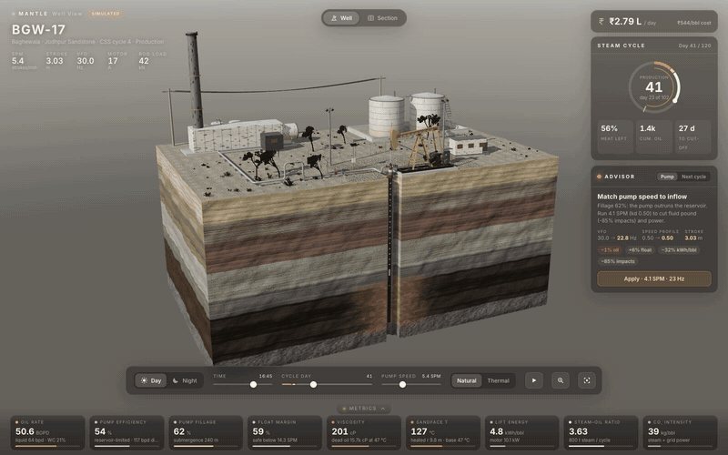

<sub>The signature moment: press <kbd>2</kbd> and the 3D diorama dolly-zooms flat while the blueprint of the same well crystallises on top. Same live twin, two ways to read it.</sub>

</div>

---

## Why this exists

Baghewala produces **17-19 degree API crude** from the **Jodhpur Sandstone** at only **46-48 degC** and low reservoir pressure. It only flows because we put steam in (**CSS**, cyclic steam stimulation) and lift it with **sucker-rod pumps (SRP)**. Today those two loops are tuned **separately, from experience**:

- steam volume, injection pressure, soak time and cut-off are chosen without a forward model of how the reservoir heats and cools;
- the pump is run at a fixed stroke speed while the crude's viscosity changes by an order of magnitude across a cycle;
- the result is **rod float, impact loading, pump unseating, rod failures, high steam-oil ratio and wasted energy**.

**Mantle** couples the two. One physics twin of the well, from the steam generator to the pump intake, is wrapped in ML forecasters and two optimisers, then shown as a 3D well, a crystallising 2D section and an exploded inspect view that an operator can read in seconds.

> Every number on screen comes from the backend (physics, database, model). No fixtures, no mock fallbacks. If the API is down the UI says **API offline** and shows dashes.

---

## What the judges asked for, and where it lives

| SIH26120 requirement | Where it lives in Mantle |
|---|---|
| **Optimise CSS parameters**: steam volume, injection pressure, soak time, production cut-off | **Advisor, Next cycle tab**: a four-lever recipe (today vs Mantle) with a per-calendar-day value objective. Model **O2** (Optuna over the M1/M2 surrogates with O1 nested inside), every reported number re-run on the exact physics twin. Schedulable via `POST /plan/schedule`. |
| **Predict reservoir heating and cooling** | **M1** thermal surrogate (sandface T, heated radius, thermal battery, P10-P90) plus the **Section view**: live isotherms, heated-radius callout, thermal battery gauge, and the **Thermal lens** on the 3D block. |
| **Predict production** | **M2** cycle forecaster: daily oil with P10/P50/P90 bands on the *Cycle production* card, past-cycle overlays, the Mantle-plan curve and the cut-off marker. |
| **Continuously optimise the SRP**: stroke speed, SPM, VFD | **O1** SRP controller + the **Advisor, Pump tab**: recommended SPM, VFD Hz and speed profile (kd) with predicted deltas in oil, float, energy and impacts, applied in one click (`POST /apply`). |
| **Detect rod float** | **Float margin** KPI (safe SPM shown under it), float sign flips at the safe-SPM limit in the physics, and float margin is a hard constraint in O1 (margin at least 0.15). |
| **Minimise impact loading** | Dynamometer card with the **impact burst marker** and the per-stroke fluid-pound strip; **M5** estimates fillage, impacts/day and impact velocity. O1 removes 94.6 % of impacts across 400 test states. |
| **Reduce pump unseating / improve reliability** | **Rod & pump health card**: 12-month **unseat calendar**, hold-down **uplift margin**, 30-day risk, per-rod fatigue map (140 rods, Goodman number), **MTBF now vs with Mantle**. Model **M4**. Inspect-Downhole tags the hold-down and seat. |
| **Improve pump efficiency** | Pump efficiency and fillage KPIs, the dyno card (**M3** classifies 12 conditions, downhole card from the Gibbs wave equation), fluid-level and submergence read-outs. |
| **Cut steam, energy and opex** | KPI strip: **SOR**, **kWh/bbl**, **CO2 kg/bbl**, lift cost; the top-right **cost anatomy** (steam, power, maintenance, chemicals vs revenue); the coupling dividend (value from tuning steam and pump *together*). |
| **Real-time monitoring and anomaly detection** | **WebSocket live stream** (4 Hz) plus **M6** streaming anomaly detector with fault injection for demos (pump-off, gas lock, load-cell fault, VFD trip). |
| **Digital twin a person can trust** | Provenance pill ("Simulated"), model cards with honest misses, seeded reproducible data, JS/Python parity tests. |

---

## The screens

<table>
<tr>
<td width="50%">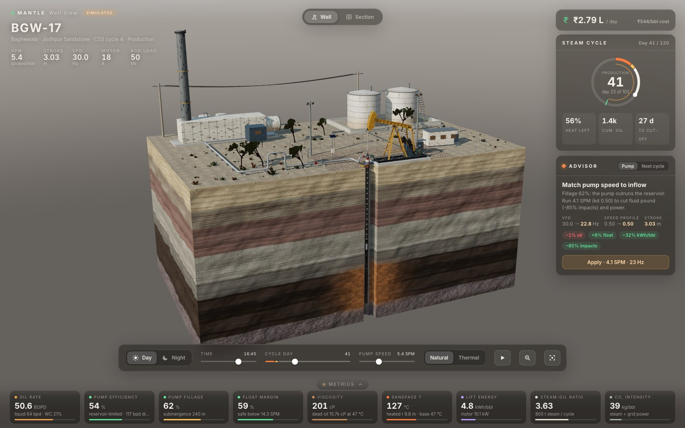<br/><sub><b>Well View, day.</b> Cut-block diorama with steam generator, tanks, pumping unit and the heated zone glowing around the wellbore. KPI strip peeks from below; the Advisor recommends 4.1 SPM (-85 % impacts) for BGW-17.</sub></td>
<td width="50%">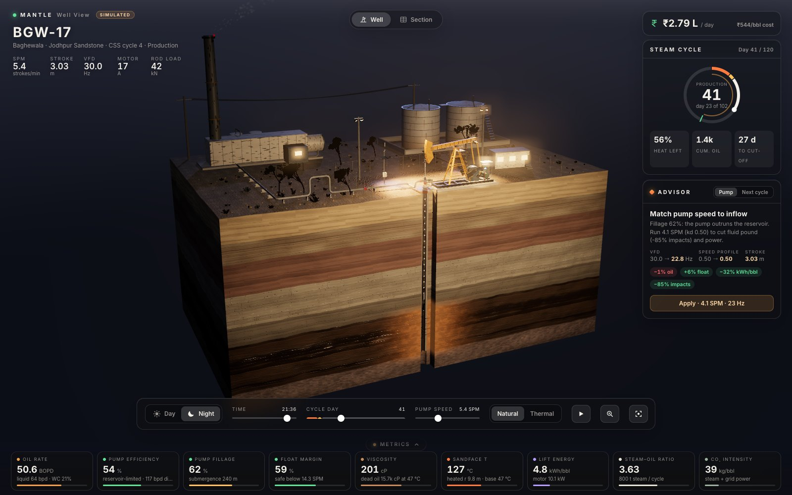<br/><sub><b>Well View, night.</b> Real sun, moon, stars and floodlights; windows, beacons and bloom follow the time slider.</sub></td>
</tr>
<tr>
<td width="50%">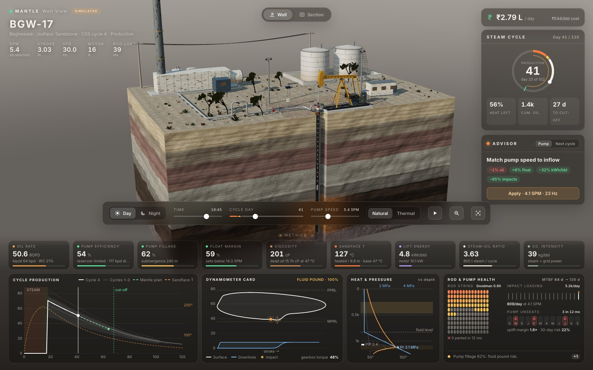<br/><sub><b>Metrics drawer.</b> Nine KPIs, cycle production with P10-P90 band, live dyno card, heat and pressure vs depth, rod and pump health.</sub></td>
<td width="50%">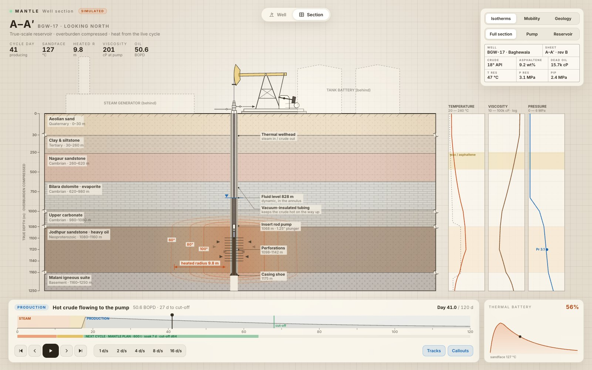<br/><sub><b>Section view.</b> True-scale A-A' blueprint: geology, isotherms and heated radius, depth tracks (temperature, viscosity, pressure), title block, cycle timeline that includes the Mantle-plan bar.</sub></td>
</tr>
<tr>
<td width="50%">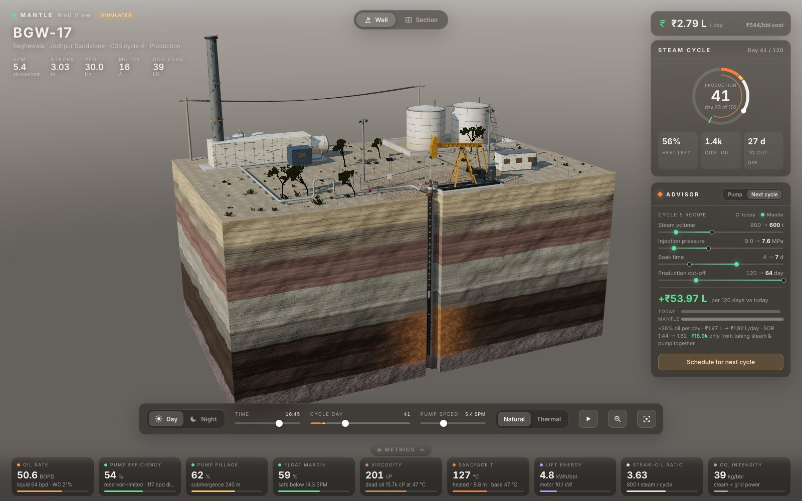<br/><sub><b>Next-cycle advisor.</b> Steam, injection pressure, soak and cut-off, today vs Mantle, with the value delta per 120 days and the share that comes only from co-tuning steam and pump.</sub></td>
<td width="50%">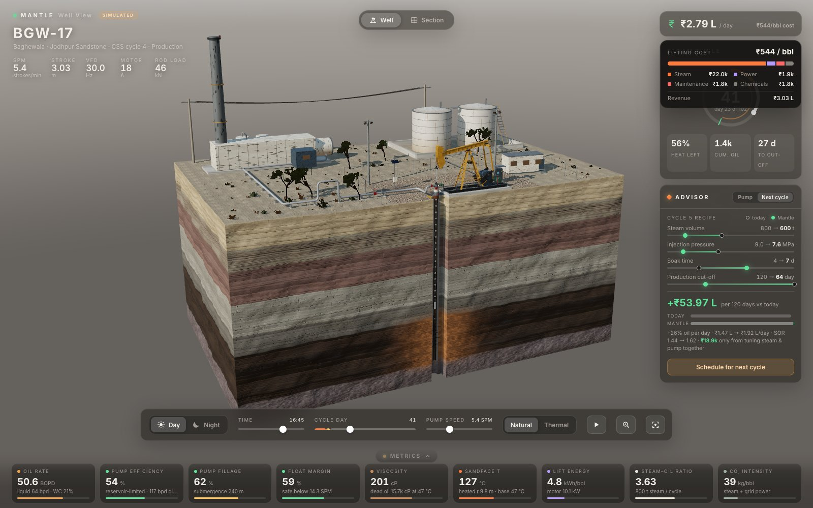<br/><sub><b>Cost anatomy.</b> Hover the top-right value panel: lifting cost per bbl split into steam, power, maintenance and chemicals against revenue.</sub></td>
</tr>
<tr>
<td width="50%">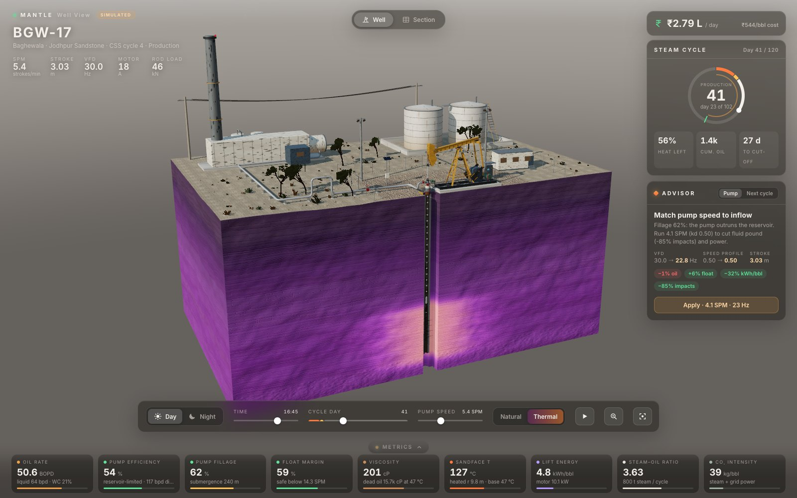<br/><sub><b>Thermal lens.</b> Press <kbd>T</kbd>: the strata become a heat map of the reservoir, eased in the shader.</sub></td>
<td width="50%">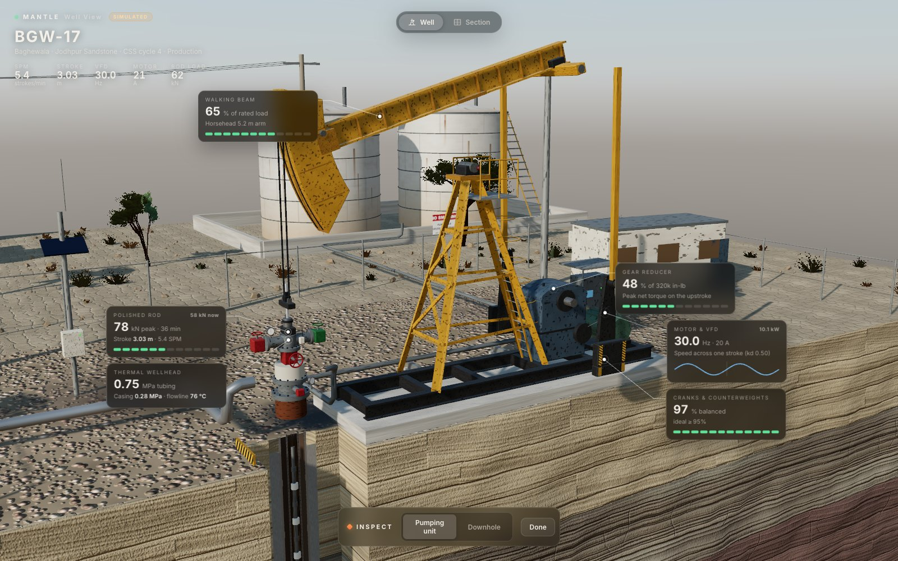<br/><sub><b>Inspect, pumping unit.</b> Camera flies in, tags cascade in: walking beam load, gear reducer torque, motor and VFD, counterweights, polished rod, wellhead.</sub></td>
</tr>
<tr>
<td width="50%">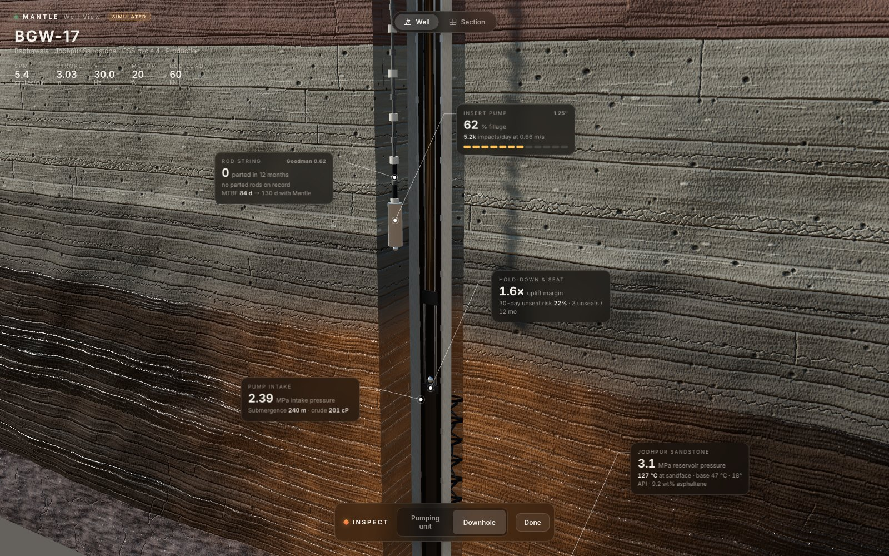<br/><sub><b>Inspect, downhole.</b> Rod string, insert pump fillage and impacts, hold-down and seat uplift margin, pump intake, reservoir.</sub></td>
<td width="50%" valign="top">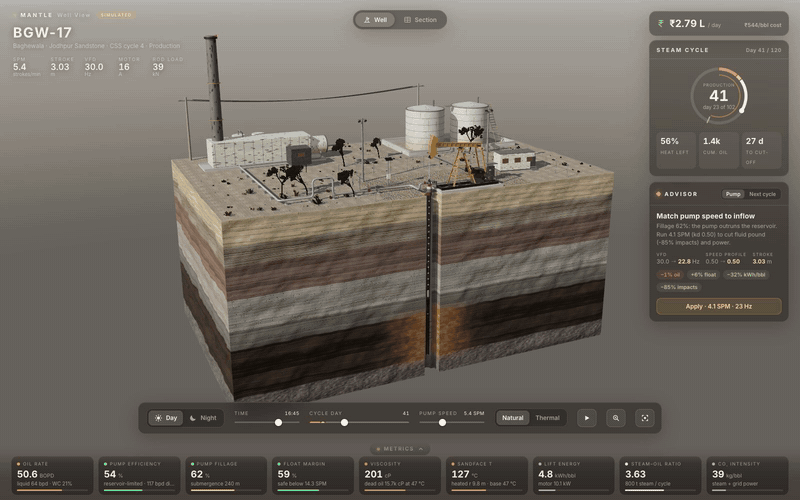<br/><sub><b>Day to night.</b> One tap, and the sky, light, windows and beacons animate through dusk.</sub></td>
</tr>
</table>

<div align="center">
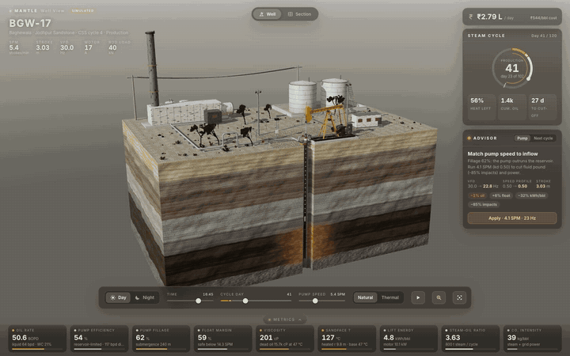<br/>
<sub><b>Inspect mode.</b> Press <kbd>I</kbd>: the pumping unit is examined tag by tag, then the <b>Downhole</b> stop slides the camera down the completion.</sub>
</div>

<br/>

<table>
<tr>
<td width="50%">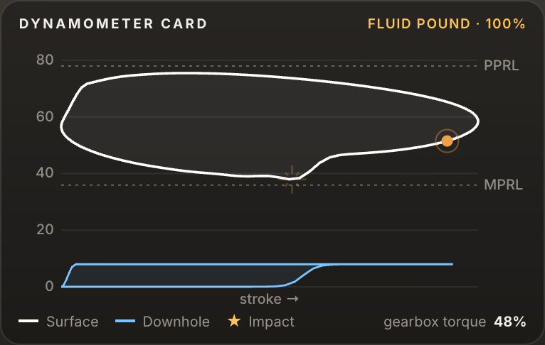<br/><sub><b>Dynamometer card.</b> Surface card (white), computed downhole card (blue), fluid-pound classification with confidence, impact marker, PPRL / MPRL limits and gearbox torque.</sub></td>
<td width="50%">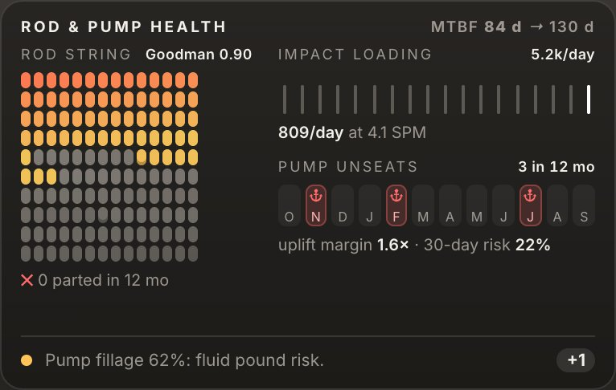<br/><sub><b>Rod and pump health.</b> Fatigue map of 140 rods, impact loading per day (now vs at the recommended SPM), 12-month unseat calendar, uplift margin, 30-day risk, MTBF 84 d to 130 d with Mantle.</sub></td>
</tr>
</table>

<sub>All screenshots are BGW-17 at cycle day 41 of 120, captured from the running app. Values shown are simulated (see the provenance pill).</sub>

---

## Architecture

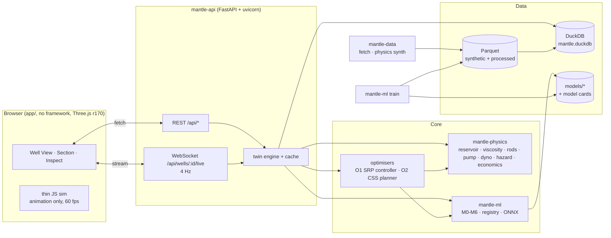

**Principles**

1. **Physics first, ML second.** Marx-Langenheim / Boberg-Lantz heating, Walther viscosity, Gibbs wave equation for the rod string. ML learns residuals, classifications and risk. **Every model has a physics or practice baseline it has to beat**, and the table below shows where it does not.
2. **One number, one owner.** The Python physics package is authoritative. The browser JS sim only animates the machine (crank angle, rod position); a parity test pins it to the Python twin.
3. **No mock data, ever.** No fixture fallback. API unreachable means an explicit offline state.
4. **Honest provenance.** Every record carries `source in {real, physics_synthetic}`; anything that must obey physics is written by the physics engine.
5. **Reproducible.** Seeded everywhere; `mantle-data build`, `mantle-ml train --all` and `docker compose up` regenerate everything.

---

## The models

All figures are from [`backend/models/REPORT.md`](backend/models/REPORT.md), generated by `uv run mantle-ml report`, with a card per model in `backend/models/<id>/card.md`. Unless stated, models are trained and evaluated on **physics-synthetic** data (the twin), so they show that the ML is faithful to and faster than the physics, **not** that it has seen a real Baghewala well (there is no public Baghewala data).

| ID | Model | What it does | Method | Result | Baseline | Target | Verdict |
|---|---|---|---|---|---|---|---|
| **M0** | Viscosity | mu(T, API, asphaltene) | Walther/ASTM D341 fit + LightGBM residual | MAPE 3.9 % (T >= 50 C) | Beggs-Robinson 98.5 % | <= 12 % | met |
| **M1** | Thermal surrogate | sandface T, heated radius, thermal battery | Analytic heating/cooling features + LightGBM, quantiles | MAE 0.20 C (80 % band covers 77 %) | analytic 3.83 C | <= 6 C | met |
| **M2** | Cycle forecaster | daily oil, cum oil, P10/P50/P90 | Physics prior x LightGBM residual, conformal bands | cycle cum-oil MAPE 6.5 %; 80 % interval covers 79-81 % | Arps prev. cycle 26.6 % | <= 10 % | met |
| **M3** | Dyno classifier | 12 card classes + confidence | 1-D CNN (174k params), temperature scaled, ONNX | macro-F1 **0.939**; perturbed set **0.853** | Fourier k-NN 0.587 | >= 0.95 / 0.90 | **MISSED** (normal, tubing-leak and friction overlap) |
| **M3b** | Downhole card | pump card from surface card | Gibbs wave equation (physics, not ML) | analytic test cases | none | within 2 % | physics |
| **M5** | VFD / impact estimator | fillage, impacts/day, impact velocity, motor A | Pump-card physics + GBM calibration | fillage MAE 0.72 pts | fixed thresholds 36.0 | <= 4 pts | met |
| **M4** | Failure and unseat risk | rod-part hazard, unseat hazard, 30-day risk, MTBF | Survival model + Miner fatigue per rod | **rod** C-index 0.971, Brier(30 d) -69.5 % vs Weibull; **unseat** C-index **0.680**, Brier +1.8 % worse | Weibull age C 0.47 | C >= 0.75 | rod met; **unseat MISSED** (hold-down capacity is hidden in the synthetic data) |
| **M6** | Streaming anomaly detector | anomaly score + event type | LSTM autoencoder + isolation forest; **pre-trained on real Petrobras 3W** | event F1 **0.720** on 3W test (real-only slice 0.667); S3 0.628 | 3-sigma 0.685 | >= 0.80 | **MISSED**, but beats baseline (many 3W faults are slow and subtle) |
| **O1** | SRP controller | SPM, VFD profile, stroke | Constrained optimisation on twin + M5 | impacts **-94.6 %**, oil -0.86 %; p95 latency 12.9 ms | fixed SPM | >= 15 % fewer impacts at <= 2 % oil loss | met |
| **O2** | CSS planner | steam, P_inj, soak, cut-off | Optuna TPE over M1+M2, O1 nested; joint vs sequential | +INR 3.2 lakh per cycle vs practice, twin-verified; positive on 88 % of 60 wells; SOR 5.57 to 4.70 (fleet mean, surrogate) | historical practice | > 0 | met |
| **O3** | RL competitor | same levers as O1 + O2 | PPO, 160k steps | net 3.8 % above O1+O2 but **2.1x the impacts** and higher risk | static practice | shown, no target | reported honestly |

**Three honest misses, and what we do about them.** M3 (0.939 vs 0.95), M4-unseat (C-index 0.68 vs 0.75) and M6 (F1 0.72 vs 0.80) fall short of the targets we set ourselves. All three still beat their baselines and are marked as xfail in the test suite rather than hidden. O2's twin-verified oil per cycle is on average 7.4 % *lower* than practice (shorter, hotter cycles); the win is money and SOR per calendar day, and we say so.

**Real vs learned from physics.** M6 is the only model validated on real field data (Petrobras 3W, held-out streams). The others are validated against the physics twin they emulate, plus a viscosity literature set for M0 calibration.

---

## Data

| Source kind | What | Volume | Licence |
|---|---|---|---|
| **Real** | [Petrobras 3W v2.0.0](https://github.com/petrobras/3W): expert-labelled real oil-well events; reduced to 5 channels at 1 min | 404,225 rows, 361 instances (M6 pre-training and test) | CC BY 4.0 |
| **Real** | [Open-Meteo](https://open-meteo.com) ERA5 hourly weather for Baghewala (27.95 N, 71.95 E) | 76,656 hourly rows | CC BY 4.0 |
| **Real (literature)** | Heavy-oil viscosity, Alomair et al., J Pet Explor Prod Technol 2016 | reference table | CC BY 4.0 |
| **Physics-synthetic** | S1 well roster | 60 wells | seeded, generated |
| | S2 CSS cycle histories | 625 cycles, 51,919 daily rows | |
| | S3 high-rate SRP telemetry (1 s) | 51.84 M rows (20 wells, 30 days) | |
| | S4 dynamometer cards, 12 classes | 200,000 cards | |
| | S5 failures / unseats / workovers | 482 / 87 / 838 | |
| | S6 optimiser traces | 50,000 scenarios | |

Honesty rules: the UI pill and `/api/meta` state the data source; raw downloads are SHA-256 pinned and the big parquet files are regenerated, not committed. Citations are in `backend/data/reference/LICENSES.md`.

---

## Using it

| Key | Action | | Key | Action |
|---|---|---|---|---|
| <kbd>1</kbd> / <kbd>2</kbd> | Well / Section | | <kbd>T</kbd> | Thermal lens |
| <kbd>N</kbd> | Day / Night | | <kbd>M</kbd> | Metrics drawer |
| <kbd>I</kbd> | Inspect mode | | <kbd>Esc</kbd> | Leave Inspect |
| <kbd>Space</kbd> | Run the cycle (Section: play) | | <kbd>C</kbd> | Reset camera |
| <kbd>H</kbd> | Hide the interface | | <kbd>&larr;</kbd> <kbd>&rarr;</kbd> <kbd>Home</kbd> <kbd>End</kbd> | Section: step / first / last |

**Gestures.** Drag to orbit, scroll to zoom toward the cursor, hover the value panel for cost anatomy. Sliders scrub time of day, cycle day and pump speed; the Advisor buttons apply the pump recommendation or schedule the next-cycle recipe (audit-logged).

URL parameters for sharing a view: `?night`, `?thermal`, `?screen=section`, `?inspect=surface|downhole`, `?drawer=open`.

---

## Quickstart

**Docker (everything)**

```bash
docker compose up            # web + api, http://localhost:8080
```

The API image builds its DuckDB from the seeds at image build; nginx serves `app/` and proxies `/api` including the WebSocket. Optional profiles:

```bash
docker compose --profile data  run --rm data     # rebuild synthetic data
docker compose --profile train run --rm train    # retrain every model
```

**Dev (two terminals)**

```bash
cd backend && uv sync && uv run mantle-data build --only S1,S2,S5   # first time only
cd backend && uv run mantle-api                                      # http://localhost:8000/api  (docs at /docs)
cd app && python3 -m http.server 8777                                # http://localhost:8777
```

**Checks**

```bash
cd backend && uv run pytest -q          # 211 passed, 5 skipped, 3 xfailed (the 3 documented misses)
uv run ruff check && uv run mypy packages
uv run mantle-ml report                 # regenerate models/REPORT.md
node app/js/sim.test.mjs                # JS sim golden checks
```

---

## API at a glance

Base `/api`, snake_case JSON, stateless scenario queries (`day, spm, kd, steam`). Full schema: [`backend/openapi.json`](backend/openapi.json) (a test fails if it is stale).

| Route | Returns |
|---|---|
| `GET /health` · `/meta` | status, loaded models · data sources, model metrics, planning prices |
| `GET /wells` · `/wells/{id}` | roster · well master (fluid, completion, unit, rods) |
| `GET /wells/{id}/state` | full metrics + derived values + pump recommendation (O1) |
| `GET /wells/{id}/series` | cycle curves with P10-P90 (M1/M2), past cycles, plan curve |
| `GET /wells/{id}/profile` | depth tracks: T, viscosity, pressure, rod stress |
| `GET /wells/{id}/dyno` | surface and downhole cards, class and probabilities (M3), impact |
| `GET /wells/{id}/health` | rod fatigue, failures, unseats, MTBF, 30-day risk (M4) |
| `GET /wells/{id}/recommend/pump` | O1 recommendation |
| `GET /wells/{id}/plan/next-cycle` | O2 recipe, value delta, joint share, SOR pair |
| `POST /wells/{id}/apply` · `/plan/schedule` | persisted, audit-logged actions |
| `WS /wells/{id}/live` | 4 Hz stream: load, position, amps, Hz, THP/CHP, anomaly score and label; accepts retargeting and fault injection |

---

## Repo layout

```
app/                       static frontend: Three.js scenes, section blueprint, inspect, API client
  js/{main,sim,api,section,inspect,terrain,sky,pumpjack,well,props,...}.js
backend/                   uv workspace (Python 3.12)
  packages/
    mantle-physics/        pure numpy/scipy twin: reservoir, viscosity, rods, pump, dyno, hazard, economics
    mantle-data/           fetchers, physics synthesis S1-S6, DuckDB loader
    mantle-ml/             features, training, registry, ONNX inference, report
    mantle-api/            FastAPI app, live WebSocket, engine, audit store
  models/                  trained artefacts, per-model card.md, REPORT.md
  data/                    reference tables (committed); synthetic/processed/raw (regenerated)
  tests/                   api, data, ml, physics
  openapi.json             exported API schema
docker/                    api + web Dockerfiles, nginx.conf
docker-compose.yml         web + api, profiles: data, train
assets/readme/             screenshots and GIFs used above
backend.md                 architecture, data, models, API contract
nextjs-port.md             brief for the planned Next.js port
```

---

## Status and roadmap

- **Working now:** three-view frontend on live backend data, ten models shipped, twin-verified planner, live stream with anomaly detection, Docker one-command run, 195 passing tests.
- **Open misses:** M3 F1 (0.939 vs 0.95), M4 unseat C-index (0.68 vs 0.75), M6 3W event F1 (0.72 vs 0.80). Documented in the model cards, tracked as xfail tests.
- **Planned:** Next.js + TypeScript port of the frontend (spec in `nextjs-port.md`), then a performance pass; fine-tune on real Baghewala data when Oil India can share it, which is the honest path from twin-validated to field-validated.
- **Known limits:** Baghewala data is not public, so the twin is calibrated to published field ranges; all wells are simulated; licence still to be decided.

---

## Credits

Petrobras 3W dataset (Vargas et al., J. Petroleum Science and Engineering 181, 2019; CC BY 4.0) · Open-Meteo / Copernicus ERA5 (CC BY 4.0) · Alomair et al. 2016, heavy-oil viscosity (CC BY 4.0) · Three.js · FastAPI · DuckDB · LightGBM · PyTorch · ONNX Runtime · Optuna · Stable-Baselines3.

**Team:** _placeholder_ · Smart India Hackathon 2026 · Problem statement SIH26120, Oil India Limited · Category: Software · Theme: Smart Automation.
