# Mantle

**A well-to-surface digital twin that plans steam and pump as one decision, for the heavy-oil wells of Baghewala.**
Smart India Hackathon 2026 · Problem statement **SIH26120** (Oil India Limited · Software · Smart Automation)

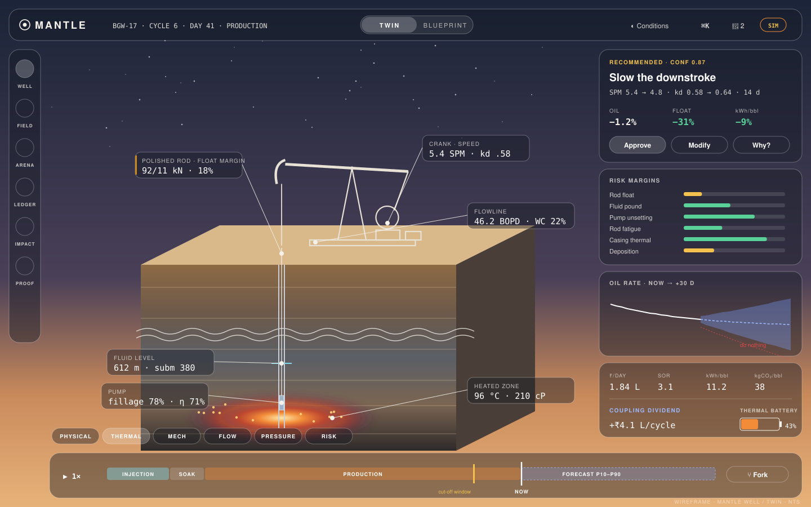

> **Status: planning (Rev B, 29 Sep 2026). No application code yet.**
> The commands in this README describe the target developer experience. They work once Phase 0 lands (see [plan §27](plan.md#27-technical-implementation-plan)). The full specification is in **[plan.md](plan.md)** (printable: **[plan.pdf](plan.pdf)**).

---

## Why Mantle

Baghewala crude (17–19° API) barely moves at reservoir temperature. Oil India heats it with **cyclic steam stimulation (CSS)** and lifts it with **sucker rod pumps (SRP)**. As the heat fades, the oil thickens, and a pump speed that was safe last week starts making the rods float, pound and fail. Today, steam design and pump settings are tuned **separately**, from experience.

Mantle models the whole chain and optimises it jointly:

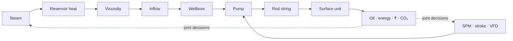

**Highlights**

- **Living 3D twin ⇄ living blueprint.** A photoreal block-diagram well whose colours, particles and stresses are the physics, which morphs in place into an animated engineering drawing (`B`).
- **Strategy Arena.** Mantle races static, heuristic, pump-off, greedy, sequential-optimal and reinforcement-learning strategies, plus an oracle bound, on identical simulated wells. The production-output graph is the evidence.
- **Coupling Dividend.** The value of optimising CSS and SRP *together*, in ₹ and barrels, decomposed.
- **Trustworthy by design.** EnKF state estimation with P10–P90, a deterministic Safety Gate, physics-vs-ML disagreement alarms, a hash-chained decision ledger, and provenance tags on every number.
- **Condition Deck.** Switch formation, crude, desert climate, completion, steam source (incl. solar-thermal) and faults. The physics and the scene both change.
- **One command.** `docker compose up`. Offline-capable.

## Screens

Six screens, quiet by default, with detail on hover and in dialogs.

| Well · Twin | Well · Blueprint | Field |
|---|---|---|
|  | 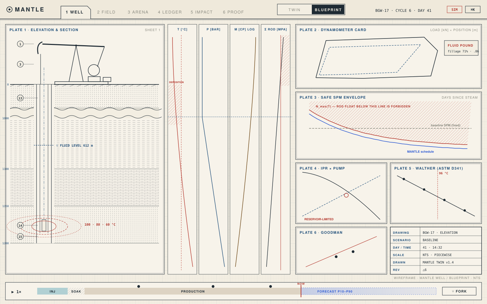 | 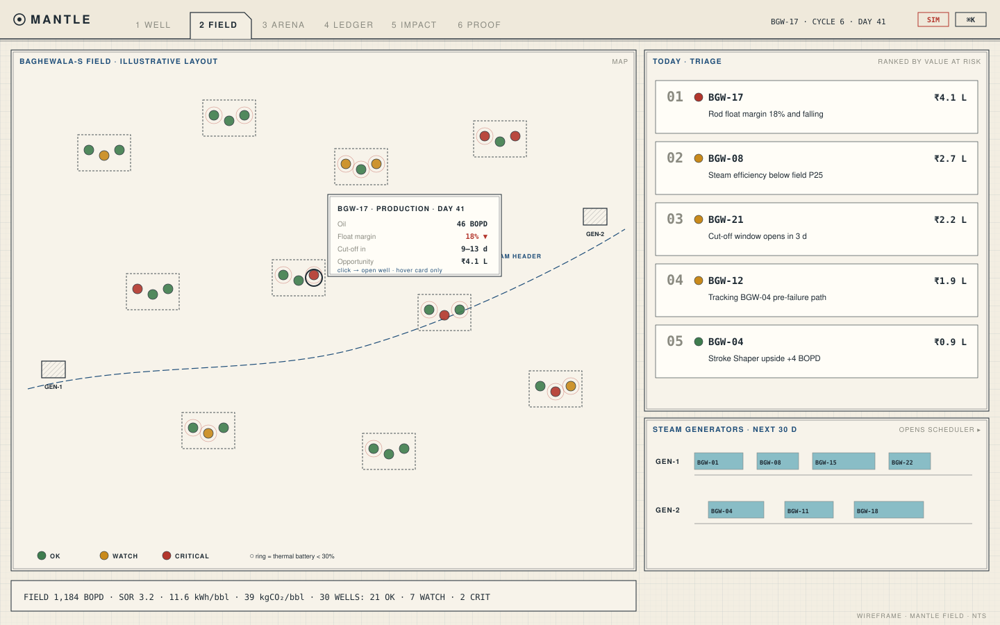 |
| **Arena** | **Ledger** | **Impact** |
| 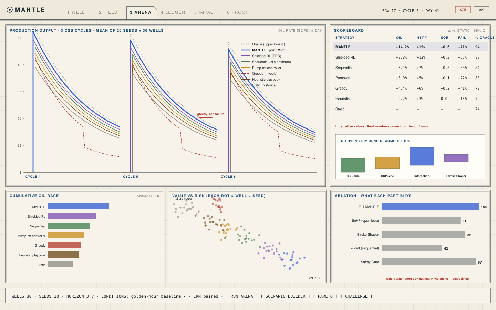 | 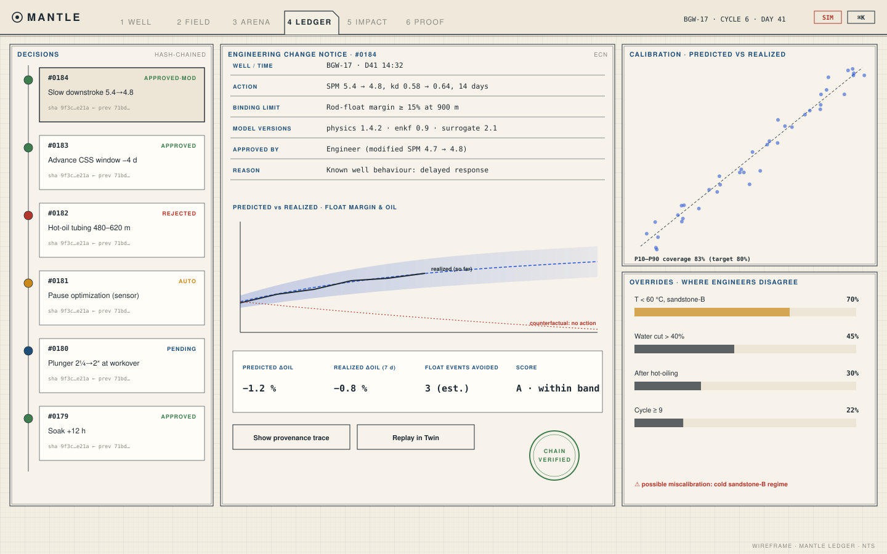 | 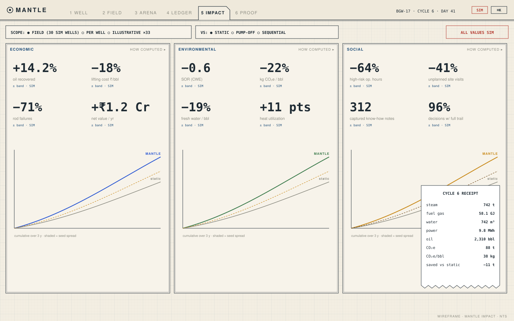 |
| **Proof** | **Interaction patterns** | **Transition storyboard** |
| 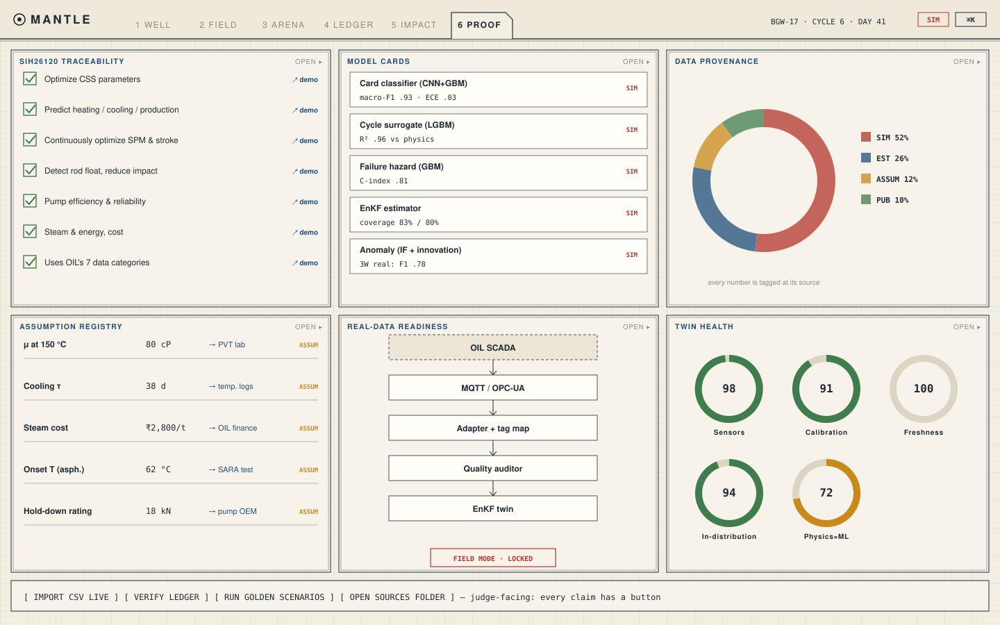 | 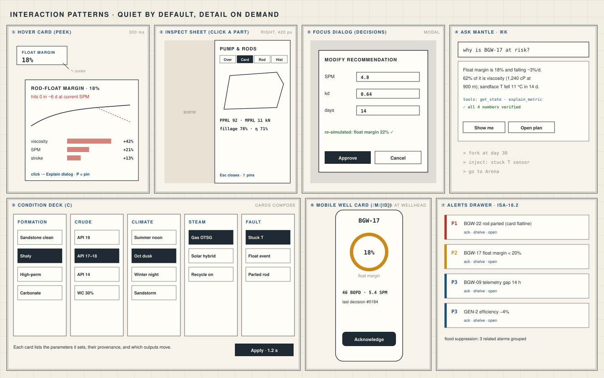 | 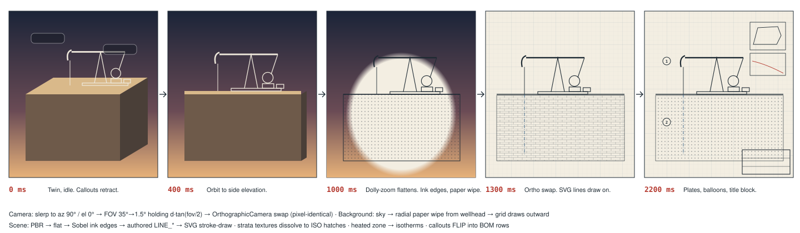 |

Specifications: [plan §6](plan.md#6-screen-specifications).

## Quick start

**Requirements:** Docker Engine 24+ with Compose v2, 16 GB RAM recommended (8 GB minimum), ~10 GB disk. No GPU needed.

```bash
git clone <repo-url> mantle
```

```bash
cd mantle && cp .env.example .env
```

```bash
docker compose up
```

Then open **http://localhost:8080**. On first run, Compose builds images, migrates the database, and seeds the synthetic Baghewala-S field and the official Arena results (≈ 2 min). Later starts take seconds.

| URL | What |
|---|---|
| http://localhost:8080 | Mantle app |
| http://localhost:8080/api/v1/docs | API docs (OpenAPI) |
| http://localhost:8080/m/BGW-17 | Mobile well card |
| http://localhost:8080/play | Judge Challenge kiosk |
| http://localhost:8090 | HTML/CSS draft gallery (`drafts` profile) |

### Compose profiles

| Command | Purpose |
|---|---|
| `docker compose up` | Full demo stack (seeded, deterministic, offline) |
| `docker compose --profile dev watch` | Hot reload for web and Python services |
| `docker compose --profile test run --rm tests` | Run the whole test suite in containers |
| `docker compose --profile drafts up drafts` | Serve the draft gallery |
| `docker compose --profile ml up mlflow` | Experiment tracking + training jobs |
| `docker compose --profile bench run --rm bench` | Regenerate the official Strategy Arena run |
| `docker compose --profile obs up` | Prometheus + Grafana |

`make up · make test · make drafts · make bench · make bundle · make pdf` are thin aliases.

## Architecture

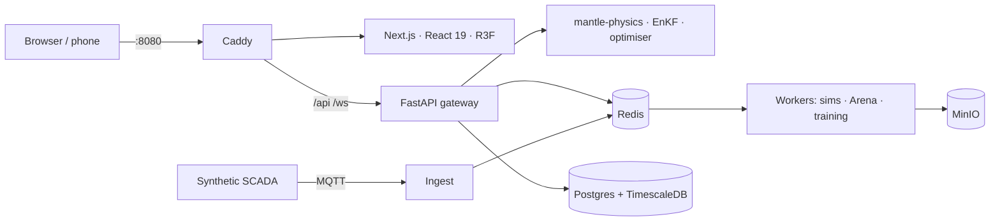

| Layer | Stack |
|---|---|
| Web | Next.js (App Router), React 19, TypeScript, React Three Fiber / Three.js, GSAP, D3/visx, MapLibre, Zustand, TanStack Query |
| API | FastAPI, Pydantic v2, WebSockets, Arq jobs |
| Engine | Python 3.12 (**uv** workspace): NumPy, SciPy, Numba, pint, iapws, pymoo, OR-Tools, LightGBM, PyTorch, MAPIE, SHAP, Stable-Baselines3 |
| Data | PostgreSQL 16 + TimescaleDB, Redis 7, MinIO, Mosquitto (MQTT) |
| Ops | Docker Compose, Caddy, GitHub Actions, OpenTelemetry |

Details: [plan §18](plan.md#18-technical-architecture) · API: [§19](plan.md#19-api-reference-v1) · DB: [§20](plan.md#20-database-schema).

## Repository layout

```
apps/        web (Next.js) · gateway (FastAPI) · worker · scada · ingest
packages/    tokens · core · physics · estimator · optimize · ml · rl · synth · arena · copilot · db · api-types
drafts/      HTML/CSS drafts + gallery (every screen & component, several variants)
assets/3d/   GLB model + kinematics, anchors, depth map
bench/       Strategy Arena configs and official results
evidence/    sources · assumptions · model cards
docs/        adr · diagrams · demo scripts
infra/       Dockerfiles · Caddy · Mosquitto · Grafana
```

## Development

### Python (always uv)

```bash
uv sync
```

```bash
uv run pytest
```

```bash
uv run --package mantle-gateway uvicorn mantle_gateway.main:app --reload
```

- One workspace, one `uv.lock`. Never `pip install`; add deps with `uv add --package <pkg> <dep>`.
- Lint/format: `uv run ruff check . && uv run ruff format .` · types: `uv run pyright`.

### Web (pnpm + Next.js)

```bash
pnpm install
```

```bash
pnpm --filter web dev
```

### UI workflow: drafts first

Every screen and component starts as **plain HTML/CSS** in `drafts/`, in at least two variants, compared side by side in the gallery (Glass/Paper toggle, onion-skin compare). The winner is recorded in `drafts/DECISIONS.md` and promoted to React. A **draft-parity test** keeps the React version pixel-close to the approved draft. See [plan §21.3](plan.md#213-draft-first-ui-workflow-htmlcss--nextjs).

```bash
docker compose --profile drafts up drafts
```

### Conventions

Trunk-based development · Conventional Commits · ADRs in `docs/adr/` · lefthook pre-commit (ruff, Biome, typecheck) · Definition of Done = code + tests + docs + provenance tags + a demo deep link where visible.

## Testing

Everything is tested: physics against textbook worked examples, estimator by twin experiments, optimiser safety by adversarial plans, API by contract fuzzing, database by migration round-trips and ledger tamper tests, UI by draft-parity and transition-frame visual tests, and the demo by an end-to-end Story Mode run (online and offline).

```bash
docker compose --profile test run --rm tests
```

```bash
uv run pytest packages/physics -q
```

```bash
pnpm --filter web test
```

```bash
pnpm --filter web e2e
```

Gates and coverage targets: [plan §23](plan.md#23-testing-strategy-tests-for-everything).

## Data

There is **no public well-level Baghewala dataset**. Mantle runs on **Baghewala-S**, a physics-based synthetic field calibrated to public anchors, and every number in the UI is tagged `MEAS · EST · SIM · ASSUM · PUB`. The source layer also supports competitor datasets (licence-aware; only MIT-licensed repos without permission) and LLM-assisted text and scenarios (never raw physics), and it is ready for OIL SCADA via MQTT/OPC-UA. See [plan §17](plan.md#17-data-strategy-and-datasets).

## Documentation

| Doc | Contents |
|---|---|
| [plan.md](plan.md) / [plan.pdf](plan.pdf) | The full plan: problem statement (verbatim), product, screens, 3D brief, physics, ML/RL, Strategy Arena, architecture, API, DB, Docker, testing, hackathon & implementation plans, scripts, judges' Q&A |
| [plan §8](plan.md#8-3d-asset-brief-hand-off-document) | 3D asset brief (hand-off to the 3D agent) |
| [plan §29](plan.md#29-scripts-how-we-talk-about-mantle) | Pitch, demo and architecture scripts |
| [plan §30](plan.md#30-judges-qa) | Judges' Q&A (economic, environmental, social impact) |
| `docs/adr/` | Architecture decision records |

## Honesty

Mantle is an independent student prototype for SIH26120, not an Oil India product. Simulated results are never presented as field results. Competitor projects informed our research and are credited as prior art. No unlicensed code or data is used.

## Team

Six roles: 3D/graphics · frontend/design system · physics · ML/estimation · backend/optimisation · product/domain/demo (see [plan §26.6](plan.md#266-team-roles-during-the-event)).

## License

To be decided by the team before the first public release.
