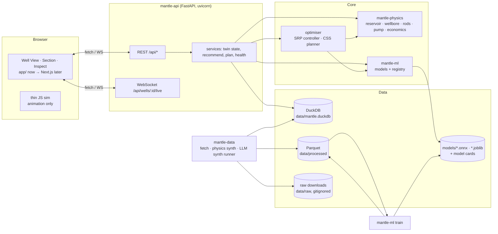

# Mantle backend — build plan

Owner: Claude (plan + wiring) · Sonnet 5.5 subagents (code + tests + Docker) · Python always via **uv**.
Status: plan v1, 2026-09-30. This file is the source of truth for the backend; older plan docs are obsolete.

The frontend today (`app/`) is a no-framework Three.js page that runs its own physics (`app/js/sim.js`) and
fills everything the sim doesn't model from `app/js/mock.js`. The backend replaces both with a real service:
a physics core, trained ML models, an optimiser, and an API whose shapes match what the UI already draws.

---

## 1. Principles

1. **Physics first, ML second.** Heavy-oil CSS + rod lift is well described by physics (Marx–Langenheim /
   Boberg–Lantz heating, Walther viscosity, Gibbs wave equation for rods). ML learns the residuals, the
   classifications and the risks that physics can't give directly. Every model has a physics baseline it must beat.
2. **Honest data.** Every record carries `source ∈ {real, physics_synthetic, llm_synthetic}`. The UI's
   "Simulated" pill reads `/api/meta`. LLM-generated time series are never used as physics truth — LLMs write
   *records, text and scenario parameters*; the physics engine writes *numbers that must obey physics*.
3. **One number, one owner.** The Python physics package is authoritative. The browser keeps a thin JS sim only
   for 60 fps animation (crank angle, rod position); every displayed metric comes from the API.
   A parity test pins JS and Python to the same golden values.
4. **No mock data, ever.** Every number the UI shows comes from this backend (physics, database, ML). There are
   no fixture fallbacks anywhere: if the API is unreachable the UI shows an explicit "API offline" state with
   dashes, never invented values. The browser's JS sim only animates the machine. Constants that are genuinely
   configuration (prices, equipment ratings) live in settings/the well master and are served by the API.
5. **Everything reproducible.** Seeds everywhere; `uv run mantle-data build` regenerates all synthetic data;
   `uv run mantle-ml train --all` retrains every model; `docker compose up` runs the whole thing.

---

## 2. Architecture



### Repo layout (uv workspace)

```
backend/
  pyproject.toml              # uv workspace root: members = packages/*
  uv.lock
  packages/
    mantle-physics/           # pure numpy/scipy, no I/O
      src/mantle_physics/{reservoir,viscosity,wellbore,rods,pump,dyno,economics,twin}.py
    mantle-data/              # fetchers, physics synth, LLM synth runner, DuckDB loaders
      src/mantle_data/{fetch/,synth/,llm/,schemas.py,db.py,cli.py}
      prompts/*.yaml          # the LLM prompt specs in §4, machine-readable
    mantle-ml/                # features, training, evaluation, registry, inference
      src/mantle_ml/{features,models/,train.py,evaluate.py,registry.py,infer.py,cli.py}
    mantle-api/               # FastAPI app
      src/mantle_api/{main.py,routes/,services/,schemas.py,live.py,settings.py}
  tests/                      # pytest: unit, property, golden, parity, API contract, e2e
  data/{raw,processed,synthetic,llm}/  (raw + big files gitignored; small fixtures committed)
  models/                     # trained artefacts + model cards (small ones committed; big via release)
docker/
  api.Dockerfile  web.Dockerfile  nginx.conf
docker-compose.yml            # api + web (+ profiles: train, llm, data)
```

Stack: Python 3.12 · numpy · scipy · pandas · polars (heavy ETL) · duckdb · pydantic v2 · FastAPI · uvicorn ·
scikit-learn · LightGBM · PyTorch (CPU) · skl2onnx/onnxruntime for serving · scikit-survival · Optuna ·
stable-baselines3 + gymnasium (RL competitor) · anthropic SDK (LLM synth runner, optional) · pytest ·
hypothesis · httpx · ruff · mypy.

---

## 3. Real datasets to fetch

| # | Dataset | Use | License | Size | How |
|---|---------|-----|---------|------|-----|
| R1 | **Petrobras 3W v2.0.0** — expert-labelled multivariate time series of undesirable events in real oil wells | Pre-train + validate the streaming anomaly detector (M6); real-data credibility slide | CC BY 4.0 | 1.8 GB zip | `mantle-data fetch 3w` → figshare `ndownloader.figshare.com/files/55019255`, SHA-256 pinned, parquet-ised |
| R2 | **Open-Meteo historical weather** for Baghewala (≈27.95 N, 71.95 E), hourly 2018–2026 | Ambient temperature for surface-line heat loss, solar/day cycle, seasonality features | CC BY 4.0 | ~5 MB | `mantle-data fetch weather` (archive-api.open-meteo.com) |
| R3 | **Heavy-oil viscosity–temperature tables** from open-access papers (e.g. *J Petrol Explor Prod Technol* 2015, 30 heavy oils 11.7–18.8° API, 20–160 °C) | Calibrate/validate the Walther (ASTM D341) viscosity model (M0) across the 17–19° API band | CC BY 4.0 (journal OA) | <1 MB | subagent extracts tables from the OA PDF into `data/raw/viscosity_literature.csv` with a citation column |
| R4 | **Volve production data** (Equinor) — daily well rates 2008–2016 | Optional: decline-curve priors / sanity checks for the production forecaster | Equinor Open Data Licence (research/education) | ~10 MB | manual download (licence click-through); loader accepts the xlsx if present, skips otherwise |

Not available publicly, so synthesised (below): Baghewala well data, CSS cycle records, SRP/VFD/dyno data,
rod-failure and pump-unseat histories. Labelled dynamometer-card sets in the literature (e.g. 35k cards from
Bahrain, SPE-194949) are proprietary — we generate cards with a validated Gibbs wave-equation model instead.

---

## 4. Synthetic data

### 4a. Physics-synthetic (code, deterministic, no LLM) — the numbers

Generated by `mantle-data build` from `mantle-physics`, seeded, with realistic noise, drift and sensor faults.

| Set | Volume (default → "enormous" flag) | Contents |
|-----|------|----------|
| S1 Field roster | 60 → 400 wells | per-well: depth, net pay, porosity, perm, So, API, asphaltene, completion (casing/tubing/rod taper/pump size), unit size — drawn from Baghewala ranges |
| S2 CSS cycle histories | 60 wells × 6–12 cycles → 400 × 15 | per cycle: steam t, injection pressure/rate/quality, soak d, cut-off d, daily oil/water/liquid, sandface T, heated radius, SOR, net ₹ |
| S3 High-rate SRP telemetry | 1 s, 20 wells × 30 d → 200 wells × 180 d | polished-rod load/position, motor amps/kW, VFD Hz, THP, CHP, flowline T, pump-off events |
| S4 Dynamometer cards | 200k → 2M cards | surface + downhole (Gibbs), 12 classes (below), varied geometry/fluid/speed, augmentations (noise, drift, clipped load cells, missing strokes) |
| S5 Failure & unseat histories | from a physics-informed hazard simulator over S3/S2 | rod parts (location, mode), pump unseats, tubing leaks, workovers, downtime, cost |
| S6 Optimiser traces | 50k scenarios | (state, action, outcome) tuples for the RL competitor and for surrogate training |

Dyno classes: normal · fluid pound · gas interference · rod float (viscous) · pump-off · tubing leak ·
travelling-valve leak · standing-valve leak · unseated pump · parted rods · plunger sticking/sand · excessive friction.

### 4b. LLM-synthetic — the records and words

Run with `uv run mantle-data llm run <spec> --n N --model <id>` (Anthropic SDK by default; any OpenAI-compatible
endpoint via env). Every spec is a YAML in `prompts/` with: system prompt, user template, **JSON schema**
(validated with pydantic; rejects are regenerated), seed variables sampled from S1/S2 so records reference real
synthetic wells/dates, dedupe by embedding, and `source=llm_synthetic`. Suggested volumes are for a big run;
the pipeline works with any N.

Shared system prompt (prepended to every spec):

> You are generating realistic but entirely fictional operational records for Baghewala, a heavy-oil field in
> the Bikaner–Nagaur basin, Rajasthan, India, operated by Oil India Limited. Reservoir: Jodhpur Sandstone,
> 1,080–1,160 m, 17–19° API crude, asphaltene 7–12 wt%, reservoir temperature 46–48 °C, low reservoir
> pressure (~3 MPa). Wells are produced by cyclic steam stimulation (CSS) and conventional beam pumping units
> with sucker-rod pumps on VFDs. Use Indian field conventions (IST timestamps, ₹, metric units with oilfield
> units in brackets where operators would use them), plausible names for roles (not real people), and
> terse operator language. Never invent company names other than Oil India Limited and generic vendors
> ("VFD vendor", "rod supplier"). Output only JSON matching the schema.

| Spec | N (suggested) | Prompt (user template; `{…}` are injected variables) |
|------|---------------|------|
| L1 `well_master` | 400 | "Write the well master record for `{well_id}` drilled `{spud_date}`: completion summary, casing/tubing/rod taper design (grades, sizes, lengths), pump (type, bore, setting depth `{pump_depth}` m), pumping unit model class and stroke settings, VFD rating, perforation interval `{perf_top}`–`{perf_bot}` m, last 3 workovers with reasons. Keep numbers consistent with: `{physics_facts}`." |
| L2 `css_cycle_design` | 4,000 (400 wells × ~10 cycles) | "Write the CSS cycle design sheet for `{well_id}` cycle `{n}` as planned by the reservoir team: steam volume, injection pressure/rate/quality, soak days, expected cut-off, rationale (2–4 sentences referring to previous cycle `{prev_cycle_summary}`), approval chain, and a post-cycle review note comparing plan vs actual `{actuals}`." |
| L3 `rod_failure_report` | 6,000 | "Write a rod-string failure report for `{well_id}` on `{date}`: failed component `{component}` at `{depth}` m, failure mode `{mode}`, visual inspection notes, suspected root cause (consistent with float margin `{float}`, Goodman `{goodman}`, impacts/day `{impacts}`, corrosion index `{corr}`), rods replaced, downtime hours, cost ₹, recommendations." |
| L4 `pump_unseat_incident` | 2,500 | "Write a pump-unseating incident note for `{well_id}` on `{date}` at cycle day `{day}`: symptoms seen on the dyno card and in production, crude viscosity at the time `{mu}` cP, hold-down type, actions taken (rod pull, reseat, hold-down change), time lost, and a one-line lesson." |
| L5 `workover_ticket` | 8,000 | "Write a workover/maintenance ticket for `{well_id}`: request, job steps, rig hours, materials, cost ₹, outcome; job type `{type}` from {rod job, pump change, tubing leak repair, stuffing box repack, VFD fault, belt/sheave change, gearbox oil change, counterbalance adjustment}." |
| L6 `operator_shift_log` | 60,000 lines | "Write `{k}` operator shift-log lines for `{well_id}` over `{date}` given telemetry highlights `{events}`: terse, timestamped, abbreviations operators use (SPM, THP, CHP, POC, fluid pound), occasional typos." |
| L7 `alarm_narrative` | 20,000 | "Explain alarm `{alarm_code}` raised on `{well_id}` at `{ts}` with context `{snapshot}` in the voice of a production engineer's triage note: probable cause, what to check, urgency (low/med/high)." |
| L8 `dyno_expert_annotation` | 12,000 (1 per ~150 cards) | "You are a rod-lift diagnostics expert. Given this dynamometer card summary `{card_features}` (and the true class `{label}` for reference), write the annotation an expert would attach: the visual cues on the card, the diagnosis, confidence, and the corrective action." |
| L9 `lab_fluid_report` | 1,200 | "Write a lab report for a crude sample from `{well_id}` taken `{date}`: API at 15.6 °C, asphaltene/resin/saturate/aromatic %, wax appearance temperature, viscosity at 50/80/120/160 °C consistent with Walther parameters `{A}`,`{B}`, water cut, BS&W, emulsion notes." |
| L10 `steam_generator_log` | 10,000 | "Write a daily steam-generator log for OTSG `{unit}` on `{date}`: steam quality, rate t/h, feedwater TDS/hardness, burner hours, fuel gas Sm³, trips and causes, consistent with injection plan `{plan}`." |
| L11 `energy_tariff_note` | 50 | "Write a short note on the electricity tariff and fuel-gas price applicable to `{period}` for a Rajasthan upstream site, as would appear in an internal cost memo (₹/kWh slabs, demand charge, gas ₹/Sm³)." |
| L12 `copilot_qa` | 5,000 pairs | "Write a question an OIL production engineer might ask about `{topic}` for `{well_id}` and the ideal grounded answer using only `{facts}` (cite the numbers). Topics: rod float, fluid pound, SOR, cut-off timing, soak length, VFD profile, asphaltene deposition, pump unseating." |
| L13 `strategy_playbook` | 300 | "Write a field-practice playbook entry (the 'historical experience' baseline) for deciding `{decision}` under `{conditions}`, as a senior operator would today without a digital twin." — used to encode the **static/heuristic baseline strategies** in the Arena. |

LLM outputs enrich the twin with realistic context (failure causes, notes, costs) and power text features for
M4, the copilot and the Arena's "today's practice" baseline. Numeric truth still comes from 4a.

---

## 5. ML models

Each model: a module in `mantle_ml/models/`, a physics baseline, a train/eval command, a model card
(`models/<name>/card.md` with data, metrics, limits), and a serving path (ONNX where possible).

| ID | Model | Predicts | Inputs | Method | Baseline to beat | Target metric |
|----|-------|----------|--------|--------|------------------|---------------|
| M0 | **Viscosity** | μ(T, API, asphaltene) cP | T, API, asph., resin, WAT | Walther/ASTM D341 two-point fit per well + LightGBM residual; monotone constraint in T | Beggs–Robinson | MAPE ≤ 12 % on R3 heavy-oil set (17–19° API band) |
| M1 | **Thermal surrogate** | sandface T(t), heated radius r_h(t), thermal battery | steam t, P_inj, quality, soak d, prior-cycle count, well props | Marx–Langenheim heated volume + Boberg–Lantz cooling as features → LightGBM (one model per output, quantile 0.1/0.5/0.9) | pure analytic model | MAE T ≤ 6 °C, r_h ≤ 0.8 m on held-out wells |
| M2 | **Cycle production forecaster** | daily oil/water over the cycle + P10/P50/P90; cum oil; SOR | M1 outputs, viscosity, PI, SPM policy, cycle #, well props | Physics prior (Boberg–Lantz rate) × LightGBM multiplicative residual; conformal calibration for intervals; per-well Bayesian scaling from its history | decline-curve (Arps) fit on previous cycle | cycle cum-oil MAPE ≤ 10 %; 80 % interval coverage 0.78–0.82 |
| M3 | **Dyno card classifier** | 12 classes + confidence; "impact" location on the card | surface card (and computed downhole card) resampled to 128 pts × (x, F) | 1-D CNN (PyTorch, ~150k params), trained on S4 with augmentations; temperature-scaled; exported to ONNX | Fourier-descriptor + k-NN | macro-F1 ≥ 0.95 on synthetic test; ≥ 0.9 on hand-labelled shape-perturbed set |
| M3b | **Downhole card** (physics, not ML) | pump card from surface card | surface card, rod taper, damping | Gibbs wave equation (Everitt–Jennings finite difference) | — | matches analytical test cases within 2 % |
| M4 | **Failure & unseat risk** | rod-part hazard, pump-unseat hazard, 30-day risk, MTBF, which rod | Goodman per depth, float events/day, impacts/day, impact velocity, corrosion index, days since workover, run-hours, text features from L3/L4/L5 (TF-IDF → SVD) | Random-survival forest / gradient-boosted Cox (scikit-survival) + per-rod fatigue accumulation (Miner's rule) to localise | Weibull on run-time only | C-index ≥ 0.75; Brier(30 d) better than baseline by ≥ 20 % |
| M5 | **VFD / impact estimator** | fillage, impacts/day, impact velocity, motor A from load | live load + position stream | physics (pump-card area) + small GBM calibration | fixed thresholds | fillage MAE ≤ 4 pts |
| M6 | **Streaming anomaly detector** | anomaly score + event type for live telemetry | 1-min windows of load, amps, THP, CHP, flowline T | LSTM autoencoder (reconstruction error) + isolation forest ensemble; **pre-trained and validated on R1 (3W, real)**, fine-tuned on S3 | 3-sigma rules | event F1 ≥ 0.8 on 3W test split |
| O1 | **SRP controller** | SPM, VFD speed profile (kd), stroke hole | twin state (μ at pump, inflow, fillage) | constrained optimisation on the physics + M5: maximise oil − energy − risk cost s.t. float margin ≥ 0.15, fillage ≥ 0.8, Goodman ≤ 0.9, torque ≤ 1.0 (SLSQP + grid warm start) | today's fixed SPM | ≥ 15 % fewer impacts at ≤ 2 % oil loss |
| O2 | **CSS planner** | next-cycle steam t, P_inj, soak d, cut-off d | well history, M1/M2, prices | Optuna TPE over M1+M2 surrogates with O1 nested inside (joint), and a **sequential** variant (steam first, pump after) → the *coupling dividend* | historical practice (L13) | report ₹/cycle, SOR, oil vs practice with P10–P90 |
| O3 | **RL competitor** (Arena) | same levers as O1+O2 | gym env wrapping the physics twin | PPO (stable-baselines3) | — | shown honestly vs O1+O2 on the same wells |

Serving: FastAPI loads the registry at startup; models are pure-CPU; every prediction response includes
`model`, `version`, `trained_on` and `source`.

---

## 6. API contract (what the UI consumes)

Base `/api`. All JSON; snake_case on the wire; the client maps to the UI's camelCase.

| Endpoint | Returns (maps to UI) |
|----------|----------------------|
| `GET /health` | `{status, version, models_loaded}` |
| `GET /meta` | `{data_source: "physics_synthetic"…, models: [...], generated_at}` → the Simulated pill tooltip |
| `GET /wells` · `GET /wells/{id}` | roster; well master (completion, fluid: API, asphaltene, T_res, P_res, dead-oil μ) → title block |
| `GET /wells/{id}/state?day&spm&kd&steam` | the full `metrics()` object the UI uses today (phase, sandfaceT, viscosity, heatedRadius, thermalBattery, oilRate, waterCut, liquidRate, fillage, pumpEff, pumpDisplacement, bottleneck, pprl, mprl, floatMargin, spmSafe, goodman, torquePct, motorKw, kwhPerBbl, sor, steamTons, cumOil, co2PerBbl, netPerDay, fluidLevel, submergence, daysToCutoff, alerts[]) **plus** everything now in `mock.js` `derive()` (hz, amps, thp, chp, pip, flowT, counterbalance, beamLoad, impactsDay, impactsMantle, impactVel, upliftMargin, unseatRisk, cost{…}, recovery) |
| `GET /wells/{id}/series` | cycle curves: day, T, mu, oil, oilP10, oilP90, spmSafe, floatMargin, sor (M1/M2) + `past_cycles[]` + `plan_curve` |
| `GET /wells/{id}/profile?day` | depth tracks: depth, Tfluid, Tformation, mu, pressure, rodStress, deposition band |
| `GET /wells/{id}/dyno?day&spm&kd` | surface & downhole card, class + confidence (M3), impact point (M5) |
| `GET /wells/{id}/health` | rods[140] fatigue, failures[], unseats (12 months), MTBF now/with Mantle, uplift margin, 30-day risk (M4) |
| `GET /wells/{id}/recommend/pump` | O1: title, detail, spm, kd, hz, stroke, deltas{oil, float, energy, impacts}, confidence |
| `GET /wells/{id}/plan/next-cycle` | O2: practice vs mantle levers, dividend ₹/cycle, joint share, oil lift, SOR pair, plan timeline |
| `POST /wells/{id}/controls` | `{spm?, kd?, cycle_day?}` → sets the scenario the twin runs; returns new state |
| `POST /wells/{id}/apply` · `POST /wells/{id}/plan/schedule` | apply recommendation / schedule plan (persisted, audit-logged) |
| `WS /wells/{id}/live` | 4 Hz: `{t, theta, rod_pos, load, amps, hz, spm_actual, thp, chp, anomaly_score}` |

### 6a. Wire contract v1 (exact shapes the frontend client `app/js/api.js` consumes)

Keys may be snake_case or camelCase; the client camel-cases recursively (`p_inj`→`pInj`, `oil_p10`→`oilP10`).
Physics objects are emitted with the physics package's `to_json()` (already camelCase, identical to the JS sim).
All scenario endpoints accept the query `day, spm, kd, steam` (floats; steam integer) and are **stateless**:
same query → same answer (cache by query). Every response carries `source` and, where ML is involved, `model`.

```jsonc
GET /api/health            {"status":"ok","version":"…","models_loaded":["M0",…]}
GET /api/meta              {"data_source":"physics_synthetic","sources":[{"id":"3w","kind":"real","licence":"CC BY 4.0"},…],
                            "models":[{"id":"M3","version":"…","trained_at":"…","metrics":{…}}],"generated_at":"…"}
GET /api/wells             [{"id":"BGW-17","name":"BGW-17","cycle":4,…}]
GET /api/wells/{id}        {"id","field":"Baghewala","reservoir":"Jodhpur Sandstone",
                            "fluid":{"api":"17–19","asphaltene":9.2,"t_res":47,"p_res":3.1,"dead_oil_cp":15400},
                            "completion":{…},"rods":{"count":140,"length_m":7.62,"tapers":[{"label":"1″","to":400},…]}}
GET /api/wells/{id}/state  {"params":{day,spm,kd,steam},
                            "metrics":{ …exactly WellSim.metrics().to_json() incl. alerts[] … },
                            "recommendation":{"title","detail","spm","kd","hz","stroke","deltas":{"oil","float","energy","impacts"},"confidence","model":"O1"},
                            "derived":{ …exactly mantle_physics.derive() keys: hz, amps, ampsAvg, profile[36], stroke, thp, chp, pip, flowT, pRes,
                                        counterbalance, beamLoad, impactsDay, impactsMantle, impactVel, uplift, upliftMargin, unseatRisk,
                                        cost{steamDay,powerDay,maintDay,chemDay,costDay,costBbl}, recovery … (ML-refined where a model exists: M5, M4) },
                            "source":"physics_synthetic"}
GET /api/wells/{id}/series?spm&kd&steam
                           { …WellSim.series().to_json() (day,T,mu,oil,oilP10,oilP90,spmSafe,floatMargin,sor) with oilP10/oilP90 from M2 …,
                            "past_cycles":[{"n":1,"oil":[121 floats]},…], "plan_curve":{"day":[…],"oil":[…],"cutoff":68}, "model":"M2" }
GET /api/wells/{id}/profile  …WellSim.profile().to_json() (depth,Tfluid,Tformation,mu,pressure,rodStress,depositionTop,depositionBot)
GET /api/wells/{id}/dyno   { …WellSim.dynoCard(160).to_json() (surface,downhole,xMax,fMin,fMax,cls,clsConf) with cls/clsConf from M3 …,
                            "class_probs":{"normal":0.02,…}, "impact":{"x":…,"f":…}|null, "model":"M3" }
GET /api/wells/{id}/health {"rods":[{"index":0,"depth_m":3.8,"taper":"1″","fatigue":0.61,"failed":false}, …140],
                            "failures":[{"rod":57,"depth":432,"size":"⅞″","mode":"…","date":"14 Mar 2026","cause":"…"}],
                            "unseats":{"months":["Oct",…12],"events":[2,5,9],"hold_down_kn":26},
                            "mtbf_days":142,"mtbf_mantle_days":260,"uplift_margin":1.4,"unseat_risk_30d":0.22,"rod_risk_30d":0.08,
                            "impacts_day":5200,"impacts_mantle":0,"impact_vel":0.65,"model":"M4"}
GET /api/wells/{id}/plan/next-cycle
                           {"practice":{"steam":800,"p_inj":9.0,"soak":4,"cutoff":120},"mantle":{"steam":920,"p_inj":9.8,"soak":6,"cutoff":68},
                            "ranges":{"steam":[500,1200],"p_inj":[7,12],"soak":[2,10],"cutoff":[40,120]},
                            "oil_lift":0.084,"sor":[3.6,3.1],"inr_per_cycle":420000,"joint_share":160000,
                            "p10_p90":{"inr_per_cycle":[…,…]},"model":"O2"}
POST /api/wells/{id}/apply          {"spm","kd"} → {"applied":true,"audit_id":"…","at":"…"}
POST /api/wells/{id}/plan/schedule  {"steam","p_inj","soak","cutoff"} → {"scheduled":true,"cycle":5,"audit_id":"…"}
WS   /api/wells/{id}/live  every 250 ms: {"t","theta","rod_pos","load","amps","hz","spm_actual","thp","chp","anomaly_score","anomaly_label"}
                           (client may send {"spm","kd","day"} to retarget the stream)
```


**v1.1 additions (required by the no-mock UI):**
- `/wells/{id}`: `"unit": {"model", "gearbox_rating_inlb", "stroke_m"}`, `"completion": {…, "plunger_in"}`.
- `/state.derived.cost`: add `"revenue_day"`. All `derived` keys must come from the database/models — never from `mantle_physics.fixtures`.
- `/health`: `"rods":[{"index","depth_m","taper","fatigue","failed"}]`, `"failure_window_months"`, `"unseats":{"months","events","hold_down_kn","details":[{"month","date","action","downtime_h"}]}`.
- `/plan/next-cycle`: `practice.inj_days` and `mantle.inj_days` (injection duration implied by the steam volume and rate).
- `/meta`: `"prices": {"oil_inr_bbl","steam_inr_t","power_inr_kwh"}` (planning prices, configurable).
- `WS /live`: add `"last_stroke": {"n", "pounded", "severity"}` (the per-stroke fluid-pound event from M5 on the streamed card).
- `/series`: `past_cycles` come from the well's recorded cycles in DuckDB, `plan_curve` from O2 + M2.

Contract tests (pytest + schemathesis-style) freeze these shapes; the frontend client is typed against the
same JSON Schema (exported from pydantic to `backend/openapi.json`).

---

## 7. Testing

- **Physics unit + property tests** (hypothesis): monotonic viscosity in T; energy conservation in heating;
  fillage ∈ [0,1]; float margin sign flips at spmSafe; linkage closure; downhole-card vs analytic cases.
- **Golden tests**: fixed inputs → frozen outputs (tolerances) for every physics function and model.
- **JS ↔ Python parity**: run `app/js/sim.js` under Node on 50 scenarios and compare to the Python twin.
- **ML tests**: train on tiny data in CI (smoke), assert metric floors on the full eval (nightly/local),
  calibration checks, ONNX parity with PyTorch/LightGBM.
- **Data tests**: schema validation for every table; LLM records validated + referentially consistent.
- **API tests**: every route, contract snapshots, WebSocket stream, error cases, latency budget (p95 < 150 ms
  for `/state`).
- **Docker smoke**: `docker compose up`, hit `/api/health`, load the page, fetch `/api/wells/BGW-17/state`.
- Tooling: `uv run pytest -q`, `uv run ruff check`, `uv run mypy`; coverage ≥ 85 % on physics/API.

---

## 8. Docker

- `api` image: `python:3.12-slim` + uv; `uv sync --frozen --no-dev`; models baked in; `uvicorn mantle_api.main:app`.
- `web` image: nginx serving `app/` (later the Next.js build), proxying `/api` → `api:8000` (same origin, no CORS).
- `docker compose up` → http://localhost:8080. Profiles: `--profile data` (build synthetic data),
  `--profile train` (retrain models), `--profile llm` (LLM synth run; needs `ANTHROPIC_API_KEY`).
- Healthchecks on both; the web container waits for the API.

---

## 9. Build sequence (each step ends with tests green + commit + push)

1. **Scaffold** uv workspace, CI config, ruff/mypy/pytest, Docker skeleton.
2. **mantle-physics**: port `sim.js` faithfully (+ parity test), then add Gibbs downhole card, hazard model, economics, depth profiles.
3. **mantle-data**: fetchers (R1–R4), physics synth S1–S6 (small default sizes), DuckDB loader, LLM runner + all 13 prompt specs (runner tested with a fake LLM; real runs are the user's).
4. **mantle-ml**: M0–M6, O1–O3 with baselines, eval reports and model cards; ship trained small models.
5. **mantle-api**: routes in §6, services, WebSocket, OpenAPI export, contract tests.
6. **Docker** compose up end-to-end + smoke test.
7. **Frontend wiring** (Claude): `app/js/api.js` client with offline fallback; replace `mock.js` and sim-derived
   metrics panel by panel; hand the user a test checklist.
8. **Next.js port** (another agent, prompt in `nextjs-port.md`), then a performance pass.

## 10. Decisions made (change here if needed)

- DuckDB + Parquet instead of Postgres/Timescale: one file, fast analytics, zero ops; swap later if multi-user writes matter.
- LightGBM for tabular, small PyTorch CNN/LSTM for signals, ONNX Runtime for serving; no GPU needed.
- Physics is authoritative in Python; the JS sim remains only for animation + offline fallback.
- LLM synthesis is optional at runtime: the backend runs and trains on physics-synthetic data alone; LLM records enrich M4 and the Arena baseline when present.
- Baghewala well IDs follow `BGW-NN`; BGW-17 is the showcase well the UI opens on.
