# Mantle: Product, Technical & Hackathon Plan

**Team project:** Mantle · **Event:** Smart India Hackathon 2026 · **Problem statement:** SIH26120 (Oil India Limited)

**Document status:** Revision B, 29 Sep 2026. This is the single source of truth for building, testing, demoing and pitching Mantle. Every section is written to be handed off on its own: to a teammate, to the 3D asset agent, or to a coding agent.

**Rev B changes:** verbatim problem statement up front · Next.js (not Vite) · uv for all Python · single-command Docker · HTML/CSS draft-first workflow · 6 screens with progressive disclosure · full screen, API and database specifications · Strategy Arena (static / heuristic / greedy / RL / … vs Mantle) · test strategy for everything · hackathon plan · phased implementation plan · pitch & demo scripts · judges' Q&A · new features · diagrams throughout.

**No code exists yet.** This document describes what we will build.

---

## How this document is organised

| Part | Sections | Read it if you are… |
|---|---|---|
| **I. The problem** | 0 Problem statement (verbatim) · 1 One-page version · 2 The problem, understood · 3 Editorial decisions | everyone, first |
| **II. The product** | 4 Information architecture · 5 Design language · 6 **Screen specifications** · 7 Twin behaviour · 8 **3D asset brief** · 9 Metrics & labels · 10 Blueprint · 11 **Transition** · 12 Condition Deck · 13 Feature catalogue | design, frontend, 3D |
| **III. The engine** | 14 Physics · 15 Estimation, ML & optimisation · 16 **Strategy Arena** · 17 Data strategy | physics, ML, backend |
| **IV. The build** | 18 Architecture · 19 **API reference** · 20 **Database schema** · 21 Repository & workflow · 22 **Docker** · 23 **Testing** · 24 Budgets | engineering |
| **V. Winning** | 25 Impact framework · 26 **Hackathon plan** · 27 **Implementation plan** · 28 Visual evidence map · 29 **Scripts** · 30 **Judges' Q&A** · 31 Competitive analysis · 32 Honesty & risks | whole team, pitch |
| **Appendices** | A Traceability · B Metric dictionary · C Glossary · D References · E Configuration · F Decision records | reference |

Diagrams are Mermaid (they render on GitHub; the PDF uses pre-rendered SVGs) plus hand-drawn wireframes in `docs/diagrams/wireframes/`.

---

# Part I: The problem

# 0. The SIH problem statement (verbatim)

> Reproduced verbatim from the SIH 2026 problem listing, as mirrored in a public copy of the listing (`problem_statement.json`, retrieved 29 Sep 2026). Only line breaks were added, at the original bullet markers (•). Spelling, spacing and punctuation are unchanged. **Before quoting it on slides, cross-check against the official SIH portal.**

| Field | Value |
|---|---|
| **Problem Statement ID** | SIH26120 |
| **Title** | Digital Twin for Well-to-Surface Optimization of Cyclic Steam Stimulation (CSS) and Sucker Rod Pump (SRP) Operations for Heavy Oil Wells of Baghewala Field. |
| **Organization** | Oil India Limited |
| **Department** | Oil India Limited |
| **Category** | Software |
| **Theme** | Smart Automation |

**Description**

• Background Baghewala Field in Rajasthan produces heavy crude oil (17–19° API) from the Jodhpur Sandstone reservoir. The reservoir is characterized by High crude viscosity, High asphaltene content, Low reservoir pressure, Low reservoir temperature (46–48°C) and Poor oil mobility under primary recovery. Consequently, artificial lift and thermal enhanced oil recovery are critical for sustained production. At present, CSS cycle design and SRP operation are optimized separately using historical experience. As reservoir temperature declines after steam injection, crude viscosity increases, leading to reduced pump efficiency, higher energy consumption, rod floating issues, rod failures and lower oil recovery. There is a need for an integrated, data-driven system that continuously optimizes both CSS and artificial lift operations.

• Problem Description Current operations face the following challenges:

• CSS parameters (steam volume, injection pressure, soak time and production cut-off)are largely based on historical practices.

• SRP operating parameters (stroke length, SPM and VFD settings) are adjusted manually and reactively.

• Heavy crude causes rod floating, impact loading, frequent pump unsetting, rod failures and increased maintenance.

• Reservoir behaviour, wellbore conditions and SRP performance are not optimized together.

• Lack of predictive analytics results in higher Steam-Oil Ratio (SOR), increased energy consumption and reduced production efficiency.

• Expected Outcome / Solution Develop an AI-enabled Well-to-Surface Digital Twin that integrates reservoir, wellbore and surface production systems to provide real-time monitoring, prediction and optimization.The solution should:

• Optimize CSS cycle parameters.

• Predict reservoir heating, cooling and production performance.

• Continuously optimize SRP operation by adjusting stroke speed and SPM based on well conditions.

• Detect rod floating and minimize impact loading.

• Improve pump efficiency and equipment reliability.

• Optimize steam and energy consumption while reducing operating cost.

• Expected Benefits

• Increased oil production and recovery.

• Reduced Steam-Oil Ratio (SOR).

• Lower energy consumption per barrel.

• Reduced rod failures and pump unsetting.

• Improved equipment life and operational reliability.

• Data-driven and predictive decision making.

• Relevant Data Availability The field has sufficient historical and operational data, including:

• Production history

• CSS cycle records

• Steam injection parameters

• VFD and SRP operating data

• Rod failure and pump unsetting history

• Well completion and reservoir data

• Fluid properties and pressure data

**Dataset:** none attached to the public listing. **YouTube:** none.

## 0.1 How every line of the statement is answered

Each line maps to a feature *and to a visual that proves it* (full matrix in Appendix A; visual proof in §28).

| Statement line | Mantle answer | Where a judge sees it |
|---|---|---|
| CSS parameters "based on historical practices" | Joint optimiser over steam volume, pressure, soak and cut-off (§15.4); cut-off by the marginal value theorem (§14.9) | Well → Reservoir sheet; Arena race chart |
| SRP settings "adjusted manually and reactively" | Receding-horizon SPM/stroke/VFD schedule + Stroke Shaper (§15.4–15.5) | Blueprint Plate 3 (safe-SPM envelope) |
| Rod floating, impact loading, pump unsetting, rod failures | Physics margins, wave-equation dynamics, dynocard classifier, hazard models (§14.7, §15.3) | 3D bridle slack + impact flash; Risk margins; Plate 2 card |
| "Not optimized together" | **Coupling Dividend** = joint minus sequential optimum, with Shapley decomposition (§15.6) | Twin chip; Arena decomposition |
| Higher SOR, energy, lower efficiency | Economics/energy/CO₂ engine; SOR in CWE (§14.9, §25) | Impact screen; carbon receipt |
| Real-time monitoring, prediction, optimisation | Synthetic SCADA → EnKF twin → forecasts with P10–P90 → optimiser (§15) | Twin live; Timeline fan |
| Expected benefits (production, SOR, energy/bbl, failures, equipment life, data-driven decisions) | Measured policy-vs-policy in the Strategy Arena (§16); tracked in Ledger (§6.7) | Arena scoreboard; Impact; Ledger calibration |
| Seven data categories | Canonical schema maps 1:1 (§17.3, §20) | Proof → Real-data readiness; live CSV import |

---

# 1. The one-page version

**What we are building.** Mantle is a well-to-surface digital twin of a Baghewala heavy-oil well and its field. It keeps a live, uncertainty-aware estimate of the whole physical chain:

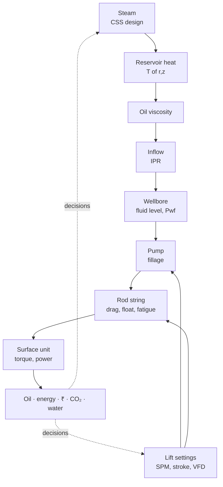
```mermaid
flowchart TB
  S[Steam<br/>CSS design] --> R[Reservoir heat<br/>T of r,z]
  R --> V[Oil viscosity]
  V --> I[Inflow<br/>IPR]
  I --> W[Wellbore<br/>fluid level, Pwf]
  W --> P[Pump<br/>fillage]
  P --> RS[Rod string<br/>drag, float, fatigue]
  RS --> SU[Surface unit<br/>torque, power]
  SU --> O[Oil · energy · ₹ · CO₂ · water]
  L[Lift settings<br/>SPM, stroke, VFD] --> P
  L --> RS
  O -. decisions .-> S
  O -. decisions .-> L
```

It forecasts where that chain is heading, searches thousands of **joint** CSS + SRP plans, rejects any plan that breaks a mechanical or thermal limit, and recommends the best remaining one. Every recommendation carries its reasoning, its uncertainty and its provenance, and gets a ledger entry that is later scored against what happened.

**One-line pitch.** *A flight simulator and autopilot for a heavy-oil well. It shows the engineer the heat they can't see, the rod stress they can't feel, and the value they lose by optimising steam and pump separately.*

**Why it wins:**

1. **You can see it.** A living 3D twin whose visuals *are* the physics: the thermal colour is the computed temperature field, particle speed is Darcy velocity, and rod colour is wave-equation stress. One key morphs it, in place, into a living engineering drawing.
2. **You can measure it.** A **Strategy Arena** races Mantle against static, heuristic, greedy, pump-off, sequential-optimal and reinforcement-learning strategies, plus an oracle upper bound, on identical simulated wells. The production-output graph and scoreboard are the evidence.
3. **It says what the PS says, as a number.** The **Coupling Dividend** is the value of optimising CSS and SRP *together* versus separately, decomposed into its parts.
4. **You can trust it.** An Ensemble Kalman Filter state estimator, P10–P90 everywhere, a deterministic Safety Gate, physics-vs-ML disagreement alarms, a hash-chained decision ledger and provenance tags on every number.
5. **It runs anywhere.** `docker compose up` brings up the whole stack, offline, on the demo laptop.

**Stack.** Next.js (App Router) + React 19 + TypeScript. React Three Fiber / Three.js for 3D, GSAP for choreography, D3/visx SVG charts. Python 3.12 managed with **uv** (a workspace of packages): FastAPI, NumPy/SciPy/Numba physics, LightGBM/PyTorch, pymoo, OR-Tools, Stable-Baselines3 for the RL contender, and our own EnKF. PostgreSQL + TimescaleDB, Redis, MinIO. Caddy as the single entry point. Everything in Docker Compose.

**How we build.** Every screen and component is first drafted as plain HTML/CSS, in several variants compared side by side, then promoted into the Next.js app. Tests exist for every layer, from physics golden values to pixel-level transition frames (§23).

**Honesty stance.** There is no public well-level Baghewala data. We use a physics-based synthetic field (*Baghewala-S*) calibrated to published anchors, keep the option to combine competitor or LLM-assisted data (§17), label every number by source, and never present simulated gains as field results.

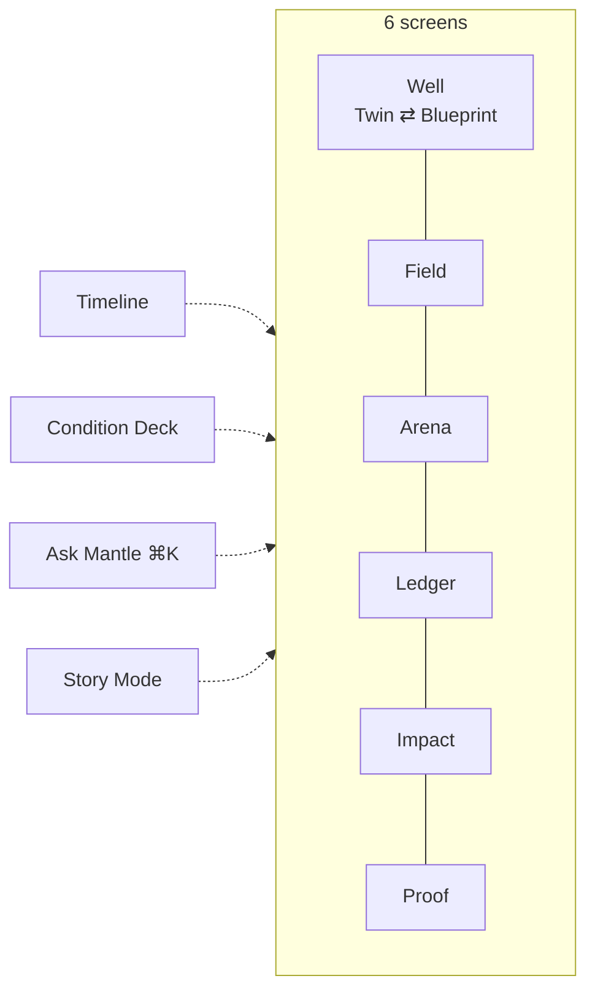
```mermaid
flowchart LR
  subgraph Screens[6 screens]
    A[Well<br/>Twin ⇄ Blueprint] --- B[Field]
    B --- C[Arena]
    C --- D[Ledger]
    D --- E[Impact]
    E --- F[Proof]
  end
  O1[Timeline] -.-> Screens
  O2[Condition Deck] -.-> Screens
  O3[Ask Mantle ⌘K] -.-> Screens
  O4[Story Mode] -.-> Screens
```

---

# 2. The problem, properly understood

## 2.1 What Oil India asked for

See §0 for the verbatim statement and §0.1 for the line-by-line mapping.

## 2.2 The physics chain, in plain words

Baghewala crude is **17–19° API** in the **Jodhpur Sandstone** at roughly **1,100–1,150 m**. Reservoir temperature is **46–48 °C**, reservoir pressure is low, asphaltene content is high, and viscosity is **roughly 10,000–13,000 cP at 50 °C** (OIL public figures). It barely moves on its own.

CSS injects steam for **about 14–21 days** (OIL), soaks the well shut-in, then produces with a **sucker rod pump**. Right after the soak the near-well zone is hot and the oil runs like thin syrup. Then the heat bleeds into the cap and base rock and leaves with the produced fluids. Viscosity climbs exponentially, and three things happen at once:

1. **Inflow falls.** Mobility k/μ drops, so the well delivers less oil.
2. **Downstroke drag rises.** The 1.1 km rod string has to fall through thickening oil. When viscous drag approaches the string's buoyant weight, the rods can't keep up with the carrier bar. That is **rod float**. Re-engagement produces **impact loading**, and that leads to fatigue and **rod failure**.
3. **The pump runs out of balance.** Fillage drops (fluid pound), friction rises, and the insert pump can be pulled off its seat (**pump unsetting**).

The operator's levers are the **steam design** (how much, how hot and wet, how fast, how long to soak, when to stop producing and re-steam) and the **lift settings** (SPM, stroke length, VFD profile, plunger size). Today the two are tuned separately and reactively. **But the steam decision sets the viscosity path, and the viscosity path sets the safe pumping envelope.** They are one decision. That coupling is the whole problem, and Mantle is built around it.

## 2.3 The one idea everything hangs on

> **A heavy-oil CSS well is a thermal battery attached to a 1.1-km steel spring.** Steam charges the battery. The pump spends it. The spring breaks if you spend it too fast while it's draining.

Every screen should make one part of that sentence visible.

---

# 3. Editorial decisions: what we kept, merged, cut and reframed

The ChatGPT thread lists about 120 features, some overlapping and some weak. Our rule: **a feature survives only if it changes a decision, proves a claim, or makes the physics visible.** Decisions are final unless the team disagrees with a reason.

## 3.1 Merged (same idea, several names)

| Thread items | Merged into | Why |
|---|---|---|
| Time Machine · Digital-Twin Replay · Telemetry Replay · Counterfactual Time Machine · 180-day horizon · "what the twin believed 23 days ago" | **The Timeline** (one global scrubber: past = replay of the recorded state, now = live, future = forecast fan; "Fork" creates a counterfactual branch at any point) | Five features were one control with three regions. One scrubber that works everywhere is stronger than five pages. |
| Why? button · SHAP · Root-Cause Explorer · Causal Graph · Decision provenance | **Explain**, three depths: *Why?* chip (top 3 drivers) → *Waterfall* (SHAP + physics sensitivities) → *Causal Trace* (the causal graph lit along the active path, with provenance) | Same question ("why this number?") at three zoom levels. |
| What-If Lab · Scenario Battle · A/B Strategy · Scenario Library · Scenario Cloning · Human-vs-AI · Training Mode | the **Arena** with modes: *Scenario builder*, *Battle* (N strategies race over 30/90/180 d), *Challenge* (a human plays the well against Mantle; doubles as the training simulator) | One engine, one results view, different framings. |
| Environmental Twin · Environmental Dashboard · Energy Intelligence · Water Intelligence · Three Impact Scorecards · Social Dashboard | **Impact Ledger** (§25) | One page, three columns, consistent method and provenance. |
| Daily Ops Brief · "Optimize My Shift" · "Which 5 wells today?" · Opportunity Map | **Field Triage** (ranked worklist + auto-generated morning brief) | Same output: a prioritized list with reasons. |
| Virtual sensors · Sensor confidence · Twin health · Data quality center · CSV auditor | **Proof** screen (twin health, data quality, provenance) with virtual sensors shown inline wherever the number appears | A number's trustworthiness belongs next to the number, plus one audit page. |
| Rod-float detector · Rod failure early warning · Pump unsetting predictor · Fluid pound · Casing integrity · Anomaly genome | **Risk Stack**: six *margins* on one physics basis, plus the dynocard classifier library | Unified presentation: every risk is "distance to a limit", not a bare probability. |

## 3.2 Reframed (right idea, wrong phrasing)

| As written | Problem | Reframed as |
|---|---|---|
| "Rod-float risk: 72%" | A probability with no physical basis is untestable and reads as made up. | **Rod-float margin** = 1 − (downstroke drag + dynamic term) / buoyant rod weight, shown as a bar to zero. The ML probability is secondary ("P(float within 7 d) = 0.31 ± 0.06"). |
| "Maximize profit" | Invites the "dumb optimizer picks the dangerous plan" critique. | **Maximize risk-adjusted net value**: revenue − steam − power − water − expected failure cost − carbon cost (optional), under hard constraints. |
| "AI recommends SPM = 4.9" | A black-box point value. | **A schedule** (SPM, stroke and VFD profile over the next N days) with confidence, drivers and the binding constraint named. |
| "Autopilot mode" executes actions | Oil India will not let a student prototype touch field PLCs, and saying so costs credibility. | Modes are **Observe · Advise · Autopilot (simulation only)**. Autopilot exists in the Arena sandbox and in Story Mode to show closed-loop behavior. Field control is a stated future integration behind OIL's own control system. |
| "Estimated remaining recoverable oil" | Can't be estimated credibly without reservoir data. | **Recovery trajectory over the simulated horizon** ("the current strategy leaves ≈X bbl on the table over 180 d vs the plan"). |
| "Reservoir–lift coupling index" (vague) | Undefined. | **Coupling Dividend** (defined in §15.6): V(joint optimum) − V(sequential optimum), in ₹ and bbl per cycle. It is measurable, and it's the PS thesis in one number. |
| "Social: fake empowerment metrics" | Correctly flagged in the thread. | **Social = safety, heat-stress exposure, knowledge retention, skilling, energy security, water stewardship in the Thar.** All grounded (§25.3). |
| Model metrics like "R² 0.999" | Competitors report near-perfect R² on their own simulator. Judges will poke at that. | Report metrics **with the dataset stated** ("vs Baghewala-S simulator, held-out wells, time-ordered split"), plus a **calibration** metric (coverage of P10–P90). Never claim field accuracy. |
| "Soil" as a condition | Surface soil barely affects the physics. | The Condition Deck separates **Surface ground** (visual, sand ingress, pad) from **Formation** (drives heat and flow). See §12. |

## 3.3 Cut (or pushed to "Vision" slides only)

| Cut | Reason |
|---|---|
| Separate Spring Boot / Java backend (PetroTwin) | No value; a second language and a second calculation path. |
| Login wall with demo passwords (several competitors) | Friction in front of judges. We use a **persona switcher** (Operator · Engineer · Manager · Viewer) without passwords, and document real SSO for deployment. |
| "Live SCADA" claims | We have none. Replaced by the **Synthetic SCADA Engine** with real protocols (MQTT/OPC-UA) (§18.8). |
| Full multiphase Beggs–Brill flowline hydraulics | Baghewala is dead heavy oil with little gas. We model single-phase liquid with water-cut emulsion viscosity and a gas/steam-flash flag. Beggs–Brill is a P3 plug-in. |
| Commercial reservoir-simulator coupling (CMG STARS) | Out of scope. We state it as a calibration path. |
| Twelve-plus top-level pages (Polaris, nishanth) | Cognitive overload. We use **6 screens + overlays** (§4.2). |
| Voice assistant | Low value in a control room, and a risk in a noisy venue. |

## 3.4 Added (not in the thread, and we think they matter)

| Addition | Why it matters |
|---|---|
| **Stroke Shaper** (VFD in-stroke speed profile) | A real lever for heavy-oil rod float that most teams ignore. It lifts the SPM ceiling without steam. |
| **Solar-thermal steam as a steam-source condition** | Rajasthan has some of India's best solar resource. Solar EOR runs commercially elsewhere (e.g. Oman). It changes CO₂/bbl and time-of-day injection scheduling, which gives us a genuine environmental optimization. |
| **Asphaltene / wax deposition band along the tubing** | The PS explicitly says "high asphaltene content" and no public repo models it. We use the wellbore temperature profile with an onset-temperature assumption (flagged ASSUMED). |
| **Casing thermal-stress gauge** (σ = E·α·ΔT) | Simple, correct and dramatic: a fully constrained casing heated 200 °C would see ~500 MPa. That explains why thermal connections and VIT matter. |
| **Ensemble Kalman Filter state estimation** | The honest way to "sync the twin to the real well". It gives P10–P90 and virtual sensors for free. |
| **Field Steam Scheduler** (CP-SAT/MILP) | One competitor planned it but never built it. Steam generators are a shared, limited resource, and deciding which well gets steam when is a field-scale economic decision. |
| **Hash-chained decision ledger** | Tamper-evident audit trail. Cheap, credible and industrial. |
| **Provenance badge on every number** (MEASURED · ESTIMATED · SIMULATED · ASSUMED · PUBLIC-SOURCE) | Our honesty policy made visible. Judges read it as maturity. |
| **Safe Calibration Probe** | Proposes the small, safe setpoint change that would teach the twin the most (active learning). It makes the loop self-improving on purpose. |
| **Drawing export** | The Blueprint sheet exports as a vector A3 PDF "well card". Engineers will pin it to a wall. |
| **ISA-101 HMI and ISA-18.2 alarm practice** | Grey at rest, color only for meaning; alarm priorities and flood suppression. Credibility with an operator audience. |

## 3.5 Rev B decisions (29 Sep 2026)

| Decision | Chosen | Why | Rejected alternative |
|---|---|---|---|
| Frontend framework | **Next.js (App Router)** + React 19 + R3F | Team choice. Nested layouts let one 3D canvas persist across routes, which the transitions need. Server components give fast first paint. `output: "standalone"` gives a small Docker image. | Vite SPA (Rev A) |
| Python tooling | **uv** everywhere (workspace, lockfile, Docker, CI) | Fast, reproducible, one tool for venv + deps + scripts | pip/poetry/conda |
| Run model | **One command: `docker compose up`** | Judges, mentors and new teammates get the same stack. Offline demo. | Manual multi-terminal setup (most competitors) |
| UI build process | **HTML/CSS drafts first**, several variants each, then promoted to React | Cheap exploration, side-by-side comparison, and a pixel reference for tests | Designing directly in React |
| Screen count | **6 screens** (Well, Field, Arena, Ledger, Impact, Proof) + overlays | Clean surfaces. Detail lives in hover cards, inspect sheets and dialogs. | 7 destinations + Evidence (Rev A); 12+ pages (competitors) |
| Cycle & Lift pages | Folded into the Well screen as **inspect sheets** (click the reservoir → Reservoir sheet; click the pump → Lift sheet) | The object *is* the navigation | Separate pages |
| Evidence strategy | **Strategy Arena**: 9 strategies, identical wells, paired statistics, visual race | "What judges don't see doesn't exist" | Before/after numbers only |
| ML vs RL | **Both exist**. ML for estimation, surrogates, diagnosis and hazard. **Shielded RL (PPO)** is an Arena contender and an optional proposal generator. The primary controller is physics-based MPC. | RL is the obvious judge question. Showing it *competing* is stronger than claiming it or avoiding it. | Pure RL controller (unsafe, opaque); no RL (looks like we avoided it) |
| Data | Keep **three options open**: physics-synthetic (default), competitor-combined (licence-aware), LLM-assisted (text and scenarios, never raw physics) | Flexibility until the Phase-2 data decision | Committing now |
| On-screen text | **No paragraphs on screens.** Labels of three words or fewer, numbers with units; explanations only in hover or dialog | Visual cleanliness | Explanatory copy on the page |

---

# Part II: The product

# 4. Information architecture

## 4.1 Personas

| Persona | Question on arrival | Lands on |
|---|---|---|
| **Field operator** | "Is anything going wrong now, and what do I do?" | Well (Twin), Alerts, mobile Well Card |
| **Production engineer** | "Why is this well behaving like this, and what's the best plan?" | Well (Blueprint + sheets), Arena |
| **Asset manager** | "Where are the money, the risk and the steam across the field?" | Field, Impact |
| **Judge / mentor** | "Is it real, is it novel, does it answer the PS?" | Story Mode, Arena, Proof |

## 4.2 Six screens, four overlays

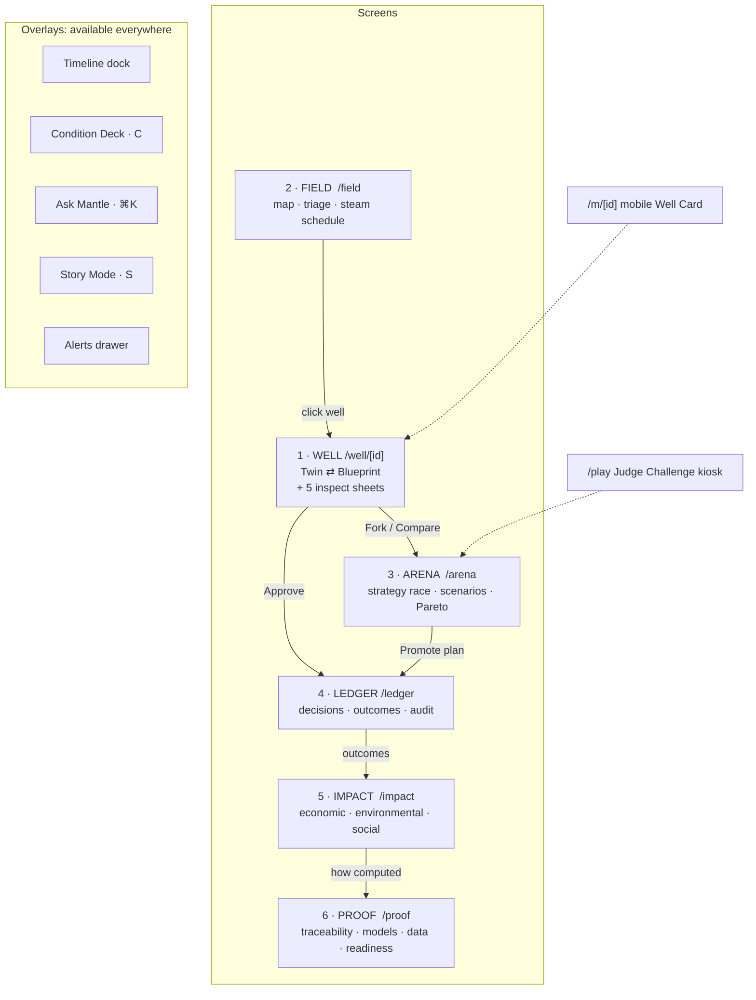
```mermaid
flowchart TB
  subgraph Screens
    W["1 · WELL  /well/[id]<br/>Twin ⇄ Blueprint<br/>+ 5 inspect sheets"]
    F["2 · FIELD  /field<br/>map · triage · steam schedule"]
    A["3 · ARENA  /arena<br/>strategy race · scenarios · Pareto"]
    L["4 · LEDGER  /ledger<br/>decisions · outcomes · audit"]
    I["5 · IMPACT  /impact<br/>economic · environmental · social"]
    P["6 · PROOF  /proof<br/>traceability · models · data · readiness"]
  end
  subgraph Overlays[Overlays: available everywhere]
    T[Timeline dock]
    C[Condition Deck · C]
    K[Ask Mantle · ⌘K]
    S[Story Mode · S]
    AL[Alerts drawer]
  end
  F -- click well --> W
  W -- Fork / Compare --> A
  W -- Approve --> L
  A -- Promote plan --> L
  L -- outcomes --> I
  I -- how computed --> P
  M["/m/[id] mobile Well Card"] -.-> W
  Q["/play Judge Challenge kiosk"] -.-> A
```

| # | Screen | Route | Skin | The one question it answers | Hero element |
|---|---|---|---|---|---|
| 1 | **Well** | `/well/[wellId]` (`?mode=twin\|blueprint`) | Glass ⇄ Paper | What is this well doing, why, and what should we do? | The 3D twin / the living drawing |
| 2 | **Field** | `/field` | Paper | Which wells need attention, and where should steam go? | Field map + ranked triage |
| 3 | **Arena** | `/arena` | Paper | Does Mantle actually beat the alternatives? | Production-output race chart |
| 4 | **Ledger** | `/ledger` | Paper | What did we decide, and was it right? | Decision timeline + predicted-vs-realised |
| 5 | **Impact** | `/impact` | Paper | What does it do for money, environment, people? | Three columns of hero numbers |
| 6 | **Proof** | `/proof` | Paper | Why should anyone believe this? | Six evidence cards, each with a button |

Also: `/m/[wellId]` (mobile Well Card), `/play` (Judge Challenge kiosk), `/present` (presenter remote). These are utility routes, not navigation.

## 4.3 Progressive disclosure: the rules that keep screens clean

1. **Default state shows only what answers the screen's one question.** At most ~7 numbers per region, and no paragraphs anywhere on a screen.
2. **Labels are three words or fewer.** Units are small and dim. Numbers use Plex Mono with tabular figures.
3. **Hover (300 ms) opens a Peek card:** a sparkline, the top three drivers and one sentence. `P` pins it.
4. **Click an object opens an Inspect sheet** (right side, 420 px, tabbed). Click a decision opens a **Focus dialog** (modal).
5. **Everything is reachable from ⌘K,** and every view has a deep link (§13.12).
6. **Empty and loading states are drawings** (blueprint lines drawing themselves), not "Loading…" text.
7. **Colour carries meaning only** (ISA-101): grey at rest; amber, orange or red only for alarms.


## 4.4 Core loop

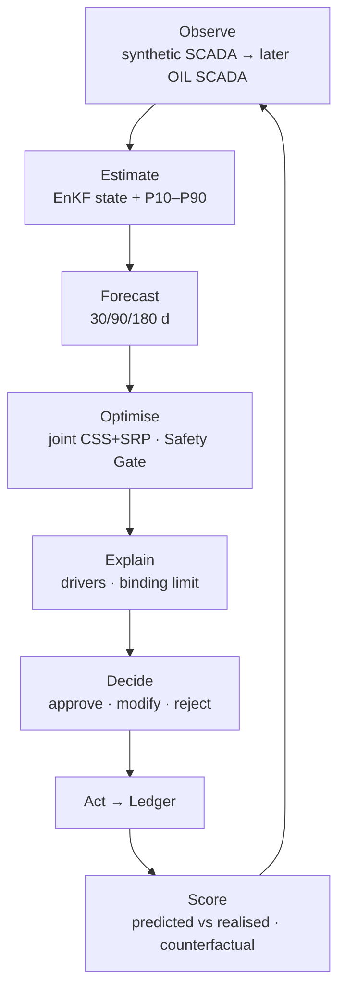
```mermaid
flowchart TB
  OBS[Observe<br/>synthetic SCADA → later OIL SCADA] --> EST[Estimate<br/>EnKF state + P10–P90]
  EST --> FC[Forecast<br/>30/90/180 d]
  FC --> OPT[Optimise<br/>joint CSS+SRP · Safety Gate]
  OPT --> EXP[Explain<br/>drivers · binding limit]
  EXP --> DEC[Decide<br/>approve · modify · reject]
  DEC --> ACT[Act → Ledger]
  ACT --> SC[Score<br/>predicted vs realised · counterfactual]
  SC --> OBS
```

## 4.5 Global context (shared by every screen)

- **Well context:** `BGW-17 · Cycle 6 · Day 41 · PRODUCTION`. Clicking it opens the well switcher.
- **Time `t`:** one shared value. Scrubbing anywhere moves everything.
- **Scenario:** `Baseline` or a named branch. A coloured ribbon shows while you are off reality.
- **Conditions:** the active Condition Deck bundle, shown as a small chip.
- **Provenance mode:** a toggle that tints every number by source (MEAS/EST/SIM/ASSUM/PUB).
- **Persona:** Operator · Engineer · Manager · Viewer. This changes defaults (e.g. Operators land on Twin, Engineers on Blueprint), never permissions in the demo.

---

# 5. Design language: Glass and Paper

One design system with two material skins, and one token file (`packages/tokens/tokens.json`) feeding both the HTML drafts and the Next.js app. Components are identical in structure and behavior. Only the tokens change (`data-skin="glass" | "paper"`). The system should feel like **one instrument maker's product**: the Glass skin is the lit console, the Paper skin is the drawing on the engineer's desk.

## 5.1 Shared foundations (both skins)

- **Type family: IBM Plex**, open licence, with engineering heritage.
  - *Plex Sans* for UI text.
  - *Plex Sans Condensed*, UPPERCASE, +6% tracking, for labels, axis titles and drafting lettering.
  - *Plex Mono* with tabular figures for **every number**, so numbers never jitter while updating.
- **Type scale:** 11 / 12 / 14 / 16 / 20 / 28 / 40 px. Metric values are 20–28 px Mono. Units are 60% size and 60% opacity (`48.2` `BOPD`).
- **Grid:** 8 px base. Paper pages also draw it on the background (§5.3).
- **Motion:** standard ease `cubic-bezier(.2,.7,.1,1)`, durations 120/240/420 ms. Numbers tween (count-up) at 240 ms. `prefers-reduced-motion` switches to cross-fades.
- **Semantic color is shared across both skins** (hue fixed, lightness tuned per skin):

| Token | Meaning | Hue |
|---|---|---|
| `thermal-*` | Temperature ramp | Perceptually uniform *inferno*-style ramp (black → purple → red → orange → pale yellow). Color-blind safe. |
| `steam` | Steam and injection | Cold cyan |
| `oil` | Crude and production | Deep amber / bitumen brown |
| `water` | Water and produced water | Blue |
| `ok · watch · high · critical` | ISA-18.2 priorities | Green · amber · orange · red. Color **only** carries meaning. |
| `twin` | Mantle plan / model | Cobalt |
| `baseline` | Historical practice | Warm grey |
| `forecast-band` | P10–P90 | Twin hue at 18% alpha |

- **Iconography:** 1.5 px stroke line icons (Lucide or Phosphor) and custom P&ID-style symbols for valves, pumps and gauges.
- **Provenance badges:** tiny caps tags after numbers, `MEAS` · `EST` · `SIM` · `ASSUM` · `PUB`. They are hidden by default, visible in Provenance mode, and always visible on the Proof screen.

## 5.2 Glass skin (Twin home only)

The 3D scene is the backdrop, and the glass panels float above it like a head-up display.

- **Panel:** fill `rgba(18,22,30,0.38)`, `backdrop-filter: blur(22px) saturate(140%)`, 1 px border `rgba(255,255,255,0.14)`, top inner highlight `inset 0 1px 0 rgba(255,255,255,0.18)`, shadow `0 12px 40px rgba(0,0,0,0.35)`, radius 16 px. Heavier panels use 0.52 fill. Text must pass WCAG AA against the *worst* background frame, so the scene-color tint under panels is limited.
- **Text:** `#F4F1EA` primary, 72% secondary. Numbers are pure white.
- **Accent:** a thin 2 px underline glow in the semantic color. No colored fills on glass except alerts.
- **Frosted edge detail:** a subtle noise texture (2% opacity) in the panel stops banding in the blur.
- **Light from the scene:** panels take a faint tint from scene lighting via a CSS variable updated at 2 Hz from the renderer's average sky color. At dusk the glass warms, at night it cools. This is a small touch that makes the UI feel physically *in* the scene.
- **Performance rule:** at most 5 blurred surfaces on screen, and nothing blurred larger than 30% of the viewport (§24).

## 5.3 Paper skin (Blueprint and every other page)

A drafting sheet, not a web page with a beige background.

- **Paper:** `#F3EEE2` base with a very low-contrast fibre noise texture and a faint vignette.
- **Grid:** minor 8 px lines `rgba(31,78,121,0.07)`, major every 40 px `rgba(31,78,121,0.14)`, drawn as SVG pattern and pixel-snapped. It behaves like engineering graph paper.
- **Inks:** graphite `#1E2A33` (primary lines and text), drafting blue `#1F4E79` (construction lines, dimensions), red pencil `#B3362C` (limits, violations, revision clouds), amber `#C98A1B` (watch), green `#3F7D4E` (ok), steam `#2F8FA8`, oil `#6B4513`.
- **Line weights (ISO 128 spirit):** 0.35 mm (visible outlines) · 0.25 mm (details) · 0.18 mm (dimension and hatch lines) · dash-dot centre lines.
- **Panels are "plates":** no shadows and no radius. 1 px graphite frame with a 4 px inner offset frame and a plate number in the corner ("PLATE 3 · DYNAMOMETER CARD"). A **title block** sits in the bottom-right of Blueprint and of every exported sheet.
- **Charts** use drafting conventions: tick marks inside the frame, condensed caps axis labels with units in brackets `LOAD [kN]`, hand-set annotations with leader lines, hatched regions for "forbidden" zones.
- **Revision clouds:** when a value changes because of a scenario or condition switch, the changed annotation gets a red scalloped cloud and a revision triangle `△2` for 3 s, then settles. This is how the paper shows change.

## 5.4 Components that exist in both skins

| Component | Glass look | Paper look |
|---|---|---|
| Metric chip | Frosted pill, big mono number, micro sparkline | Boxed value with unit, small hatch sparkline |
| Callout | Glass card with glowing leader line to a 3D anchor | Balloon (circled number) + leader + notes table |
| Tabs / segmented | Frosted pills | Index-card tabs with a folded-corner active state |
| Buttons | Glass, glow on focus | Outlined ink, "stamp" press effect |
| Timeline | Frosted dock, phase bands glowing | Ruled strip like a chart recorder, phase bands hatched |
| Alert | Glass with left color bar | Red-pencil margin note with ISA priority glyph |
| Recommendation card | Glass hero card | Engineering change notice (ECN) form layout |

---

# 6. Screen specifications

This is the build spec for every screen. Each screen lists **regions** (what's visible by default), **interactions** (hover, click, keys), **dialogs and sheets**, **data** (API and WebSocket bindings from §19), **states**, and **acceptance criteria**. Wireframes are not to scale. The HTML/CSS drafts (§21.3) turn them into real proposals.

## 6.1 The shell (every screen)

| Region | Contents | Notes |
|---|---|---|
| Top bar | Logo · screen tabs 1–6 · well context · Twin/Blueprint toggle (Well only) · Conditions chip · ⌘K · Alerts bell · `SIM` badge · persona avatar | Glass on Well/Twin, index-card tabs on Paper |
| Timeline dock | Phase bands, now marker, forecast fan, event pins, play/speed, Fork | Present on Well and Field. Collapsed to a thin strip elsewhere. |
| Overlay layer | Peek cards, inspect sheets, dialogs, command palette, toasts | One overlay manager, one focus trap |

**Keyboard map**

| Key | Action | Key | Action |
|---|---|---|---|
| `1`–`6` | Go to screen | `B` | Twin ⇄ Blueprint |
| `C` | Condition Deck | `⌘K` / `Ctrl K` | Ask Mantle / command palette |
| `Space` | Play / pause time | `←` `→` | Step (stroke / hour / day, by zoom) |
| `F` | Fork at current `t` | `L` | Cycle lens (Twin) |
| `X` | X-ray (Twin) | `P` | Pin hovered Peek |
| `S` | Story Mode | `?` | Shortcut sheet |
| `Esc` | Close top overlay | `.` | Toggle provenance tint |

## 6.2 Screen 1: Well · Twin mode


**Regions (default)**

| Region | Default content |
|---|---|
| Scene | 3D block-diagram well (§7, §8), current lens, ≤ 7 anchored callouts (§9) |
| Recommendation card | Verb-first action title ("Slow the downstroke"), the setting change, 3 deltas (oil, float risk, energy), confidence, **Approve · Modify · Why?** |
| Risk margins | 6 bars: float, pound, unsetting, fatigue, casing thermal, deposition |
| Forecast | Oil rate now → +30 d, P10–P90 fan, red dashed "do nothing" ghost |
| Economy strip | ₹/day · SOR · kWh/bbl · kg CO₂/bbl |
| Coupling Dividend + **Thermal Battery** | ₹/cycle chip; battery icon = remaining useful reservoir heat (% and days) |
| Lens switcher | Physical · Thermal · Mech · Flow · Pressure · Risk |

**Interactions**

| Target | Hover (Peek) | Click |
|---|---|---|
| Any 3D part | Outline glow + name + 2 numbers | Opens that part's **Inspect sheet** (§6.4) |
| Callout | Peek: 24 h sparkline + drivers | Opens the part's sheet on the relevant tab |
| Risk bar | Peek: margin trend, time-to-limit, top drivers | **Explain dialog** (Why? → waterfall → causal trace) |
| Forecast | Peek: horizon switch 7/30/90/180 d | Timeline jumps to forecast |
| Recommendation deltas | Peek: P10–P90 for each delta | — |
| Approve | — | Confirm toast; ledger entry; the card flips to "Applied (sim)" |
| Modify | — | **Modify dialog**: editable settings; live re-simulation of margins; approve/cancel |
| Why? | — | Explain dialog on the recommendation |
| Coupling Dividend | Peek: decomposition mini-waterfall | Goes to Arena, pre-filtered to this well |
| Thermal Battery | Peek: heat in, lost, used; days to cut-off | Reservoir sheet → Heat tab |

**Data:** `GET /wells/{id}/state?t=`, `GET /wells/{id}/forecast`, `GET /wells/{id}/thermal-field?t=`, `GET /recommendations?well_id=&status=open`, `WS /ws/wells/{id}` (state @2 Hz, cards per stroke, alarms).

**States:** *loading*: the intro sequence (§13.12) plays until the GLB and state are ready. *stale* (no data > 30 s sim): a grey "STALE" badge on callouts. *sensor-excluded*: the affected callout shows `EST` and a dotted leader. *infeasible plan*: the Recommendation card shows "No safe plan: binding: rod float @ 900 m" in red pencil.

**Acceptance:** 60 fps on the demo laptop · ≤ 7 callouts · every number shows its provenance in Provenance mode · every interaction is reachable by keyboard.

## 6.3 Screen 1: Well · Blueprint mode


**Regions:** Plate 1 elevation & section (balloons ①–⑮) · 4 depth tracks (T, P, μ, σ_rod) · Plate 2 dynamometer card · Plate 3 safe-SPM envelope · Plate 4 IPR × pump · Plate 5 Walther chart · Plate 6 Goodman · title block · (BOM and notes open in a sheet so the default view stays clean).

**Interactions:** hover a depth track → a crosshair across all tracks with a readout. Hover a balloon → part highlight + BOM row peek. Click a plate → it expands to full-sheet **Plate focus** (with export). Drag the timeline → revision clouds on changed annotations. `E` → export sheet (A3 vector PDF/SVG).

**Data:** `GET /wells/{id}/profile?t=` (depth tracks), `GET /wells/{id}/cards?t=&n=`, `GET /wells/{id}/envelope`, `GET /wells/{id}/ipr?t=`, `GET /wells/{id}/bom`.

**Acceptance:** vector-crisp at 200% zoom · the line-art pumping unit animates at SPM · plates match Twin numbers exactly at the same `t` (tested, §23).

## 6.4 Inspect sheets (inside the Well screen)

Clicking a part opens its sheet. **This is where the Rev A "Cycle" and "Lift" pages now live.**

| Sheet (opened by clicking…) | Tabs | Contents |
|---|---|---|
| **Surface unit** (beam, crank, motor, VFD) | Overview · Stroke Shaper · Energy | SPM, stroke, kd, torque % rating, polished-rod HP, motor kW; the Stroke Shaper polar speed diagram with an editable kd (what-if); energy per stroke |
| **Wellhead & steam** (wellhead, steam line) | Injection · Heat balance · Casing | Steam rate, pressure, quality (surface vs sandface); heat-balance Sankey; casing thermal-stress gauge; injection plan editor (volume ↔ rate ↔ duration locked) |
| **Wellbore** (tubing, casing, annulus) | Profiles · Deposition · Fluid level | Temperature/pressure/viscosity vs depth; asphaltene/wax band; fluid level and submergence history |
| **Pump & rods** (rods, pump) = *Lift sheet* | Card · Rod string · Risks · Schedule · Maintenance | Live surface/downhole cards + diagnosis; per-section stress/Goodman; the 6 margins with time-to-limit; the 14-day SPM/kd/stroke schedule; maintenance forecast + "delay it?" what-if |
| **Reservoir** (heated zone, rock) = *Reservoir sheet* | Heat · Cycle · Cut-off · History | Heated radius and mean T with bands; Thermal Battery; steam design editor; marginal steam curve (Δoil per +100 t); cut-off/re-steam window with cost-of-waiting; cycle history and degradation per cycle |

Every sheet footer shows: `Compare in Arena` · `Fork here` · `Ask about this`.

## 6.5 Screen 2: Field


| Region | Default | Hover | Click |
|---|---|---|---|
| Field map (cream cartographic) | Pads, wells as risk-coloured dots; thermal-battery ring; steam header and generators | Well Peek card (oil, float margin, cut-off in, opportunity) | Opens Well screen |
| Triage list | Top 5 wells ranked by value at risk: number, well, one-line reason, ₹ | Peek: the evidence behind the reason | Opens Well at the relevant sheet |
| Generators strip | Next 30 d of injection slots per generator | Slot Peek: well, tonnes, window | **Steam Scheduler dialog** (Gantt, drag to override, re-solve, shadow price of an extra generator-day, what-if generator down) |
| KPI footer | Field BOPD · SOR · kWh/bbl · CO₂/bbl · health counts | — | — |

**More in dialogs:** *Fleet table* (all 30 wells, sortable, `T`) · *Morning Brief* (generated 06:00 sim-time; print) · *Similarity* ("BGW-12 is tracking BGW-04's pre-failure path"; trajectory overlay) · *Field time-lapse* (the map "breathes" as wells heat and cool across a year).

**Data:** `GET /field/summary`, `GET /field/triage`, `GET /field/map`, `GET /field/steam-schedule`, `POST /field/steam-schedule/solve`, `GET /wells/{id}/similar`.

## 6.6 Screen 3: Arena (the evidence screen)


| Region | Default |
|---|---|
| **Production output** (hero) | Oil rate vs day over 3 CSS cycles for all strategies (mean, with seed bands on hover). Mantle is bold cobalt, the oracle a dotted grey ceiling, static grey. Failure events are marked. |
| Scoreboard | Δ vs Static with 95% CI: oil, net ₹, SOR, failures, % of oracle. Mantle row highlighted. |
| Coupling Dividend decomposition | CSS-side · SRP-side · Interaction · Stroke Shaper |
| Cumulative race | Animated bar race of cumulative oil (plays on `▶`) |
| Value vs risk | Each dot = well × seed × strategy |
| Ablation | What each Mantle component buys; the variant without the Safety Gate is marked disqualified for violations |
| Run bar | Wells · seeds · horizon · condition preset · **Run Arena** · Scenario builder · Pareto · Challenge |

**Dialogs:** *Scenario builder* (sandbox levers and conditions, saved scenarios, clone) · *Pareto explorer* (oil × SOR × energy × risk; brush a region → the optimiser returns the plan) · *Battle replay* (split-screen twins of any two strategies, synchronised) · *Strategy card* (definition, parameters, code link, tuning budget) · *Judge Challenge* (launch `/play`; shows the leaderboard).

**Data:** `GET /arena/strategies`, `POST /arena/runs` (job), `GET /arena/runs/{id}` + `WS /ws/jobs/{id}`, `GET /arena/runs/{id}/series?metric=oil_rate`, `GET /arena/runs/{id}/scoreboard`, `POST /scenarios`, `POST /optimize/pareto`.

**Acceptance:** the pre-computed "official" run loads in < 1 s. A live mini-run (3 wells × 3 seeds × 1 cycle) finishes in < 30 s with visible progress. Every number links to `bench/` artefacts.

## 6.7 Screen 4: Ledger


| Region | Default | Click |
|---|---|---|
| Decision timeline | Cards: id, action (≤ 6 words), status stamp, short hash | Selects the decision |
| ECN (engineering change notice) | Well/time, action, binding limit, model versions, approver, reason; **predicted vs realised** chart with counterfactual; score | `Show provenance trace` dialog; `Replay in Twin` |
| Calibration | Predicted vs realised scatter; P10–P90 coverage | Calibration dialog by model |
| Overrides | Regimes where engineers disagree with the model | Override analytics dialog |
| Chain seal | "CHAIN VERIFIED" stamp | Re-verify (`GET /ledger/verify`) |

**Data:** `GET /decisions`, `GET /decisions/{id}`, `GET /decisions/{id}/trace`, `GET /decisions/{id}/outcome`, `GET /ledger/verify`, `GET /analytics/overrides`, `GET /analytics/calibration`.

## 6.8 Screen 5: Impact


Three columns (Economic · Environmental · Social), four hero numbers each (value, ± band, `SIM`), and a cumulative chart vs baselines. The scope toggle is *Field (30 sim wells)* · *Per well* · *Illustrative × 33 wells*, and the baseline toggle is *Static* · *Pump-off* · *Sequential*.

**Dialogs:** *How computed* per number (formula, inputs, source links) · **Cycle receipt** (printable receipt: steam, fuel, water, power, oil, CO₂e, saved vs baseline) · *Social evidence* (heat-stress-weighted site visits avoided; high-risk hours).

**Data:** `GET /impact/summary?scope=&baseline=`, `GET /impact/series`, `GET /impact/receipt?well_id=&cycle=`.

## 6.9 Screen 6: Proof


Six cards, each with one action button (judge-facing):

| Card | Default | Button |
|---|---|---|
| SIH26120 traceability | Each PS line with a check | `↗ demo` jumps to the proving view via deep link |
| Model cards | Model, headline metric, dataset tag | Opens the full model card |
| Data provenance | Donut: SIM / EST / ASSUM / PUB / MEAS share | Opens source registry |
| Assumption registry | Top assumptions with "replace with…" | Full registry |
| Real-data readiness | SCADA → MQTT/OPC-UA → adapter → auditor → twin; FIELD MODE locked | **Import CSV live** (auditor runs in front of judges) |
| Twin health | Rings: sensors, calibration, freshness, in-distribution, physics≈ML | Health detail |

Footer actions: `Import CSV live` · `Verify ledger` · `Run golden scenarios` · `Open sources`.

**Data:** `GET /evidence/traceability`, `GET /evidence/models`, `GET /evidence/provenance/summary`, `GET /evidence/assumptions`, `POST /data/imports`, `GET /data/imports/{id}/report`, `GET /twin/health`.

## 6.10 Overlays

| Overlay | Trigger | Contents |
|---|---|---|
| **Timeline dock** | Always (Well, Field) | Phase bands; past = replayed estimate; future = P50 with P10–P90 fan; pins (events, decisions); speed 0.25×–500×; horizons 24 h–180 d; Fork |
| **Condition Deck** | `C` | 5 card columns (Formation, Crude, Climate & time, Completion & lift, Steam source) + Faults + Presets. Apply = 1.2 s scene cross-fade + revision clouds. |
| **Ask Mantle** | `⌘K` | Command palette + copilot answers (verified numbers, sources, "Show me") |
| **Alerts drawer** | Bell | ISA-18.2 priorities P1–P4; ack / shelve / open; flood grouping |
| **Story Mode** | `S` | Scripted demo beats, presenter notes on a second screen or phone (`/present`), deterministic seed |
| **Settings** | Avatar | Quality (auto/high/low), units (SI / field), sound, reduced motion, persona |

## 6.11 Utility routes

| Route | Purpose |
|---|---|
| `/m/[wellId]` | **Mobile Well Card**: installable PWA; float-margin ring, rate, SPM, last decision, Acknowledge. Reached by QR at the (virtual) wellhead. |
| `/present` | **Presenter remote**: phone as clicker for Story Mode (next/prev beat, notes, timer), paired by QR, over WebSocket |
| `/play` | **Judge Challenge kiosk**: 60-second game, operate BGW-17 for 60 sim-days with two sliders (SPM, re-steam day) vs Mantle; leaderboard |

## 6.12 Screen state rules (all screens)

| State | Treatment |
|---|---|
| Loading | Blueprint line-drawing skeleton (strokes draw on), never spinners |
| Empty | A small drawing plus a 3-word label ("No decisions yet") |
| Error | Red-pencil margin note with retry; details in a dialog |
| Offline / no LLM | `LOCAL` badge; copilot switches to templated answers |
| Stale | Grey `STALE` badge on affected numbers |
| Off-reality (scenario) | Coloured ribbon + scenario name in the top bar |

---

# 7. Twin behaviour (3D scene)

## 7.1 Layout

The Twin screen's layout, regions and interactions are specified in §6.2. This section covers how the 3D scene behaves.

## 7.2 Camera and interaction

- **Default pose:** three-quarter view from slightly above, looking at the wellhead, with the whole block diagram framed. There is a slow idle drift (±3° azimuth over 40 s) so the scene always feels alive.
- **Orbit** with constraints (no going under the slab bottom, no clipping inside rock). **Zoom** to the wellhead, pumping unit or reservoir via **snap points**, with double-click on a part to fly to it.
- **Dive (scroll while hovering the wellbore):** the camera descends along the well axis. Callouts change with depth: surface → fluid level → pump → perforations → heated zone. A depth gauge on the left edge shows true MD/TVD.
- **Hover a part:** outline glow, tooltip with name and 2 key numbers. **Click:** the right stack switches to that part's panel (e.g. Rod String: taper table, stress at depth, fatigue).
- **X-ray toggle (`X`):** casing and tubing go translucent so the rods, pump and fluid become visible.
- **Split view (Scenario compare):** the canvas splits vertically into two synchronized twins (Baseline | Plan) with linked cameras and a divider you can drag. This is a signature demo moment.

## 7.3 Lenses (one model, six analytical tools)

| Lens | What changes in the scene | Data source |
|---|---|---|
| **Physical** (default) | Photoreal PBR materials | none |
| **Thermal** | Cut faces and reservoir volume show the computed **T(r,z)** field. Tubing is colored by the fluid temperature profile (Ramey). Steam lines glow. Everything else goes grey. | Thermal engine grid |
| **Mechanical** | Rod string colored by axial stress per section (tension warm, compression cold). **Stress waves travel down the string** (from the Gibbs solver) in slow-motion. Gearbox torque shown as a radial gauge ring on the crank. | Wave-equation solver |
| **Flow** | GPU particles for oil (amber) and water (blue) moving through the formation toward the perforations, **speed ∝ computed Darcy velocity**. When the reservoir cools, the particles visibly crawl. Fluid rises in the tubing in pulses at SPM. | Inflow + pump model |
| **Pressure** | Pressure field on the cut faces (reservoir → Pwf → pump intake) and the fluid level in the annulus as a bright meniscus plane. | Wellbore hydraulics |
| **Risk** | Scene desaturated. Risk "hot spots" pulse where margins are low: rod string sections near float, the pump (fillage/unsetting), the casing (thermal stress), the tubing band where asphaltene deposition is likely. | Risk Stack |

## 7.4 Phase-dependent behavior (the scene tells the CSS story)

| Phase | Scene behavior |
|---|---|
| **Injection** | Pumping unit parked (horsehead at top, brake on). Rods are pulled or hung off, per the completion option. White steam particles stream down the VIT. A steam plume vents at the generator skid off-pad. The heated zone *grows* visibly (Marx–Langenheim radius). Callouts: steam rate, wellhead pressure, steam quality at surface vs sandface, casing thermal stress. |
| **Soak** | Everything still. Wellhead shut-in valve closed (red handle). The heated zone *diffuses*: the edge softens and the core cools slightly. A soak timer and the "optimal production start" countdown appear on the wellhead. |
| **Production** | Pump runs at SPM with the Stroke Shaper profile. Oil particles flow in. The fluid level oscillates. The heated zone slowly shrinks and cools; its color drifts from yellow to red to purple across the cycle. |
| **Decline / cut-off** | The same as production, but the Risk lens auto-suggests itself when margins shrink. When the marginal value theorem trigger fires, a subtle red "CUT-OFF WINDOW" ring appears on the timeline and a ghosted steam line lights up to foreshadow the next cycle. |

## 7.5 Surface environment (driven by the Condition Deck)

Sky, sun angle, ambient light, wind, dust and heat haze all respond to the selected climate and time of day (§12.4). The default demo condition is **"Thar · late-October dusk"**, which gives the best glass contrast and the most beautiful light.

---

# 8. 3D asset brief (hand-off document)

> **For the 3D modeling and animation agent.** This section is self-contained. Build a physically plausible, *schematic-realistic* Baghewala heavy-oil CSS well as a geological block diagram. Everything that moves will be driven procedurally by our physics engine at runtime. You build the rig, the pivots, the materials and the anchors, **not baked animations** (except where noted). Target: glTF 2.0 (`.glb`), Three.js / React Three Fiber, WebGL2 with a WebGPU-ready path.

## 8.1 Overall concept

- A **floating geological block diagram**: a rectangular slab of earth about **60 m × 40 m in plan**, with the top face being desert terrain and the front and right faces cut to reveal the strata. The well descends through the cut corner so the full wellbore is visible on the cut faces (a quarter-section cutaway around the well axis).
- **Depth handling.** Real depth is ~1,150 m and the surface equipment is ~10 m, so use a **piecewise depth scale** with drafting-style **break bands**:
  - **Zone A, surface to 30 m:** true scale 1:1.
  - **Zone B, 30 m to 1,050 m:** compressed about 25:1. Two **"depth break" ribbons** (a thin gap with a zig-zag/sine edge, like the break symbol on an engineering drawing) cross the slab. Strata continue across them.
  - **Zone C, 1,050 m to 1,200 m (cap rock, reservoir, base):** about 1:3. The reservoir zone is the visual climax at the bottom.
  - The final slab's visual height is ~55 m. Provide the **mapping function** (true depth → model Y) as a JSON table in the export so the frontend places depth-driven elements correctly.
- **Style target:** *photoreal materials, illustrative composition*. Think of a high-end museum cutaway or a Nat Geo infographic. Clean bevels, believable wear, no noise for its own sake. Rock faces read as real sandstone, carbonate and shale, but with crisp, slightly idealized bedding lines, like a textbook plate.

## 8.2 Surface: pad and environment

- **Terrain top:** Thar desert sand with low aeolian ripples (displacement plus normal map), sparse dry scrub (khejri-like thorny shrubs, 3–5 instances, low poly with alpha cards), a few pebbles. Sand color warm ochre `#C9A46A` to `#E0C28E`.
- **Well pad:** a compacted gravel/caliche rectangle, ~20 m × 16 m, slightly raised, with a darker oil-stained patch near the wellhead. There is a concrete plinth under the pumping unit.
- **Perimeter:** a low chain-link fence on 2 sides only (so it doesn't block the camera), a gate, and a small hazard signboard *with generic text* (no real company logos or branding).
- **Instrumentation pole:** an RTU cabinet on a pole with a small solar panel, an antenna and a status LED (emissive, driven by alarm state).
- **Steam line:** an insulated steam line (aluminium-clad lagging with visible band clamps) enters from the slab edge on pipe sleepers, through an isolation valve (handwheel), to the thermal wellhead. The **off-slab steam generator** is implied: the line exits the slab edge with a clean cap.
- **Production flowline:** an insulated flowline leaves the wellhead to the opposite slab edge. Include a check valve and a pressure gauge.
- **VFD cabinet:** a weatherproof enclosure near the motor with cable tray, a small HMI window (emissive screen that we texture at runtime) and a sunshade canopy.
- **Lighting fixtures:** 1 pole light (emissive at night).

## 8.3 Pumping unit: conventional beam unit (primary asset)

Build an API-style **conventional crank-balanced beam pumping unit**, roughly a 320-size unit (overall ~9–10 m tall, ~12 m long). **Every moving part is a separate node with its pivot at the true joint.**

- **Base / skid:** a steel I-beam skid bolted to the plinth.
- **Samson post:** an A-frame tripod (3 legs, cross bracing, ladder with safety cage on one leg, a small platform at the saddle bearing).
- **Walking beam:** a box/I-beam with a stiffener pattern. The pivot is the **saddle bearing** on top of the Samson post.
- **Horsehead:** a curved arc front with a wire-rope groove. It should be a separate node so it can swing for workover (optional).
- **Bridle (wireline hanger):** two steel wire ropes from the horsehead arc to the **carrier bar**. Rig as a **2-bone chain or spline** so it can go **slack** (rod float state). Provide a blend shape `bridle_slack` with 0–1 sag.
- **Carrier bar, polished rod clamp, polished rod:** a chrome polished rod (high metalness, low roughness) passing down into the **stuffing box** on the wellhead.
- **Equalizer and tail bearing:** at the rear of the beam.
- **Pitman arms (×2):** connect the equalizer to the crank pins.
- **Cranks (×2) with counterweights:** crank arms with 2–4 bolted counterweight blocks each. The crank pivot is the gearbox output shaft.
- **Gear reducer:** a cast gearbox housing with an oil sight glass and a breather.
- **Prime mover:** an electric induction motor on sliding rails, a **V-belt drive** with a perforated belt guard (the pulleys inside are visible through the perforations), and a brake lever and drum.
- **Paint:** industrial safety yellow with a dark grey structure (or oxide red, as a variant). The **counterweights** have black and yellow hazard stripes. Edges get subtle wear (edge-mask metal showing through), dust accumulation on upper surfaces, and a hint of oil streaking down the wellhead.
- **Kinematics requirement:** we solve the **four-bar linkage** (crank → pitman → beam → horsehead) at runtime. Provide exact pivot locations as **named empties** (`PIV_crank`, `PIV_crankpin_L/R`, `PIV_equalizer`, `PIV_saddle`, `PIV_horsehead_arc_center`) and link lengths in metadata. Do **not** bake the motion.

## 8.4 Pumping unit: hydraulic long-stroke variant (secondary asset)

OIL operates both conventional and hydraulic SRP units, so build a **hydraulic long-stroke unit** as a swap-in variant:

- A vertical tower (~11 m) with a hydraulic cylinder, a cable-over-sheave or direct-acting rod, a hydraulic power pack skid (tank, pump, motor, accumulator) and hoses.
- It uses the same wellhead interface and a named anchor for the polished rod.
- Moving nodes: the cylinder rod and the sheave, with a linear pivot.

## 8.5 Wellhead (thermal)

- A **thermal wellhead** (rated for steam, "320 °C class" in look): tubing head, casing head, master valve, wing valves (one to the steam line, one to the flowline), a tee with the **stuffing box** on top, a pressure gauge (dial face as a runtime texture), a temperature transmitter, and a sample point.
- Valve handwheels are separate nodes with rotation pivots (open/close animation during phase changes).
- Insulation jackets on the upper wellhead body (quilted blanket look).

## 8.6 Subsurface: the cut block

- **Strata (top to bottom, schematic and indicative for the Bikaner–Nagaur basin; label as schematic):**
  1. Aeolian sand / alluvium (loose, warm ochre)
  2. Tertiary sediments (variegated clays/siltstones)
  3. Nagaur Group, red-brown sandstone/siltstone
  4. Bilara Group carbonates/evaporites (grey dolomite with white anhydrite/halite streaks). This is the **cap rock** and it gets a subtle crystalline sparkle in the normal map.
  5. Upper carbonate interval (thin, darker, oil-stained patches). This is the variant heavy-oil zone for the Condition Deck.
  6. **Jodhpur Sandstone (reservoir):** buff-to-pinkish cross-bedded sandstone. Visible cross-bedding lines. **Oil-stained** darker brown saturation pattern in the pay interval.
  7. Basement below (dark, crystalline).
- Each stratum is a **separate mesh** (`STRAT_01_aeolian` … `STRAT_07_basement`) with **world-space triplanar PBR materials** (no UV stretching on cut faces) and **a thin bright edge line** along the bedding contacts (the "textbook" feel).
- **Cut faces** have a very slight emissive lift so the section reads even at night.
- Depth tick marks are **embossed on the front cut edge** every 100 m (true depth) and are also exported as anchors (`DEPTH_0100` … `DEPTH_1200`).

## 8.7 Wellbore and completion (section view)

Build the wellbore as **concentric tubulars in quarter-section**, so the cut plane shows the layers:

- **Conductor** (short, large, cemented), **surface casing** to ~Zone B top, **production casing** to the reservoir base with a **thermal-grade look** (premium connection collars every ~12 m true, shown as slightly thicker rings, fewer in the compressed zone).
- **Cement sheath** between casing and formation: light grey, with a granular normal map.
- **Vacuum-insulated tubing (VIT):** inner and outer walls with a visible gap (the vacuum annulus) at the cut. Joints every ~12 m. A **bare-tubing variant** is needed as a Condition Deck swap.
- **Tubing anchor / catcher** above the pump.
- **Rod string:** sucker rods of **3 taper sections** (e.g. 1″, ⅞″, ¾″) plus **sinker bars** at the bottom. Rod couplings are visible as bulges. **Rod guides / centralizers** are molded polymer, every few rods, off-white. The string is **segmented into 24 nodes** (`ROD_SEG_01` … `ROD_SEG_24`, each with a pivot at its top) so we can drive per-segment displacement (stretch and wave) and per-segment stress color.
- **Downhole insert pump (x-ray-ready):** a **barrel** (transparent-able), **plunger** (chrome) with the **traveling valve** (ball and seat) at its bottom, the **standing valve** (ball and seat) at the barrel bottom, and the **seating nipple / hold-down** (a mechanical cup-type look).
  - Valve balls are separate nodes (they lift ~5 mm, exaggerated ×3, when open).
  - A **fluid-fill mesh** inside the barrel with a morph target `fill_level` 0–1 (we drive fillage).
  - A **gas/steam pocket** mesh above the fluid (`barrel_gas`) for interference states.
- **Perforations:** a helical shot pattern in the casing across the pay. Each perforation tunnel is a small cone into the formation with a darker "flow mouth" decal.
- **Annulus fluid:** a mesh from the pump intake up to the **dynamic fluid level**, with a separate top-surface node `FLUID_LEVEL_SURFACE` (a flat ring with a meniscus shader) that we move in Y.
- **Tubing fluid:** inner column mesh with a vertex-color gradient we update (temperature/viscosity along depth).

## 8.8 Reservoir visuals (the hero)

- **Heated zone:** an **axisymmetric volume** around the perforations. Deliver it as:
  1. a set of **8 nested shells** (`HEAT_SHELL_1..8`, radial iso-surfaces at normalized radii 0.125 … 1.0, smooth, low poly, with edge-fade alpha), and
  2. a **disc slice** on each cut face (`HEAT_SLICE_FRONT`, `HEAT_SLICE_SIDE`) that we shade with a data texture.
  At runtime we scale the shells and write T(r,z) into a 256×64 float texture. The shader maps it to the thermal ramp on the cut faces and gives the shells a soft volumetric glow.
- **Steam chamber (injection phase):** a translucent, slightly turbulent volume near the perforations (a raymarched noise volume or layered soft particles) that grows with injected heat.
- **Oil flow particles:** no mesh needed. Provide **8 spline "streamline" guides** converging radially on the perforations along the pay (`FLOW_GUIDE_01..08`). We spawn GPU particles along them.
- **Cap-rock and base heat loss:** thin glowing gradients at the reservoir top and bottom contacts (so heat loss to the over- and underburden is visible), driven by a uniform.

## 8.9 Environment, sky and atmosphere

- **Sky:** a physically based sky (Preetham/Hosek or an HDRI set) with **4 lighting presets as HDRIs** (CC0 sources such as Poly Haven are fine): *Desert noon*, *Golden hour / dusk (default)*, *Night (clear, stars)*, *Overcast / dust haze*. Sun direction is exposed as a runtime parameter.
- **Ground fog / dust layer:** a height-fog volume, parameterized (for sandstorm).
- **Heat haze:** a screen-space distortion mask over hot pipes (the steam line and wellhead during injection). Provide a `HAZE_EMITTERS` group of simple proxy meshes.
- **Steam vents:** 2 emitter locations (steam generator edge, wellhead vent) as empties `FX_STEAM_*`.
- **Sandstorm:** emitters along the windward slab edge (`FX_SAND_*`).
- **Night:** emissive windows on the VFD HMI, the pole light, the RTU LED and the beacon on top of the Samson post (red aviation-style blink).

## 8.10 States and animation (what moves and how we drive it)

All motion is **procedural and driven by runtime parameters**. You provide rigs, pivots, morphs and material hooks. Bake only the idle micro-motions listed.

| Element | Driven by | Required from asset |
|---|---|---|
| Crank, pitman, beam, horsehead | Crank angle θ(t) from SPM + Stroke Shaper profile; four-bar solver | Pivots, link lengths |
| Polished rod, carrier bar | Horsehead arc kinematics | Named nodes |
| Bridle slack | Rod-float state (0–1) | `bridle_slack` morph / 2-bone rig |
| Rod segments | Per-segment displacement u(z,t) and stress σ(z,t) from the wave equation | 24 segment nodes, a vertex attribute for stress color |
| Plunger, valve balls | Pump kinematics, valve open/close logic | Nodes with local Y translation |
| Barrel fluid | Fillage per stroke | `fill_level` morph |
| Gas pocket | Interference state | `barrel_gas` scale |
| Annulus fluid level | Fluid level (m) → model Y | `FLUID_LEVEL_SURFACE` |
| Heated-zone shells and slices | T(r,z) field, r_h(t) | Shell meshes, slice meshes with UVs in (r,z) |
| Valve handwheels | Phase changes | Rotation pivots |
| Beacon, LEDs, HMI screens | Alarm state, time of day | Emissive materials with named slots |
| **Baked idle only** | Scrub sway (±2°, 6 s loop), fence flag flutter, RTU antenna micro-sway | Small baked clips |

**Special states we must be able to show (verify the rig supports them):**

1. **Normal pumping** at 2–9 SPM.
2. **Rod float:** the carrier bar separates from the polished rod clamp by a visible gap, the bridle sags, then a snap-back. We add a white impact flash and a shockwave ring on the rod string.
3. **Fluid pound:** the plunger hits the fluid surface mid-downstroke. We add a ripple and a load spike.
4. **Gas/steam interference:** a gas pocket in the barrel compresses on the downstroke.
5. **Pump unsetting:** the whole pump assembly lifts ~0.3 m (exaggerated) off the seating nipple. Needs a pump-assembly parent node.
6. **Parted rod:** a separation between two segments. The lower part drops.
7. **Injection:** the unit is parked and the steam flow is on.
8. **Soak:** everything is still and the wellhead is shut-in.
9. **Workover (optional, vision):** the horsehead is swung back.

## 8.11 Anchors for labels and callouts

Provide **empties** (zero-size nodes) at the exact point where a leader line should touch. Name them exactly as follows, since the frontend binds metrics by these names:

```
ANCHOR_horsehead        ANCHOR_polished_rod      ANCHOR_crank
ANCHOR_gearbox          ANCHOR_motor             ANCHOR_vfd
ANCHOR_wellhead         ANCHOR_steam_inlet       ANCHOR_flowline
ANCHOR_casing_upper     ANCHOR_fluid_level (moves with FLUID_LEVEL_SURFACE)
ANCHOR_rod_mid          ANCHOR_rod_bottom        ANCHOR_tubing_mid
ANCHOR_pump             ANCHOR_standing_valve    ANCHOR_perforations
ANCHOR_heated_zone      ANCHOR_caprock           ANCHOR_reservoir_far
```

## 8.12 Line-art layer (required for the Blueprint transition)

The 2D Blueprint is drawn from **the same model**, so the asset must also contain **clean drafting geometry**:

- A collection `LINE_*`: **hand-curated polylines** (not auto-generated from every triangle edge) that describe each part's **side-elevation outline** as seen from the +X axis (the Blueprint camera looks down −X). Include silhouettes, key internal edges (beam web, crank circle, counterweight outlines), **centre lines** (flagged `centre=true`) and **hidden lines** (flagged `hidden=true`).
- **Section hatching regions** (`HATCH_*`) as closed planar polygons on the cut plane for each stratum, cement and steel section, with a `hatch` custom property naming the ISO-style pattern (`sandstone_dots`, `limestone_brick`, `shale_dashes`, `steel_45`, `cement_stipple`, `evaporite_cross`).
- The line collection is parented to the same moving nodes, so the line-art pumping unit **animates identically**.
- **Custom properties** on line nodes: `weight` (thick/medium/thin), `layer` (outline/detail/centre/hidden/dimension).

## 8.13 Materials and textures

- **PBR metallic-roughness.** Textures at 2K max (1K for small parts), **KTX2 / Basis-compressed**. Use texture atlases where sensible. Rock uses **triplanar** shaders (we can do this in code; supply tileable albedo, normal and roughness sets per stratum).
- **Material list (named, so we can override per lens):** `M_paint_yellow`, `M_paint_grey`, `M_steel_bare`, `M_chrome`, `M_wire_rope`, `M_rubber_belt`, `M_concrete`, `M_gravel`, `M_sand`, `M_insulation_alu`, `M_insulation_blanket`, `M_cement`, `M_tubular_steel`, `M_VIT_outer`, `M_rod_steel`, `M_rod_guide_poly`, `M_pump_barrel` (supports transmission), `M_fluid_oil`, `M_fluid_water`, `M_strat_01..07`, `M_glass_hmi`, `M_emissive_led`.
- **Oil:** near-black brown with a strong specular and thin-film edge sheen. When heated, the shader lightens toward amber (we drive `u_temperature`).

## 8.14 Budgets and delivery

- **Triangles:** ≤ 350k total in the hero LOD. Pumping unit ≤ 90k, wellhead ≤ 25k, rock block ≤ 40k (detail comes from textures), wellbore ≤ 60k. **LOD1** at ~40% and **LOD2** at ~15% for the fleet thumbnails and split view.
- **Draw calls:** ≤ 120 in the hero view. Merge static meshes by material.
- **File:** a single `mantle_well.glb` ≤ 25 MB with meshopt compression, plus `mantle_well_hydraulic.glb` (the variant unit only), plus `depth_map.json`, `kinematics.json` (pivot positions, link lengths, stroke length options: 100/120/144 in), and `anchors.json`.
- **Units:** metres, Y-up, the well axis at the origin (X=0, Z=0), and the ground surface at Y=0.
- **Naming:** `PREFIX_part_detail`, no spaces. Every animated node has its origin at the pivot.
- **Acceptance test:** loads in `three/examples` glTF viewer without errors. All pivots rotate cleanly (no wobble). The line-art layer overlays the orthographic side view within 1 px at 1080p. Renders at 60 fps at 1440p on an M1/M2 MacBook with a baseline post-processing chain.

## 8.15 Look references (describe, don't copy)

- Museum cutaway illustrations of oil wells (clean section, labelled strata).
- Textbook geological block diagrams (floating slab, bedding lines, depth ticks).
- Industrial product renders of pumping units (clean studio lighting, believable wear).
- *Mood:* golden hour over the Thar, warm sand against cold steel, and a glowing ember of heat deep underground.

---

# 9. Metrics and labelling system

## 9.1 Decision: attach the few, dock the many

We **do** attach metrics to the object like a scientific diagram, but **only the few that are physically located**, and never more than **seven at once**. Everything else lives in the glass side panels.

The reasons: attached labels make causality legible ("this number is *this* part"), and they are what makes the scene look like a scientific plate rather than a game. Past seven labels, the scene turns into a sticker book and callouts start occluding the physics.

**Rules**

1. A metric earns a callout only if it is **a property of a place** (load *at* the polished rod, fluid level *in* the annulus, temperature *in* the heated zone). Field-level or economic numbers never get callouts.
2. **Max 7 visible.** The set changes with the **phase** and the **lens** (tables below).
3. **Leader lines:** 1 px, with a small circle at the anchor end. Horizontal-first elbow routing with 12 px min spacing. Labels lay out in screen space with a light force-directed solver: they repel each other, are attracted to their anchor's side of the screen, and never overlap the right-hand glass stack.
4. **Occlusion aware:** when an anchor is hidden behind geometry, the leader goes dashed and the card dims to 50%.
5. **Level of detail:** when zoomed far out, cards collapse into a dot with just the number. When zoomed in, cards expand to a value, a trend arrow, a 24 h micro-sparkline and a provenance tag.
6. **Changing values** tween. **Alarmed values** gain a colored left bar and a gentle pulse (ISA priority 1–2 only).
7. **Click a callout** to open that part's panel in the right stack. **Shift-click** to pin it (pinned callouts survive phase changes).

## 9.2 Callout sets (Twin view)

**Production phase (default):**

| # | Anchor | Metric | Example |
|---|---|---|---|
| 1 | Polished rod | PPRL / MPRL, rod-float margin | `92 / 11 kN · margin 18%` |
| 2 | Crank | SPM (+ downstroke share) and gearbox torque % of rating | `5.4 SPM · kd 0.58 · 71% torque` |
| 3 | Motor / VFD | Power, frequency | `18.6 kW · 42 Hz` |
| 4 | Flowline | Oil rate, water cut, wellhead temperature | `46 BOPD · WC 22% · 58 °C` |
| 5 | Fluid level | Level and submergence | `612 m · subm. 380 m` |
| 6 | Pump | Fillage, volumetric efficiency, hold-down margin | `78% · η 71% · HD 2.3×` |
| 7 | Heated zone | Sandface temperature, viscosity, heated radius | `96 °C · 210 cP · r_h 11 m` |

**Injection phase:** (1) steam inlet: rate t/d, pressure, quality · (2) wellhead: cumulative steam t / target · (3) casing upper: thermal stress % of yield · (4) tubing mid: steam quality at depth · (5) perforations: sandface quality and temperature · (6) heated zone: heated radius growth · (7) caprock: heat loss rate.

**Soak phase:** (1) wellhead: shut-in time / optimal soak · (2) heated zone: average T and diffusion · (3) caprock: loss rate · (4) perforations: pressure build-up.

**Lens overrides:** in the Mechanical lens the rod callouts show stress at depth (`@742 m: 84 kN · σ 118 MPa · Goodman 0.64`). In the Flow lens they show inflow vs pump capacity (the bottleneck).

## 9.3 What lives in the side panels (Twin)

- **Recommendation card:** action, schedule, expected Δ (oil, SOR, energy, risk), confidence, binding constraint, Approve / Modify / Reject.
- **Risk Stack (margins):** rod float · fluid pound · pump unsetting · rod fatigue (Goodman) · casing thermal · deposition. Each shows the margin bar, trend and "time to limit" (e.g. `float margin hits 0 in ~6 d at current SPM`).
- **Forecast:** oil rate P10/P50/P90 for 30 d, with the "if we do nothing" ghost line.
- **Economy strip:** ₹ net/day, cycle SOR (CWE), kWh/bbl, kg CO₂e/bbl, m³ water/bbl.
- **Coupling Dividend:** `+₹4.1 L / cycle · +6.8% oil · SOR −0.4 (vs sequential)`.
- **Twin health:** a small ring (sensor integrity, calibration, data freshness).

## 9.4 Different metrics in the Blueprint

The Twin answers *"how is it doing?"*. The Blueprint answers *"why, and how close to the limits?"* The Blueprint's metrics are engineering quantities, drawn as profiles, envelopes and design tables (full list in §10.3). The **same underlying state** feeds both, and the transition retypesets the shared numbers so the viewer sees continuity.

---

# 10. The Blueprint view (2D technical sheet)

## 10.1 Concept

A **living engineering drawing**: an A-series landscape sheet on cream graph paper, drawn in graphite and drafting-blue ink. It shows the same well at the same instant as the Twin, **still animated**. The line-art pumping unit keeps nodding at SPM, the rod-string stress bands pulse, the fluid-level line bobs, and the dynamometer card traces itself stroke by stroke. It should feel like a drawing that is quietly alive.

## 10.2 Sheet layout


- **Plate 1, Elevation and section (left, ~45% width):** the line-art well (from the `LINE_*` layer) with depth breaks, section hatching per stratum, **balloon callouts ①–⑮** referencing the **Bill of Materials**, dimension lines (stroke length, pump setting depth, perforation interval, fluid level), and heated-zone **isotherms** drawn as contour lines (100 °C, 80 °C, 60 °C) with inline labels, like a topo map.
- **Depth tracks (log-style strips aligned to the same depth axis):**
  1. **Temperature profile.** Tubing fluid, annulus and formation T vs depth (Ramey), with the asphaltene/wax **onset temperature** as a red dashed vertical line and the **deposition-risk interval** hatched red where the profile crosses it.
  2. **Pressure profile.** Tubing and annulus pressure vs depth, Pwf, pump intake pressure, and the fluid level marker.
  3. **Viscosity profile.** μ(z) on a log axis, following the temperature.
  4. **Rod stress envelope.** σ_max and σ_min per depth over the last stroke, with the **Goodman allowable** as a red limit line and sections within 10% hatched.
- **Plate 2, Dynamometer card:** the surface card (graphite) and the downhole card (drafting blue, dashed) from the wave equation. A ghost "healthy" card in faint hatch. The **diagnosis label** is set in a drafting box ("FLUID POUND · fillage 71% · conf. 0.86"). The card traces live.
- **Plate 3, SPM envelope:** days since steam on X. On Y, the **safe SPM ceiling N_max(t)** (from viscosity, rod weight and the downstroke share), the actual SPM (baseline) and the Mantle schedule. The forbidden region above N_max is hatched red. This is the single most explanatory chart for the PS: **"the safe speed shrinks as the well cools."**
- **Plate 4, IPR × pump capacity:** the inflow performance curve at the current temperature (and ghost curves at +15 d and +30 d), the pump displacement line, and the operating point marked **⊕**. Annotated **"RESERVOIR-LIMITED"** or **"PUMP-LIMITED"**.
- **Plate 5, Walther chart (ASTM D341 paper):** log-log(ν) vs log T, with the lab points (or assumed anchors, tagged ASSUM), the fitted line, and today's operating temperature marked. It looks exactly like the chart engineers use.
- **Plate 6, Goodman diagram:** alternating vs mean stress for the top rod of each taper, the operating points, and the allowable line with service factor.
- **Optional plates (tabbed, same slot):** heat-balance Sankey drawn as a drafting flow diagram (steam energy → surface loss → wellbore loss → reservoir → caprock loss → produced heat), the **casing thermal-stress** mini-diagram, the **Stroke Shaper** polar speed profile, and the **pump-off / fillage** history.
- **Bill of Materials and rod taper table:** parts with sizes, grades and ratings (API rod grade, lengths, weights). Values that are assumptions are *italic with ASSUM tag*.
- **Notes block:** numbered drafting notes generated from the state ("3. Rod float margin < 20% below 900 m: consider SPM ≤ 4.8 or kd ≥ 0.6"). These are the recommendation rewritten as an engineer would write it.
- **Title block:** well, cycle, day, time, scenario/branch name, revision number (increments on every condition or plan change), "DRAWN: Mantle twin v1.4 · CHECKED: [engineer on approval]", scale "NTS (depth piecewise, see breaks)", provenance legend.

## 10.3 Blueprint metrics (engineering set)

Pump displacement PD · effective plunger stroke (after rod stretch) · rod stretch · PPRL · MPRL · load range · card area (work per stroke) · polished-rod HP · hydraulic HP · system efficiency · peak gearbox torque vs rating · counterbalance effect · Goodman ratio per taper · N_max (safe SPM) · float margin per depth · hold-down margin · Pwf · pump intake pressure · submergence · fluid gradient · heat-loss breakdown (surface / wellbore / caprock) · steam quality at sandface · heated radius · average heated-zone T · μ at sandface and at the pump · mobility ratio μ_hot/μ_cold · Boberg–Lantz J_hot/J_cold · casing thermal stress % of yield · deposition interval (m) · IPR slope (productivity index).

## 10.4 Interactions on paper

- Hover a balloon to highlight the part and its BOM row. Hover a track to show a depth crosshair across all tracks, with a readout (`@ 742 m · 71 °C · 34 bar · 1,120 cP · σ 118 MPa`).
- Drag the **timeline**: the whole sheet updates. Changed annotations get **revision clouds**.
- **Export:** vector PDF (A3) and SVG, with the title block filled. A "Print well card" button.
- **Compare:** overlay a scenario in drafting blue on top of the baseline in graphite. This is the classic "revision overlay".

---

# 11. The Twin ⇄ Blueprint transition (shot-by-shot)

## 11.1 Intent

The Twin should **become** the Blueprint in place. The well never leaves its spot on screen. The camera swings to a pure side elevation, perspective flattens into orthographic, light and material drain into ink, and the world around the well (sky, desert, glass panels) turns into paper, grid and plates. The viewer's eye stays locked on the well, so they feel they are *looking at the same object in a different language*. Target duration **2.2 s** (adjustable 1.6–3.0 s), fully interruptible and reversible.

Trigger: the `TWIN | BLUEPRINT` toggle, the `B` key, or a "Show the engineering" beat in Story Mode.

## 11.2 Choreography


Timeline in milliseconds. Easing is `power3.inOut` unless noted.

| t (ms) | Camera | Scene / 3D | UI / 2D | Background |
|---|---|---|---|---|
| **0–150** | Idle drift stops. Controls lock. | Callouts retract: cards shrink into their anchor dots (80 ms stagger). | Right-hand glass stack slides 24 px right and fades to 0 (blur ramps down for performance). | — |
| **150–700** | **Orbit** from the current pose to azimuth 90° (pure +X side), elevation → 0°, roll 0. The path is a slerp with slight overshoot damping. The well axis stays pinned to the screen point it will occupy in the Blueprint (the Plate 1 centre line). | Lenses fade to Physical. Particle systems ease out (steam and oil particles slow and fade). | Top bar glass de-saturates. | Sky begins to desaturate. Sun direction swings to side light to flatten shadows. |
| **700–1250** | **Dolly-zoom to orthographic:** move the camera back along −X while narrowing FOV so the well's on-screen height *h* stays constant: `d(t)·tan(fov(t)/2) = const`. FOV goes 35° → 1.5°. Perspective visibly *flattens*: the Samson post legs straighten and the block's depth faces collapse to a sliver. This is the "wow" beat. | **Material drain:** PBR shading cross-fades to a flat albedo (light-grey fill), then to white. A screen-space **edge pass** (Sobel on depth + normals) fades in in graphite, and the authored `LINE_*` layer fades in on top. The terrain's top face and the non-cut faces fade out. The cut face remains. Strata textures dissolve into **hatch patterns** (the hatch shader cross-fades from texture to procedural hatch using a noise-threshold dissolve). | The glass left rail morphs: rounded pill icons become index-card tabs (FLIP transform), and the fill goes from glass to paper. | **Paper wipe:** a cream "ink-bleed" mask expands radially from the wellhead. Its edge has a subtle fibrous noise so it looks like paper soaking in, and the sky is replaced behind it. |
| **1250–1300** | **Camera swap:** at FOV 1.5° we swap to an `OrthographicCamera` whose frustum height equals the perspective frustum height at the focal plane. The swap is pixel-identical. | — | — | — |
| **1300–1800** | Ortho camera holds. A subtle 1.02 → 1.0 "settle" scale. | WebGL lines hand off to **SVG**: the same `LINE_*` polylines, projected with the ortho matrix into the SVG viewBox, **draw on** with `stroke-dashoffset` (outline first, then details, then centre lines), in perfect registration. WebGL line opacity goes to 0 as SVG completes. **Depth break symbols** snap in. | **Plates slide in** from the right like drafting sheets placed on the desk (40 ms stagger, 8 px shadow that fades). Plates draw their frames first, then their axes, then the data. **Depth tracks extend** downward from the ground line. | **Grid draws in:** minor lines fade in, then major lines draw outward from the well axis (scaleX from centre). |
| **1800–2200** | — | Heated zone becomes **isotherm contour lines** (marching squares on T(r,z)) with inline labels. **Balloons ①–⑮** pop in with leader lines, retypesetting the Twin callout values into BOM rows (a FLIP animation of the numbers from their old screen positions into the table cells). | **Title block stamps in** (scale 1.1 → 1.0 with a tiny rotation settle, like a rubber stamp). Notes type in (typewriter, 8 ms/char, capped at 400 ms). | Paper vignette settles. |
| **2200+** | Idle. | The line-art pumping unit **continues nodding**: SVG paths are updated every frame from the same kinematic solver. | Dyno card begins tracing live. | — |

**Reverse (Blueprint → Twin):** play the same timeline in reverse with two changes. (1) The paper wipe *collapses* into the wellhead, like ink draining. (2) The dolly-zoom reversal is 20% faster so that depth "pops" back, which feels good. Particles restart at the end.

**Interruptibility:** any input during the transition reverses from the current progress (GSAP timeline `reverse()`), with no jumps.

**Reduced motion:** a 250 ms cross-fade between two pre-rendered states, no camera move.

**Sound (optional, off by default, the demo toggles it on):** a soft mechanical "latch" at the camera swap, a paper slide per plate, and a stamp thud on the title block. It should stay very quiet.

## 11.3 How it works technically

- **One source of truth for geometry:** the GLB provides meshes, `LINE_*` polylines and `HATCH_*` polygons. The same nodes are animated by the kinematic solver in both views.
- **Perspective → ortho continuity:** keep the target's focal distance *d₀* and frustum height *h = 2·d₀·tan(fov₀/2)*. Each frame, set `fov(t)` and `d(t) = h / (2·tan(fov(t)/2))`. At the end, create the ortho camera with `top = h/2`, `bottom = −h/2`, `left/right = ±h·aspect/2`, at the same position and orientation. The projection is identical to within a pixel.
- **3D → SVG registration:** the projection `P·V` of the ortho camera maps world points to NDC, then to the SVG viewBox (the same pixel size as the canvas). Polylines are projected once at the swap and reprojected per frame only for moving nodes (the pumping-unit parts and the fluid level).
- **Edge pass:** a post-processing effect (postprocessing library) with Sobel on normal + depth buffers into an ink-colored line mask. It is used only during the 700–1300 ms window to bridge the materials. Final lines are SVG.
- **Hatch dissolve:** a custom `ShaderMaterial` per stratum: `mix(textureSample, hatchPattern(worldPos, patternId), dissolve)`, where `dissolve` uses a noise threshold so the change looks like the pattern "growing" through the texture.
- **Paper wipe:** a full-screen CSS layer (`mask-image` with an animated radial gradient and a noise texture) above the canvas and below the UI. The canvas background is set to transparent after the wipe completes, to save GPU.
- **Orchestration:** a single **GSAP timeline** owns all tracks (camera, uniforms, CSS variables, SVG draw), so the whole thing can be seeked, reversed and time-scaled. Theatre.js is used in development to *author* the camera curve and easing visually, then exported as keyframes the GSAP timeline plays.
- **State continuity:** the physics state and time `t` don't change during the transition. Only presentation changes. Numbers that appear in both views are FLIP-animated between their DOM positions.

## 11.4 Other transitions in the product

- **Twin → any Paper page:** the same paper-wipe mask, but with no camera move, 600 ms.
- **Paper page → Paper page:** plates reshuffle (FLIP), grid stays, 240 ms.
- **Condition switch in the Twin:** a 1.2 s scene cross-fade (sky, strata materials, particles) with the relevant callouts showing a before/after tick.
- **Condition switch in the Blueprint:** changed plates get revision clouds. The title-block revision number increments.
- **Scenario fork:** the Twin splits into two views with a vertical "tear" line (the two halves slide apart 12 px, then settle).

## 11.5 Next.js implementation notes

- The R3F `<Canvas>` lives in the **root layout** (`SceneHost`, client-only via `next/dynamic` with `ssr: false`), so route changes never remount WebGL. The Twin ⇄ Blueprint toggle is a `?mode=` search-param change on the same route, with no navigation.
- The Blueprint SVG layer is a sibling client component positioned over the canvas. It subscribes to the same camera store, so the ortho projection matrix is shared.
- The paper-wipe between the Twin and other screens uses the View Transitions API where available (Next.js `unstable_ViewTransition` / `document.startViewTransition`), falling back to the CSS mask layer.
- Server components render the paper shell and the first data. The 3D and animated layers hydrate after. The intro sequence (§13.12) covers the gap.

---

# 12. The Condition Deck: switching ground, crude, climate, equipment and faults

## 12.1 Principle

A condition is a **named bundle of parameters that changes the physics and the picture together**. If a switch only changes the look, it doesn't belong here. It belongs to the visual settings. The Deck opens as a glass sheet in the Twin and as a paper index-card drawer elsewhere. Each card shows the physical parameters it sets, their provenance, and which outputs they affect.

Conditions compose: *Formation × Crude × Completion × Lift × Steam source × Climate × Fault*. **Presets** bundle interesting combinations for the demo.

## 12.2 Ground: surface vs formation

Most of what "soil" suggests has no effect on the physics, so we split it into two layers.

**Surface ground (visual and minor physics):**

| Option | Visual | Physics effect |
|---|---|---|
| Aeolian sand (default) | Ochre ripples | Sand ingress into the stuffing box raises polished-rod friction slightly (ASSUM). Surface flowline heat loss follows ambient temperature. |
| Gravel pad / caliche | Compacted, lighter | None beyond visuals |
| Wet (monsoon) | Darkened sand, puddles | Higher convective loss on bare surface lines. Pad access delay adds to maintenance time. |

**Formation (drives heat and flow):**

| Option | Key parameters (indicative, all ASSUM unless PUB) | What it changes |
|---|---|---|
| **Jodhpur Sandstone, clean (default)** | φ ≈ 0.22, k ≈ 800 mD, h_net ≈ 18 m, ρc ≈ 2.4 MJ/m³K | Baseline |
| **Jodhpur Sandstone, shaly / tight** | k ≈ 150 mD, higher clay | Lower injectivity (longer injection for the same steam), lower J, steeper decline. The optimizer shifts toward smaller slugs and earlier cut-off. |
| **Jodhpur Sandstone, high-perm channel** | k ≈ 2,000 mD | High injectivity, faster heat convection away, risk of steam breakthrough to offset wells (fleet effect) |
| **Upper carbonate (heavy oil variant)** | Lower φ, fractured, crude ~38,000 cP (a public OIL EOI figure, PUB) | Dramatic viscosity. Rod float binds early. Shows why CSS alone isn't enough. |
| **Unconsolidated / sand-prone** | Sand production index ↑ | Plunger/barrel wear rate ↑, pump efficiency decay, sand-fill events |

Each option re-textures the reservoir stratum (grain size, cross-bedding, fractures for the carbonate) and changes the hatch pattern on the Blueprint.

## 12.3 Crude and fluid

| Option | Parameters | Effect |
|---|---|---|
| API 19° (lighter end) | μ₅₀ ≈ 8,000 cP | More forgiving envelope |
| **API 17–18° (default)** | μ₅₀ ≈ 10,000–13,000 cP (OIL PUB) | Baseline |
| API 14° (heaviest wells) | μ₅₀ ≈ 15,000 cP+ | Tight envelope, float-prone |
| Water cut 10% / 30% / 60% | Emulsion multiplier (Richardson form, ASSUM) | Viscosity ↑ at moderate water cut, liquid load ↑, heat carried away ↑ |
| High asphaltene | Onset T_ao ↑ (ASSUM) | Deposition band grows up the tubing. Hot-oiling recommendation appears. |

Visual: crude darkness and sheen in the tubing, the particle color, and the barrel fluid.

## 12.4 Climate and time (Thar desert)

| Option | Scene | Physics effect |
|---|---|---|
| **Summer noon (48 °C ambient)** | Harsh overhead sun, strong heat haze, bleached sky | Lower surface heat loss. Motor derating at high ambient (efficiency ↓). **Worker heat-stress index** (social metric) ↑, so the value of each avoided site visit ↑. |
| **Late-October dusk (default)** | Golden light, long shadows | Nominal |
| **Winter night (4 °C)** | Stars, lit RTU, cold blue light | Surface flowline cooling ↑, so wellhead viscosity ↑ and flowline back-pressure ↑ (insulation value visible) |
| **Sandstorm (andhi)** | Dust fog, low visibility, particles | Telemetry packet loss (data-quality demo), sand ingress, deferred site visits |
| **Monsoon shower** | Wet surfaces, overcast | Access delays, higher surface losses |

Time-of-day also drives the **solar steam availability** below.

## 12.5 Completion and lift equipment

| Option | Effect |
|---|---|
| **VIT (default)** vs bare tubing | Wellbore heat loss (Ramey U-value) and steam quality at the sandface. You can literally see the thermal lens change along the tubing. |
| Conventional beam unit (default) vs hydraulic long-stroke unit | Stroke length range (long-stroke reduces SPM for the same PD, which reduces float risk), speed-profile flexibility, efficiency |
| Rod string design A / B / C (taper, grade) | Buoyant weight, drag, Goodman margins |
| Plunger size 1¾″ / 2¼″ / 2¾″ | PD, fluid load |
| VFD on / off | Stroke Shaper available or not |

## 12.6 Steam source (the environmental lever)

| Option | Effect |
|---|---|
| **Gas-fired once-through steam generator (default)** | ~η 85% (ASSUM), CO₂ from fuel combustion |
| Diesel/crude-fired | Higher CO₂/t steam, higher cost |
| **Solar-thermal + gas hybrid** | Daytime steam from solar and night top-up from gas. The optimizer prefers daytime injection and shifts cycle timing. CO₂/bbl drops sharply. Visual: a ghosted mirror field at the slab edge catches the sun. |
| Produced-water recycling on/off | Fresh-water use per tonne of steam |

## 12.7 Faults (the Anomaly Injector)

Inject one or more faults, then watch detection, diagnosis and response.

| Fault | What the simulator does | What Mantle should do |
|---|---|---|
| Temperature sensor stuck / drifting | Frozen or ramping reading | Flag inconsistency with the EnKF innovation. Exclude the sensor. Pause optimization for that well. Explain. |
| Sudden cooling (early water breakthrough) | Faster T decline | Re-forecast. Tighten the SPM envelope. Advance the re-steam window. |
| Rod float event | Wave solver shows float | Alarm P1. Card classifier shows "rod float". Recommend kd↑ / SPM↓. |
| Fluid pound | Fillage < 70% | Card diagnosis. Recommend SPM↓ or timer (pump-off control). |
| Steam/gas interference | Gas in the barrel | Card diagnosis, recommend gas-anchor / pump-intake depth change |
| Pump unsetting | Hold-down margin < 1 | Alarm. Workover recommendation. |
| Parted rod | Load collapses | Card flatline. P1 alarm. Production stops. |
| VFD fault | Frequency oscillation | Diagnose electrical vs mechanical |
| Steam pressure loss | Injection pressure drop | Heat-delivery estimate ↓. Extend injection or accept a smaller slug. |
| Telemetry dropout (sandstorm) | Missing packets | Data-quality degrade. Virtual sensors take over (labelled EST). |

## 12.8 Presets (for the demo and training)

1. **"Golden-hour baseline":** default well, Cycle 6, Day 41.
2. **"Summer squeeze":** 48 °C noon, API 16°, water cut 30%, day 55. Float margins collapse.
3. **"The carbonate problem":** upper carbonate, 38,000 cP. Why CSS alone isn't enough.
4. **"Sun-powered steam":** solar hybrid. Shows the CO₂/bbl and schedule shift.
5. **"Night of the sandstorm":** telemetry loss plus a stuck temperature sensor. Shows safety behavior.
6. **"Bare tubing vs VIT":** a side-by-side split twin.

---

# 13. Feature catalogue by module

Priority tags: **P0** = the product doesn't work or answer the PS without it · **P1** = what makes it clearly better than competitors · **P2** = the "how did students build this" tier · **P3** = vision / post-hackathon. We intend to build P0–P2.

## 13.1 Well screen: Twin and Blueprint

| Feature | Tier | Notes |
|---|---|---|
| 3D block-diagram well, procedurally animated at the real SPM | P0 | §7, §8 |
| Attached callouts (≤7, phase-aware) and glass side stack | P0 | §9 |
| Lenses: Physical / Thermal / Mechanical / Flow / Pressure / Risk | P0 (Thermal, Mechanical) · P1 (others) | §7.3 |
| Phase-dependent scene (injection, soak, production, decline) | P0 | §7.4 |
| Blueprint sheet with depth tracks, 6 plates, BOM, notes, title block | P0 | §10 |
| Twin ⇄ Blueprint transition | P0 | §11. This is our signature, so treat it as core. |
| Dive camera along the wellbore with depth gauge | P1 | |
| X-ray mode (translucent casing/tubing) | P1 | |
| Split twin (Baseline vs Plan), synchronized | P1 | |
| Stress waves visible on the rod string (from the wave equation) | P1 | Slow-motion factor shown on screen |
| Drawing export (vector A3 PDF/SVG) | P1 | |
| Scene light-tinted glass UI | P2 | |
| Hydraulic long-stroke unit variant | P2 | |

## 13.2 Field

| Feature | Tier | Notes |
|---|---|---|
| Field map (cream cartographic style, pads, wells as glyphs showing phase and risk) | P0 | Synthetic layout, labelled "illustrative". The location context is Bikaner district, Rajasthan. |
| Fleet table (sortable: opportunity, risk, SOR, energy/bbl, CO₂/bbl, phase, days to cut-off) | P0 | |
| **Field Triage + Morning Brief** (ranked worklist with reasons; brief generated at 06:00 sim-time, exportable) | P1 | Brief text is templated from tool results (with an optional LLM polish that passes through the verifier) |
| **Field Steam Scheduler** (Gantt across generators; CP-SAT allocation of steam slots to wells under capacity, crew and cut-off windows) | P1 | Our biggest field-level economic feature |
| **Cross-well similarity** ("BGW-12 is tracking BGW-04's pre-failure trajectory"; nearest neighbours in trajectory-embedding space) | P2 | DTW distance or a learned embedding |
| **Well fingerprint** (radar: thermal response, injectivity, cooling rate, float sensitivity, degradation per cycle) | P1 | Derived from EnKF-calibrated parameters, which makes it real, not decorative |
| **Opportunity budget** ("where should the next ₹10 L of intervention go?"; a knapsack over candidate interventions) | P2 | |
| Well Card (mobile page via QR at the wellhead: state, alarms, last decision) | P2 | Social impact: field-crew access |

## 13.3 Reservoir sheet (CSS)

| Feature | Tier | Notes |
|---|---|---|
| Cycle timeline and history (all cycles: steam t, days, soak, peak rate, 60-d oil, SOR, heat efficiency) | P0 | |
| **Steam design panel:** volume, rate, pressure, quality, soak. **Coupled fields** (duration = volume / rate, locked relations shown). | P0 | Enforces physical coupling |
| **Heat balance** (steam energy → surface loss → wellbore loss → reservoir → caprock loss → produced heat), as a Sankey | P0 | "Heat delivery efficiency", "Heat utilization" |
| Heated-zone growth and cooling (r_h(t), T̄(t)) with P10–P90 | P0 | |
| **Cut-off and re-steam timing** (marginal-value trigger, window with uncertainty, cost of waiting vs cost of early start) | P0 | Explicit PS item |
| **Marginal steam curve** (Δoil per extra 100 t, diminishing returns, economic stop point) | P1 | "Steam ROI" |
| **Cycle degradation model** (response vs cycle number, per well; remaining economic cycles over the horizon) | P1 | |
| **Casing thermal-integrity gauge** (σ = E·α·ΔT vs yield; ramp-rate advice) | P1 | |
| **Solar-aware injection schedule** (if the steam source is a hybrid: day/night steam mix, CO₂ impact) | P2 | |

## 13.4 Lift sheet (SRP)

| Feature | Tier | Notes |
|---|---|---|
| Live surface and downhole dynamometer cards (Gibbs wave equation) | P0 | |
| **Card diagnosis library** (normal, fluid pound, gas/steam interference, rod float, parted rod, TV leak, SV leak, pump tagging (hitting down), pump unsetting, over-travel) | P0 (5 classes) · P1 (all) | CNN on card image plus Fourier-descriptor GBM, ensembled |
| **SPM safe envelope** N_max(t) with actual vs plan | P0 | The chart that explains the PS |
| **Risk Stack** (float, pound, unsetting, Goodman fatigue, casing thermal, deposition) as margins plus time-to-limit | P0 | |
| **Receding-horizon SPM/stroke/plunger schedule** (daily re-solve) | P0 | |
| **Stroke Shaper** (VFD in-stroke speed profile; downstroke share kd; polar diagram) | P1 | Our lever. The optimizer can use it. |
| **Bottleneck analysis** (inflow vs pump capacity; reservoir-limited vs pump-limited) | P0 | |
| **Rod-string designer** (taper sizes, grades; Goodman per section; buoyant weight vs drag) | P1 | Hardware options enter the optimizer |
| Rod string depth map (click any depth: tension, compression, drag, temperature, fatigue index) | P1 | |
| Maintenance forecast calendar (risk-ranked inspections; **maintenance what-if**: delay cost vs risk) | P1 | |
| **Pump-off control emulation** (a baseline everyone in industry uses; we compare against it honestly) | P1 | |
| Energy per stroke, motor loading, power factor | P1 | |

## 13.5 Arena: scenarios and strategies

| Feature | Tier | Notes |
|---|---|---|
| **Strategy Arena** (9 strategies race on identical wells; §16) | P0 | The evidence backbone |
| **Sandbox** (change any lever or condition; simulate 30/90/180 d; result deltas) | P0 | Coupled inputs enforced; infeasible settings are rejected with the reason |
| **Battle** (up to 6 strategies: Baseline, Max-oil, Min-energy, Min-SOR, Min-risk, Mantle; racing trajectories and cumulative curves) | P0 | |
| **Pareto explorer** (3D/2D fronts over oil, SOR, energy, risk; brush to pick a region; the optimizer returns the plan) | P1 | |
| **Forks** from the Timeline (branch at any past day; counterfactual replay) | P1 | The Replay + counterfactual feature |
| Scenario library (save, clone, tag, share link, compare any two) | P1 | |
| **Challenge mode** (the user operates the well for 60 sim-days vs Mantle; scored on oil, SOR, damage, CO₂; leaderboard) | P2 | Training simulator and a great stall/demo toy |
| Autopilot (simulation only): closed-loop Mantle runs the well in fast-forward | P1 | Shows stability |

## 13.6 Ledger

| Feature | Tier | Notes |
|---|---|---|
| Recommendation queue (per well, priority, expiry) | P0 | |
| **Approve / Modify / Reject** (modify re-simulates; reject requires a reason code + note) | P0 | |
| **Decision Ledger** (hash-chained, append-only: inputs snapshot, model versions, plan, approvals, outcomes) | P0 | Tamper-evident |
| **Outcome scoring** (predicted vs realized at T+1/7/30 d; calibration over time) | P1 | |
| **Counterfactual estimate** per decision ("vs not acting": estimated benefit ± band from the EnKF ensemble) | P1 | |
| **Knowledge capture** (structured override reasons become features and rules; "known well behaviours" library) | P1 | |
| **Override analytics** ("the model is overridden 70% of the time when T < 60 °C on sandstone-B: possible miscalibration") | P2 | |
| Recommendation provenance trace (plan → models → inputs → assumptions → evidence) | P1 | |

## 13.7 Timeline (global overlay)

| Feature | Tier |
|---|---|
| Phase-banded strip for the current and previous cycles; events and decisions as pins | P0 |
| Scrub past (replay the estimated state), now (live), future (P50 path with P10–P90 fan) | P0 |
| Playback 0.25×–500× (sim-time), step by stroke / hour / day | P0 |
| "If we do nothing" ghost trajectory vs plan | P0 |
| Fork (creates a scenario branch at t) | P1 |
| Horizons 24 h / 7 d / 30 d / 90 d / 180 d | P0 |

## 13.8 Ask Mantle (copilot and command palette)

| Feature | Tier | Notes |
|---|---|---|
| Command palette (jump anywhere, run actions: "fork at day 30", "inject stuck sensor") | P0 | |
| **Tool-calling copilot** grounded in twin tools (§18.7) | P1 | |
| **Numeric verifier** (every number in an answer must trace to a tool result; otherwise the answer is blocked or rewritten) | P1 | |
| Answer cards with "Show me" (highlights in the Twin, opens the plate) | P1 | |
| Offline fallback (templated answers from the same tools when there is no network) | P1 | Venue-proof |

## 13.9 Impact

See §25. Economic, environmental and social ledgers vs baseline policies, per well and per field. P0 for economic and environmental, P1 for social.

## 13.10 Proof

| Feature | Tier |
|---|---|
| **Provenance mode** (tints every number by source) | P0 |
| **Assumption Registry** (each constant: value, basis, "replace with…", status) | P0 |
| Model cards (purpose, data, split, metrics, calibration, limits) | P0 |
| Data import (CSV/Parquet/ZIP) + **Data Quality Auditor** (gaps, duplicates, impossible values, unit mismatch, drift) | P1 |
| **Twin Health** (sensor integrity, calibration, freshness, OOD, physics–ML disagreement) | P1 |
| **SIH Traceability page** (Appendix A, live links to the features) | P0 |
| Real-data readiness diagram and adapter status (SIM mode ⇄ FIELD mode switch, disabled) | P1 |

## 13.11 Story Mode

| Feature | Tier |
|---|---|
| Deterministic scripted demo (seeded), keyboard stepping, presenter notes on a second screen | P0 |
| Auto-pilot demo loop for the exhibition stall | P1 |
| "Judge's questions" quick links (each opens the evidence for a common question) | P1 |

## 13.12 New in Rev B: creative features

| Feature | What it is | Why it earns its place | Tier |
|---|---|---|---|
| **Intro: "the drawing comes alive"** | On first load, the Blueprint line drawing draws itself (masking GLB streaming), then runs the reverse transition into the 3D Twin | Turns loading time into the first wow. It also teaches the two views in 3 seconds. | P1 |
| **Thermal Battery** | A battery gauge for remaining useful reservoir heat (% and days to cut-off), computed from the heat balance | The core metaphor as UI. Instantly understood. | P0 |
| **Ghost Well** | In compare mode, a translucent cyan "ghost" pumping unit runs the alternative plan next to the real one and visibly drifts out of phase | Counterfactuals you can *see* | P1 |
| **Strategy Race** | Animated cumulative-oil bar race and synchronised production curves in the Arena | The evidence becomes a spectacle | P0 |
| **Judge Challenge** (`/play`) | 60-second game: a judge operates the well against Mantle, with a leaderboard on the stall screen | Engagement, and judges feel the problem is hard | P1 |
| **Presenter remote** (`/present`) | Phone as clicker plus notes for Story Mode | Smooth demo | P1 |
| **Cycle receipt** | A printable, receipt-styled summary of each cycle's steam, fuel, water, power, oil and CO₂e vs baseline | Makes the environmental impact tangible | P1 |
| **Deep-link snapshots** | The URL encodes well, `t`, scenario, lens, camera and open sheet, so any exact view can be shared | Proof buttons, Story Mode and bug reports all use it | P0 |
| **"Since you last looked"** | On return, a small digest of changes (alarms, decisions, forecast shifts) | Operators' real need | P2 |
| **Shift handover note** | Auto-generated one-page PDF of the shift: state, changes, open decisions | Operational realism, and a social-impact talking point | P2 |
| **Black-box recorder** | The 10 minutes around any P1/P2 event are auto-saved as a replayable clip (state + cards) | Incident forensics | P1 |
| **Explain-by-contrast** | "Why this plan instead of X?" shows the delta in drivers and constraints between two plans | Better than generic explanations | P2 |
| **Cycle time-lapse export** | Renders the Twin through a whole cycle to WebM (for reports and the pitch video) | Makes the pitch video free | P2 |
| **Units toggle** | SI ↔ oilfield units (bbl/m³, bar/psi, °C/°F) | Engineers will ask | P1 |
| **Field "breathing" time-lapse** | The field map animates a year: wells glow as they're steamed and fade as they cool | One of the prettiest views of CSS | P2 |
| **Blueprint revision flip** | Flip through the drawing's revision history like a stack of sheets | Shows change over time in the Paper idiom | P2 |
| **Sonification** (off by default) | Soft rhythmic pump sound; a distinct click on impact loading | "Hear the rod float" moment in the demo | P3 |

---

# Part III: The engine

---

# 14. Physics engine

One Python package, `mantle.physics`, is the **only** calculation path. Forecasts, the optimizer, the copilot and exports all call it. The frontend never re-implements physics. The only exception is pure geometry (pumping-unit kinematics for rendering). Each relation below lists its source standard or paper. Everything tagged ASSUM goes into the Assumption Registry.

## 14.1 Steam and surface lines

- **Steam properties:** IAPWS-IF97 (the `iapws` or `CoolProp` library). Wet-steam enthalpy `h = h_f + x·h_fg`. Heat injected `Q = m·(h − h_fw)`.
- **Surface line loss:** insulated-pipe conduction plus external convection to ambient, where ambient comes from the Condition Deck. Steam quality drops along the line.
- **Steam-generator fuel and CO₂:** `fuel = Q_steam / η_gen`. CO₂ = fuel energy × emission factor (natural gas ≈ 56 kg CO₂/GJ, IPCC default; ASSUM until OIL data). For the solar hybrid, the solar fraction comes from a time-of-day DNI profile (ASSUM, typical western Rajasthan).

## 14.2 Wellbore heat transfer (injection and production)

- **Ramey (1962)** transient wellbore heat loss with the **Willhite (1967)** overall heat-transfer coefficient U. **VIT** is modelled via an apparent thermal conductivity (ASSUM range 0.006–0.06 W/m·K).
- Outputs: steam quality and temperature at the sandface (injection), and the fluid temperature profile T(z) during production (which feeds viscosity along the tubing, rod drag per depth and the deposition band).
- **Casing thermal stress:** fully constrained `σ = E·α·ΔT` (E ≈ 207 GPa, α ≈ 12.4×10⁻⁶ /°C, so ~2.6 MPa per °C of ΔT), compared with casing grade yield. This drives the ramp-rate advice.

## 14.3 Reservoir thermal model

- **Injection:** **Marx–Langenheim (1959)** heated area `A(t) = (Q̇·M·h)/(4·k_ob·M_ob·ΔT) · G(t_D)`, `G(t_D) = e^{t_D}·erfc(√t_D) + 2√(t_D/π) − 1`. Heated radius `r_h = √(A/π)`.
- **Soak and production:** an **axisymmetric r–z finite-volume conduction–convection model** (a 256 × 64 grid). It includes conduction to the over- and underburden, convective heat removal with produced fluids and the initial condition from the injection stage. It is solved implicitly (SciPy sparse) and runs in < 50 ms per simulated day. **This grid is what the 3D Thermal lens and the Blueprint isotherms render.**
- A fast **lumped fallback** (Boberg–Lantz average-temperature form) is used inside the optimizer's inner loop, with the grid model used to calibrate it.

## 14.4 Fluid properties

- **Viscosity–temperature:** **Walther / ASTM D341**, `log₁₀log₁₀(ν + 0.7) = A − B·log₁₀T`, fitted per well to anchor points (PUB: μ ≈ 10,000–13,000 cP at 50 °C; ASSUM high-temperature anchor). **Andrade** (`ln μ` linear in 1/T) is the cross-check.
- **Density:** API gravity → SG = 141.5 / (API + 131.5), with a thermal-expansion correction.
- **Emulsion:** effective viscosity `μ_e = μ_o·exp(k·φ_w)` (Richardson form, k ASSUM) up to the inversion point.
- **Asphaltene / wax deposition proxy:** deposition risk where T(z) < T_onset (ASSUM, per well) weighted by flow velocity (low shear → more deposition). Output: a risk band (m) and a hot-oiling or VIT recommendation.

## 14.5 Inflow

- **Boberg–Lantz (1966)** stimulated productivity: `J_hot/J_cold = ln(r_e/r_w) / [(μ_h/μ_c)·ln(r_h/r_w) + ln(r_e/r_h)]`.
- **Composite radial Darcy** with skin and relative permeability. **Vogel (1968)** below the bubble point is optional (low gas).
- **Depletion:** material balance on drained pore volume, which feeds cycle-over-cycle degradation.
- **Production = min(inflow at the pump-intake drawdown, pump capacity × fillage)**. The bottleneck analysis comes from which term binds.

## 14.6 Wellbore hydraulics

- The fluid gradient (oil + water, temperature-dependent density) sets the **pump intake pressure**, **Pwf**, **dynamic fluid level** and **submergence**.
- Tubing friction uses viscosity along depth (laminar in heavy oil, Hagen–Poiseuille in the annulus). It contributes to the upstroke load.
- Fluid level evolves as a **material balance in the annulus**: `dV/dt = q_inflow − q_pump`. This is what makes pump-off and fluid pound emerge naturally.

## 14.7 SRP mechanics

- **Pumping-unit kinematics:** exact **four-bar linkage** for conventional units (API Spec 11E geometry). The polished-rod position, velocity and acceleration come from crank angle θ(t). **VFD speed profile** θ̇(θ) implements the **Stroke Shaper** (a downstroke share `k_d` from 0.5 to 0.7, smooth profile).
- **Rod string dynamics:** the **Gibbs (1963) damped wave equation** `∂²u/∂t² = a²·∂²u/∂z² − c·∂u/∂t` with a = √(E/ρ) ≈ 5,000 m/s. Solved by finite differences (Numba JIT, CFL-stable) per taper section, with **viscous drag per section** (Couette annulus, below) and the pump boundary condition (valve logic, fillage, gas compression). Outputs: surface and downhole cards, stress σ(z,t), displacement u(z,t) (drives the 3D rod segments) and impact spikes.
- **Downhole card from a surface card** (for measured data): Gibbs / **Everitt–Jennings** inversion. This is used when real cards arrive.
- **Fast analytical layer** (used in the optimizer inner loop): **API RP 11L** plus **Mills acceleration** `α = S·N²/70,500`:
  - `PPRL = W_rf + F_o + W_r·α + F_drag`, `MPRL = W_rf − W_r·α − F_drag`
  - `W_rf = W_r·(1 − 0.128·G)`, `F_o = 0.340·G·D²·H`, `PD = 0.1166·S·N·D²` (bbl/d)
- **Viscous rod drag (Couette):** `F = 2π·μ(z)·v·L / ln(D_t/D_r)`, integrated over depth with the μ(z) profile, where v is the rod velocity.
- **Rod-float criterion:** the rods follow only if buoyant weight > drag + friction. **Float margin** `m_f = 1 − (F_drag + F_fric) / W_b` (at peak downstroke velocity). **Safe downstroke velocity** `v_max = (1 − margin_req)·W_b / C_drag`, and the **SPM ceiling** `N_max = 120·k_d·v_max / (π·S)`, corrected by a factor fitted to the wave solver. *This is the envelope on Plate 3.*
- **Fatigue:** **Modified Goodman** per taper: `S_a,allow = (T/4 + 0.5625·S_min)·SF`, and the ratio `S_range / S_a,allow` is the Goodman loading.
- **Gearbox torque:** net torque from the torque factor × (polished-rod load − counterbalance effect). The peak goes against the API 11E rating.
- **Pump unsetting:** hold-down margin = hold-down rating / (upstroke plunger friction + fluid-load transient). Plunger friction rises with μ at the pump (ASSUM correlation).
- **Motor and energy:** polished-rod HP from card area × SPM. Motor input = PRHP / (η_surface·η_motor(load)). Energy per barrel follows.

## 14.8 Card diagnosis physics (training data for the classifier)

The wave solver generates cards for each fault class by changing boundary conditions: incomplete fillage (pound), gas compression (interference), float (lagged downstroke), a parted rod (load collapse), valve leaks (leak term), tagging (bottom contact), unsetting (hold-down release). Noise, sensor offset and card shape augmentations make the classifier robust.

## 14.9 Cycle economics and the cut-off rule

- **Daily margin:** `m(t) = oil·price − steam cost (amortized) − power − water − maintenance hazard cost − carbon cost (optional)`.
- **Cut-off by the marginal value theorem:** end production when `m(t)` falls below the **best achievable average margin per day of a fresh cycle, including injection and soak downtime**. Take the argmax over the next cycle's design. This makes the steam plan and the pump plan one decision.
- **SOR** in cold-water-equivalent barrels: `SOR = (steam t × 6.2898) / oil bbl`, reported per cycle and cumulatively. Instantaneous SOR (iSOR) is also available.

## 14.10 Numerical hygiene

SI units internally, with `pint` at the API boundary. Every function carries a docstring citation and a unit test against a published worked example (API RP 11L examples, Marx–Langenheim tables, IAPWS check values). Property-based tests (Hypothesis) check the invariants: T never rises during soak without a source, viscosity is monotone in T, PD is non-negative, and energy balance closes within 1%.

---

# 15. Learning, estimation and optimization layer

Physics first, ML where it earns its place: **calibrating**, **correcting residuals**, **being fast** and **recognizing patterns**. One engine per job.

## 15.0 Do we have an ML model? An RL model? Yes, and here is the exact inventory

Mantle is **physics-first and ML-everywhere-it-helps**. The primary controller is model-predictive control (MPC) on the physics twin. ML makes it calibrated, fast, perceptive and honest about uncertainty. RL is present as a serious contender and an optional proposal generator, never as an unshielded controller.

| # | Model | Kind | Inputs → outputs | Trained on | Used in | Visible where |
|---|---|---|---|---|---|---|
| M1 | **EnKF state estimator** | Bayesian data assimilation (64–128 member ensemble) | telemetry → hidden state, parameters, P10–P90 | online, per well | everything downstream | Twin bands, virtual sensors, Proof → Twin health |
| M2 | **Cycle surrogate** | LightGBM + MLP ensemble, conformal wrapper | well params + plan + conditions → oil, SOR, energy, risk, value | ~200k simulated cycles | optimiser pre-screen | Arena (Pareto), Proof → Model cards |
| M3 | **Residual learner** | LightGBM on physics residuals | state → correction | residuals (synthetic model-form error now, real later) | forecasts | Proof → "physics vs ML" |
| M4 | **Dynocard classifier** | 1D-CNN + Fourier-descriptor GBM ensemble, calibrated | card → 10 classes | ~500k wave-equation cards + augmentations; Polaris MIT cards as external test | alarms, diagnosis | Plate 2 label; Lift sheet; Alerts |
| M5 | **Failure hazard** | Discrete-time survival GBM | loading history → P(rod failure / unsetting in 7/30 d) | hazard-driven synthetic failures | risk margins, maintenance | Risk Peek; Maintenance tab |
| M6 | **Anomaly detector** | EnKF innovation tests + Isolation Forest + physics–ML disagreement | windows → anomaly score + type | synthetic + **Petrobras 3W real data** (validation) | Safety pause | Alerts; Proof |
| M7 | **Production forecaster** (P2) | Temporal Fusion Transformer | daily history + known steam schedule → quantiles | synthetic history | comparison vs EnKF forecast | Proof → Model cards |
| M8 | **Shielded RL policy** | PPO (Stable-Baselines3) in a Gymnasium env; actions filtered by the Safety Gate | observation → ΔSPM, kd, re-steam trigger | 20–50 M simulated steps, domain-randomised | **Arena contender**; optional proposal generator | Arena (purple line) |
| M9 | **Copilot LLM** | Tool-calling LLM + numeric verifier | question → grounded answer | pre-trained (API) | Ask Mantle | ⌘K |

**The RL environment** (`packages/rl`, Gymnasium API):

- **Observation (daily):** EnKF posterior summary (sandface T, μ at the pump, r_h, fluid level, fillage, float margin, Goodman ratio), cycle day, phase, days since steam, recent oil, SPM, kd, economics prices, and condition flags.
- **Action:** `ΔSPM ∈ [−0.5, +0.5]`, `kd ∈ [0.5, 0.7]`, `resteam ∈ {0, 1}` (only valid in production). A discrete-continuous hybrid is handled via a parameterised action head or a discretised grid.
- **Reward:** daily risk-adjusted margin (oil value − power − steam amortisation − expected failure cost) − λ·(constraint-violation magnitude).
- **Shield:** actions pass through the same **Safety Gate** as Mantle. Unsafe actions are projected to the nearest safe action and counted (reported in the Arena).
- **Training:** domain randomisation over wells and conditions; curriculum from easy (clean sandstone) to hard (carbonate, summer); 5 training seeds; evaluation on held-out wells.

**Why MPC is primary and RL is a contender.** MPC is explainable (it names its binding constraint), sample-efficient (it needs no millions of well-days) and safe by construction. It also adapts instantly to new conditions via the EnKF. RL shows what a black-box learner can do. If it ever beats MPC in the Arena, we can promote it as a *proposal generator* whose suggestions still pass through physics verification and the Safety Gate. **Either way, the Arena decides, in public.**

## 15.1 State estimation: the Ensemble Kalman Filter (the heart of "digital twin")

- **Ensemble:** 64–128 members of the coupled physics model, each with slightly different uncertain parameters.
- **State and parameters (augmented):** heated-zone temperature field (reduced to 6 modes), r_h, a viscosity-curve multiplier, J (productivity) multiplier, skin, fluid level, rod-friction coefficient, pump-leak coefficient, and the heat-loss multiplier.
- **Observations:** wellhead temperature and pressure, oil and water rate (test-separator or tank-dip cadence), motor power, SPM, card features (PPRL, MPRL, area, fillage), echometer fluid level (when available).
- **Update cadence:** hourly for fast states and daily for parameters. Inflation and localization are applied.
- **Outputs used everywhere:**
  1. P10/P50/P90 for any forecast (run the ensemble forward),
  2. **virtual sensors** (downhole viscosity, fillage, heated radius, rod stress at depth) tagged EST with their spread,
  3. **innovation checks** for sensor-fault detection (a reading inconsistent with the ensemble is suspicious),
  4. **well fingerprints** (posterior parameters),
  5. **counterfactuals** (re-run the posterior ensemble under the alternative action).

## 15.2 Surrogates (speed for the optimizer)

- **Cycle surrogate:** a gradient-boosted (LightGBM) and small-MLP ensemble that maps (well parameters, steam design, SRP schedule, conditions) → cycle outcomes (oil, SOR, energy, max risk, net value). It is trained on ~200k simulated cycles from Baghewala-S. It is used to pre-screen thousands of candidates, and **the top-k are re-verified with full physics** before any recommendation. The surrogate never has the last word.
- **Residual learner:** LightGBM on physics residuals `y_obs − y_phys` (per well, pooled with well-ID effects). It absorbs systematic model error once real data exists. On synthetic data it is trained with deliberate "model-form" perturbations so the machinery is demonstrable.

## 15.3 Pattern models

- **Card classifier:** a 1D-CNN on the resampled (position, load) loop plus **Fourier shape descriptors** into LightGBM, ensembled, with calibrated probabilities (temperature scaling). The classes are the §13.4 library.
- **Failure hazard:** discrete-time survival model (gradient-boosted hazard) for rod failure and pump unsetting within 7/30 d. Inputs: cumulative Goodman-loading cycles, float events, impact counts, sand index, card-class history.
- **Anomaly detection:** (a) EnKF innovation tests, (b) Isolation Forest on multivariate telemetry windows, (c) physics-ML disagreement. Alerts are classified by type (sensor / thermal / mechanical / hydraulic / electrical).
- **Forecasting (P2):** a Temporal Fusion Transformer on daily production with the steam schedule as a known future input. It is compared with the EnKF forecast and reported honestly.

## 15.4 Joint optimizer

- **Decision variables:**
  - **CSS:** steam mass, injection rate (→ duration), injection pressure, quality (bounded by the generator), soak duration, production cut-off, next-cycle start.
  - **SRP:** SPM(t) schedule (piecewise per 3–5 days), stroke length, downstroke share k_d(t), plunger size (discrete), rod design (discrete, optional), pump-off timer.
- **Objectives (multi-objective):** maximize risk-adjusted net value · minimize SOR · minimize energy/bbl · minimize CO₂e/bbl · minimize peak risk. Or scalarize with operator-set weights (the "objective sliders").
- **Hard constraints (the Safety Gate, deterministic and never learned):** float margin ≥ m_req at every step · Goodman ≤ 1.0 (× SF) · gearbox torque ≤ rating · PPRL ≤ structure rating · casing thermal stress ≤ yield/SF · injection pressure ≤ fracture limit (ASSUM) · SPM, stroke and frequency within equipment range · steam availability (from the Field Scheduler).
- **Method:**
  1. **NSGA-II/III (pymoo)** over the surrogate for the Pareto front (~5k evaluations in seconds),
  2. **full-physics verification** of the Pareto set,
  3. the **Safety Gate** filters, and each rejection is recorded with its reason,
  4. the chosen point is refined with **CMA-ES / Nelder–Mead** on full physics.
  If nothing is feasible, the output is **"INFEASIBLE"** with the binding constraints named. We never substitute a fallback answer (a flaw found in a competitor).
- **Receding horizon (MPC-style):** each sim-day, re-solve the SPM/k_d schedule for the next 14 days with the updated EnKF state. Only the first step is "recommended". This is continuous optimization in the literal sense.

## 15.5 Stroke Shaper optimization

For each day, choose k_d and the smooth speed profile that maximize production (upstroke-speed dependent) subject to the downstroke float margin and gearbox torque (speed changes add inertial torque). The result is shown as a polar speed diagram. The gain appears as the "Stroke Shaper contribution" in the Coupling Dividend breakdown.

## 15.6 The Coupling Dividend (headline metric, defined)

Let `V(c, s)` be the risk-adjusted net value over the horizon for CSS design `c` and SRP policy `s`.

- **Current practice (sequential):** `c_seq = argmax_c V(c, s_hist)`, then `s_seq = argmax_s V(c_seq, s)` (SRP tuned afterwards, reactively).
- **Joint:** `(c*, s*) = argmax_{c,s} V(c, s)`.
- **Coupling Dividend** `CD = V(c*, s*) − V(c_seq, s_seq)`, reported in ₹/cycle, bbl/cycle and ΔSOR, with P10–P90 from the ensemble.
- **Decomposition (Shapley over the two decision groups):** CD = CSS-side gain + SRP-side gain + **interaction gain**. The interaction share is the literal answer to "why must CSS and SRP be optimized together".

It is shown on the Twin (chip), in the Arena (Battle row) and in Impact (field total).

## 15.7 Field Steam Scheduler

- **Problem:** G generators with capacity (t/day) and N wells, each with a candidate cycle design and a feasible start window (from the cut-off rule), plus crew and rig constraints and an optional solar-availability profile.
- **Solver:** OR-Tools **CP-SAT** (interval variables per injection, cumulative capacity constraints). The objective is field risk-adjusted value over 180 d. It re-solves when any well's window moves.
- **Output:** a Gantt chart, per-well start dates, the value of an extra generator-day (shadow price), and the "what if generator 2 is down for 10 days".

## 15.8 Uncertainty, calibration and trust

- **Conformal prediction** (MAPIE) wraps the surrogates and ML models with coverage-guaranteed intervals (on the synthetic distribution). **Coverage is reported** on the Proof screen.
- **OOD detection:** Mahalanobis distance in standardized feature space plus the ensemble spread. Beyond the threshold, the recommendation is downgraded to "advisory: outside validated range".
- **Physics–ML disagreement:** |ML − physics| / physics > 15% raises a flag, shows both values, and the recommendation requires an engineer's reason to approve.
- **SHAP** for the ML models. **Local physics sensitivities** (finite differences on the full model) for physics outputs. Both feed **Explain**.
- **Safe Calibration Probe (P2):** candidate small setpoint changes (e.g. ±0.3 SPM for 24 h) scored by **expected information gain** on the most uncertain parameters (ensemble variance reduction) minus the value lost. The best one is proposed as an optional "learning action".

---

# 16. Strategy Arena: concrete evidence that Mantle wins

> Judges believe what they can see. The Arena puts every reasonable way of running these wells on the same simulated field, under the same conditions, and **plots their production output side by side**.

## 16.1 The contenders

| ID | Strategy | Definition | What it represents | Why include it |
|---|---|---|---|---|
| S0 | **Static (historical practice)** | Fixed steam slug (e.g. 800 t), fixed soak (5 d), fixed SPM for the whole cycle, fixed cycle length (120 d). Reactive SPM cut only after a failure. | Today's practice described in the PS | The baseline |
| S1 | **Tuned static** | The same fixed rules, but constants grid-searched per well on training seeds | "Just tune the constants" | Shows the gains aren't mere tuning |
| S2 | **Heuristic playbook** | Operator rules: SPM −0.5 if fillage < 70% or a float alarm; +0.3 if fillage > 95%; re-steam when rate < 15 BOPD | Experienced-operator reactive control | Realistic human baseline |
| S3 | **Pump-off controller** | Industry-standard POC: idle when fillage drops, fixed steam plan | Current industry automation | The honest baseline for energy |
| S4 | **Greedy (myopic)** | Each day, choose the SPM that maximises *today's* production within hard limits; re-steam when today's margin < 0 | Short-term maximiser | Shows why myopia burns heat and rods |
| S5 | **Sequential optimum (silo)** | Optimise CSS assuming nominal SRP, then optimise SRP given that CSS | "Optimised separately", exactly the PS's complaint | Baseline for the Coupling Dividend |
| S6 | **Shielded RL (PPO)** | M8 above | Learned black-box control | The inevitable judge question |
| S7 | **Mantle (joint MPC)** | EnKF + joint optimiser + receding horizon + Stroke Shaper + Safety Gate | Our system | — |
| S8 | **Oracle** | Hindsight optimum with true parameters and perfect forecasts (long-horizon optimisation on the true simulator) | The ceiling | Report Mantle as **% of oracle** |

**Ablations of Mantle:** no EnKF (open-loop), no Stroke Shaper, sequential instead of joint, no Safety Gate (disqualified if any violation), surrogate-only (no physics verification).

## 16.2 Protocol (fair by construction)

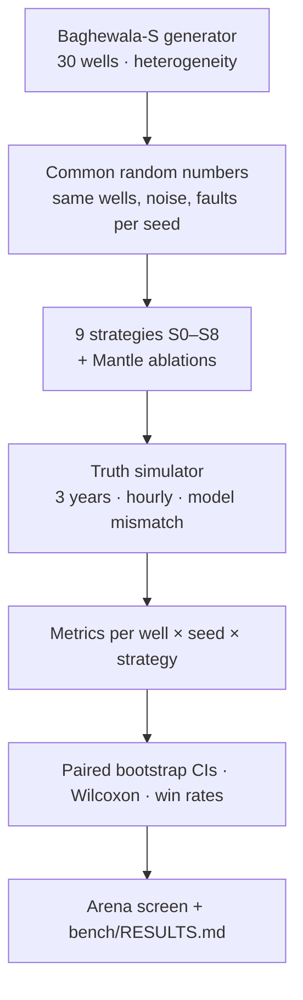
```mermaid
flowchart TB
  G[Baghewala-S generator<br/>30 wells · heterogeneity] --> CRN[Common random numbers<br/>same wells, noise, faults per seed]
  CRN --> ST[9 strategies S0–S8<br/>+ Mantle ablations]
  ST --> SIM[Truth simulator<br/>3 years · hourly · model mismatch]
  SIM --> MET[Metrics per well × seed × strategy]
  MET --> STAT[Paired bootstrap CIs · Wilcoxon · win rates]
  STAT --> VIS[Arena screen + bench/RESULTS.md]
```

- **Same information:** every strategy except the oracle sees only the noisy telemetry. Mantle and RL go through the same estimator interface. Static and heuristic strategies see raw telemetry, as today.
- **Same constraints:** hard limits are enforced by the truth simulator for everyone (failures happen). The Safety Gate is part of a strategy, not the environment.
- **Same budget:** each strategy's tuning uses only training seeds. Evaluation uses held-out seeds **and held-out wells**.
- **Scale:** 30 wells × 20 seeds × 3 years (≈ 18 CSS cycles per well per seed). Stress sets use the Condition Deck presets (§12.8).
- **Model mismatch:** the truth simulator uses parameters the strategies don't know, and includes model-form perturbations (e.g. a different viscosity-curve shape), so Mantle's physics is not a copy of the truth.

## 16.3 Metrics

| Group | Metrics |
|---|---|
| Production | cumulative oil; oil rate over time; recovery over horizon |
| Economics | net risk-adjusted value; lifting cost ₹/bbl |
| Efficiency | SOR (CWE); kWh/bbl; heat utilisation |
| Environment | kg CO₂e/bbl; fresh water m³/bbl |
| Reliability | rod-failure count; pump-unsetting count; float hours; impact events; Goodman damage; downtime |
| Safety | constraint violations (must be 0 for gated strategies) |
| Relative | % of oracle; Coupling Dividend (S7 − S5) |

**Statistics:** per-well paired differences vs S0 with 95% paired-bootstrap CIs; Wilcoxon signed-rank; win rate (share of well × seed pairs where Mantle > contender); effect sizes. Everything is reported with N.

## 16.4 Visuals (what judges see)

1. **Production output graph (hero):** oil rate vs day over 3 cycles, one line per strategy, seed bands on hover, failure markers. This is the graph asked for, and it's the first thing on the Arena screen.
2. **Cumulative oil race:** an animated bar race.
3. **Scoreboard:** deltas with CIs and % of oracle.
4. **Value vs risk scatter:** each dot = well × seed × strategy.
5. **Coupling Dividend decomposition** and **ablation bars**.
6. **Battle replay:** split-screen twins of any two strategies, with the ghost well.

Illustrative shape of the hero chart (placeholder values; the real chart is generated from `bench/` runs):

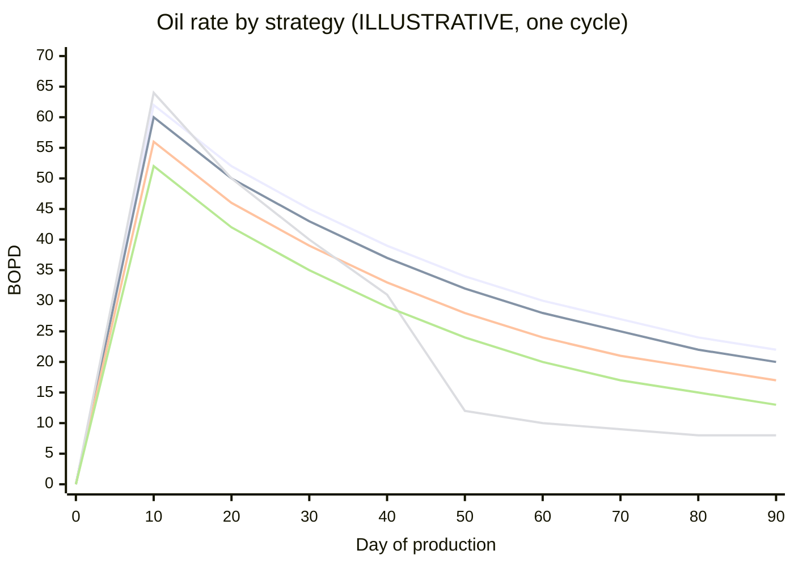
```mermaid
xychart-beta
  title "Oil rate by strategy (ILLUSTRATIVE, one cycle)"
  x-axis "Day of production" [0, 10, 20, 30, 40, 50, 60, 70, 80, 90]
  y-axis "BOPD" 0 --> 70
  line "Oracle" [0, 62, 52, 45, 39, 34, 30, 27, 24, 22]
  line "Mantle" [0, 60, 50, 43, 37, 32, 28, 25, 22, 20]
  line "Sequential" [0, 56, 46, 39, 33, 28, 24, 21, 19, 17]
  line "Greedy" [0, 64, 50, 40, 31, 12, 10, 9, 8, 8]
  line "Static" [0, 52, 42, 35, 29, 24, 20, 17, 15, 13]
```

## 16.5 What we must show to claim "Mantle wins"

| Claim | Pass criterion |
|---|---|
| Mantle beats today's practice | Net value vs S0: CI lower bound > 0; win rate ≥ 80% of well × seed pairs |
| Mantle beats the best simple baselines | Net value > max(S1–S4) with CI lower bound > 0 |
| Joint beats silo | Coupling Dividend (S7 − S5) > 0, CI excludes 0 |
| Safer, not just richer | Failures and float hours ≤ S3; **zero** constraint violations |
| Close to the ceiling | % of oracle reported (target ≥ 85%) |
| Robust | Holds on ≥ 4 of 6 condition presets; failures explained honestly where it doesn't |

If a criterion fails, the Arena says so. That honesty is itself a strong argument in front of technical judges.

## 16.6 Live and pre-computed runs

- **Official run:** pre-computed in `bench/`, versioned (seed manifest, code hash), and loaded instantly by the Arena.
- **Live mini-run:** 3 wells × 3 seeds × 1 cycle, run in front of judges (< 30 s), streaming progress ("S4 greedy: rod failure on BGW-07 day 58").
- **CI regression:** a small arena runs in CI. Mantle's margin over S0 must stay within a tolerance band, or the build fails (§23).

---

# 17. Data strategy and datasets

## 17.1 The situation

The PS says OIL has "sufficient historical and operational data", but **no dataset is attached to the public listing**, and **no public well-level Baghewala telemetry exists**. Every public competitor uses synthetic data. We will too, but we will do it better and say so more clearly:

> **Physics-based synthetic field (Baghewala-S) → calibrated to public anchors → real-data-ready ingestion → EnKF calibration the day real data arrives.**

If OIL shares data during the hackathon (ask the nodal centre/mentor on day 1), the canonical schema (§17.3) takes it with no code change.

## 17.2 Public anchors (for calibration and credibility)

| Anchor | Value | Source (verify before citing on slides) |
|---|---|---|
| API gravity | 17–19° | SIH26120 statement |
| Reservoir temperature | 46–48 °C | SIH26120 statement |
| Reservoir | Jodhpur Sandstone, ~1,150 m | Oil India, Rajasthan fields page |
| Dead-oil viscosity | ~10,000–13,000 cP at 50 °C | Oil India, Rajasthan fields page |
| Steam injection phase | ~14–21 days, injectivity-dependent | Oil India, Rajasthan fields page |
| Lift | Conventional + hydraulic SRPs, thermal wellheads, VIT | Oil India, Rajasthan fields page |
| Pump setting | ~1,200–1,300 m production depths | OIL procurement documents (cited in the ChatGPT thread) |
| Upper carbonate crude | ~38,000 cP (one reported figure) | OIL EOI 011/2022 (per a competitor's source index) |
| Thermal connections | ISO/PAS 12835 qualification, 320 °C steam class | OIL Drilling EOI 2025-26 (per a competitor's source index) |
| Field output milestone | ~1,202 BOPD across ~33 wells (Apr 2026) | OIL announcement (per competitor READMEs; verify) |
| Geology | Baghewala characterization (stratigraphy, rheology) | ACT SHARP consortium report D4.1 (2022) (per a competitor's source index) |
| Technical papers | SPE papers on Baghewala CSS (e.g. SPE APOG 2023) | Referenced by competitors; obtain and read |

**Action:** one team member owns "source truth". They obtain each primary document, confirm the numbers, and file them in `evidence/sources/` with page references. The app's PUB tags link to these.

## 17.3 Canonical schema (the contract with real data)

Designed to map one-to-one onto OIL's seven data categories in the PS. Tables are TimescaleDB hypertables where time-series.

| Table | Grain | Key columns | OIL category |
|---|---|---|---|
| `wells` | well | id, pad, lat/lon (illustrative), spud date, TD, perf top/bottom, formation variant, API, μ anchors | Well completion & reservoir |
| `completions` | well × version | casing program, tubing type (VIT/bare), anchor depth, pump depth, pump type/size, unit type/size | Well completion |
| `rod_strings` | well × version × section | size, grade, length, weight, guides | Well completion |
| `pvt_lab` | sample | T, μ, ρ, water cut, asphaltene onset (if any) | Fluid properties |
| `css_cycles` | well × cycle | start/end of injection, soak, production; steam t; avg pressure, quality; cut-off reason | CSS cycle records |
| `steam_readings` | well × time | rate, pressure, temperature, quality (est.) | Steam injection parameters |
| `production_readings` | well × time | oil, water, gas, wellhead P/T, test flag | Production history |
| `srp_readings` | well × time | SPM, stroke, VFD Hz, motor kW/A, PPRL/MPRL, fillage, runtime | VFD and SRP operating data |
| `dyno_cards` | well × time | surface card points (JSON/array), downhole card (derived), class, confidence | VFD and SRP data |
| `events` | well × time | failure type (rod part, unsetting, float, pound), workover, downtime h, cost | Rod failure & pump unsetting history |
| `pressure_surveys` | well × time | echometer fluid level, BHP surveys | Pressure data |
| `conditions` | well × time | active Condition Deck bundle (for synthetic runs) | — |
| `twin_state` | well × time | EnKF posterior summary (means, spreads) | — |
| `forecasts` | well × issue time × horizon | P10/P50/P90 per variable | — |
| `recommendations`, `decisions` | id | plan JSON, gate results, approvals, hash, prev_hash | — |
| `provenance` | value ref | source type (MEAS/EST/SIM/ASSUM/PUB), source id, model version | — |

The full DDL is in §20. The schema is published as JSON Schema + Parquet specs, with a data dictionary (units, ranges, required/optional).

## 17.4 Baghewala-S: the synthetic field generator

- **Field:** 30 wells on 8 pads, heterogeneity sampled per well (formation variant, k, h, API/μ curve, completion, unit size, rod design, cycle count 1–12).
- **Span:** 3 years, hourly SRP/production, per-stroke cards sampled every 30 min, daily tests, CSS cycles with realistic scheduling.
- **Three policies simulated on identical wells and seeds:**
  1. **Historical practice** (fixed steam slug, fixed SPM, reactive changes after alarms),
  2. **Historical + pump-off controller** (the honest industry baseline for energy),
  3. **Mantle** (closed loop).
  All impact claims are **policy-vs-policy on the same simulated wells, mean ± sd over seeds**.
- **Realism layers:** sensor noise (per instrument class), drift, stuck sensors, packet loss (sandstorm days), unit conversions gone wrong (deliberately, for the auditor), operator overrides, maintenance crews with limited availability, steam-generator downtime.
- **Failures:** hazard-based (not scripted) from cumulative Goodman cycles, float/impact counts and sand, so failure *learning* is possible.
- **Outputs:** the canonical schema (Parquet + DB), a data card, and a seed manifest. Everything is reproducible with one command.

## 17.5 Competitor datasets (what's public, and how we may use it)

Reviewed 29 Sep 2026. **Licence matters:** a repo with no licence is "all rights reserved" by default. We may **read and compare** but must not copy code or data into our product without the author's permission. We use these datasets as **plausibility benchmarks** for Baghewala-S (distributions, ranges) and cite them. For MIT-licensed repos we may reuse with attribution.

| Repo (licence) | Public data | Contents | Our use |
|---|---|---|---|
| **Dhayananth1511/Polaris-SIH26120** (MIT) | 7 CSVs | 8 wells; telemetry (3,200 rows); 32 CSS cycles; production (2,560); SRP ops (1,472); **dyno cards (38,400 points: normal, float, pound, gas)**; 65 failure events | Reusable with attribution: card shapes as a secondary classifier test set, schema cross-check |
| **dasher06/SIH2026_SRP_Performance_Model** (MIT) | `synthetic_srp_cards.csv` (32.7 MB) + metrics | Physics SRP cards; **also trained on a real 7-well "NK" SRP SCADA dataset (not in repo)** | Reuse cards as an external test. **Ask the author where the NK data came from.** A real SCADA source would be gold. |
| XploY04/Aavartan (none) | `data_schema.json` (schema 3.1), `parameter_dictionary.csv` (87 KB), `formula_catalog.csv`, demo + flagship datasets | The best-documented schema and formula catalogue among competitors | Read-only reference: compare our schema coverage and formula list |
| Apaar-Gupta/SIH-2026 (none) | `training_data.csv` (3,000 cycles), `hourly_training_data.csv` (24,000 rows) | Steam-driven hourly forecast data | Benchmark distributions |
| nishanth24vv (none) | 15 wells × 365 d time series, SQLite | Wellbore hydraulics fields | Benchmark |
| Bhuvanesh0097/wellwise-sih (none) | `baghewala_synthetic_v1_corrected.csv` (7.5 MB) | Temperature/rate/float risk | Benchmark |
| sandhya-parekar (none) | Sensor readings (1.5 MB), well data (1.6 MB), SRP, CSS, alerts | 5 wells, 90 days | Benchmark |
| n230837 (none) | `wells_dataset.csv` (12.6 MB), SRP features/timeseries, **SRP operating envelope** | Large synthetic set | Benchmark; envelope comparison |
| naveed1756/SIH120PROT (none) | Dyno-card JSON library, **9 classes** (normal, fluid pound, rod float, rod parted, steam/gas interference, SV leak, tagging, …) | Class taxonomy | Confirms our class list; read-only |
| ZotacMaster (none) | Synthetic CSS/production/reservoir/SRP CSVs + TimescaleDB schema | | Reference |
| varshini2419 (none) | `well_static.csv`, **`constraints_registry.csv`**, RAG index over OIL public documents | Source list is valuable | Use the *source list* to find primary documents (the facts are public) |
| Rohit-girish-Belagali (none) | Generated at runtime: 24 wells × 1,095 d × 3 policies, CSV export | Policy comparison approach | Method reference |

**Real, licensed public data we should use:**

| Dataset | Licence | Why |
|---|---|---|
| **Petrobras 3W** (github.com/petrobras/3W) | Apache-2.0 | Real, expert-labelled well-event time series (offshore wells, not SRP). Use it to **validate our anomaly-detection pipeline on real sensor pathologies** (drift, frozen, spikes) and to show method credibility on real data. |
| **BYU-PRISM USTAR-Artificial-Lift** | none (research code) | Model-predictive rod-pump control reference (Hansen et al. 2018). Read for method only. |
| Public dynamometer-card datasets (Kaggle/papers) | varies | Search, verify licence and provenance, then use as an external test for the card classifier. Only use items with clear licences. |

## 17.6 Real-data readiness

- **Adapters:** CSV/Parquet/ZIP upload · **MQTT** (Sparkplug B payloads) · **OPC-UA** client (asyncua) · historian export (PI/Aspen, as CSV).
- **Unit and tag mapping UI:** map a customer tag (e.g. `BGW17.SRP.PPRL_KN`) to a canonical field with a unit.
- **Mode switch:** `SIMULATION ⇄ FIELD`. Field mode is shown as available but locked ("requires OIL data-sharing agreement").

## 17.7 Data source options (kept open until the Phase 2 decision)

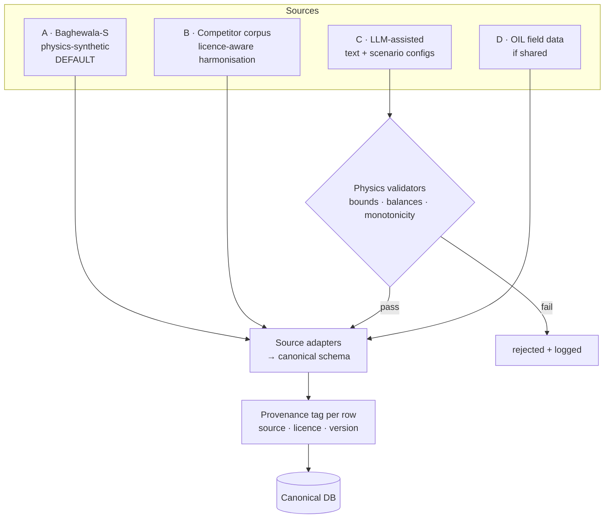
```mermaid
flowchart TB
  subgraph Sources
    A[A · Baghewala-S<br/>physics-synthetic<br/>DEFAULT]
    B[B · Competitor corpus<br/>licence-aware harmonisation]
    C[C · LLM-assisted<br/>text + scenario configs]
    D[D · OIL field data<br/>if shared]
  end
  A --> AD[Source adapters<br/>→ canonical schema]
  B --> AD
  C --> V{Physics validators<br/>bounds · balances · monotonicity}
  V -- pass --> AD
  V -- fail --> X[rejected + logged]
  D --> AD
  AD --> PROV[Provenance tag per row<br/>source · licence · version]
  PROV --> DB[(Canonical DB)]
```

| Option | What it gives | Rules | Best use |
|---|---|---|---|
| **A. Physics-synthetic (Baghewala-S)** | Unlimited, internally consistent, labelled data incl. failures and faults | Calibrated to public anchors; seeds versioned | Training, Arena, demo (default) |
| **B. Competitor corpus** | Independent simulators' views of the same field | **MIT repos (Polaris, dasher06): reuse with attribution. Unlicensed repos: only with written permission from authors**; harmonise via adapters; keep the `source` column | **Cross-simulator validation**: train on ours, test on theirs. If our models hold up on four independent teams' simulators, that's a strong robustness argument. |
| **C. LLM-assisted** | Operator notes, maintenance logs, shift reports, failure narratives, alarm texts; *scenario configurations* (parameter sets) that the physics then simulates | **Never** LLM-generated time series as truth (they break energy and mass balance). Every numeric row passes physics validators; tagged `SIM-LLM`. | Realistic text for the copilot, knowledge capture and Ledger demos; scenario diversity |
| **D. OIL data** | Real calibration | Data-sharing agreement; stays on-prem; never committed | EnKF calibration, residual learning |

**Decision point:** end of Phase 2 (§27), recorded as ADR-0007. The adapters and provenance tags mean any mix works without code changes.

**Permission request template for unlicensed competitor data** (send via GitHub issue or email):

> Hi, we're Team Mantle (SIH26120). We'd like to use `<file>` from your repo only as an external validation set, with credit in our README and app. Would you be OK with that? Happy to share our results with you.

---

# Part IV: The build

# 18. Technical architecture

## 18.1 System context

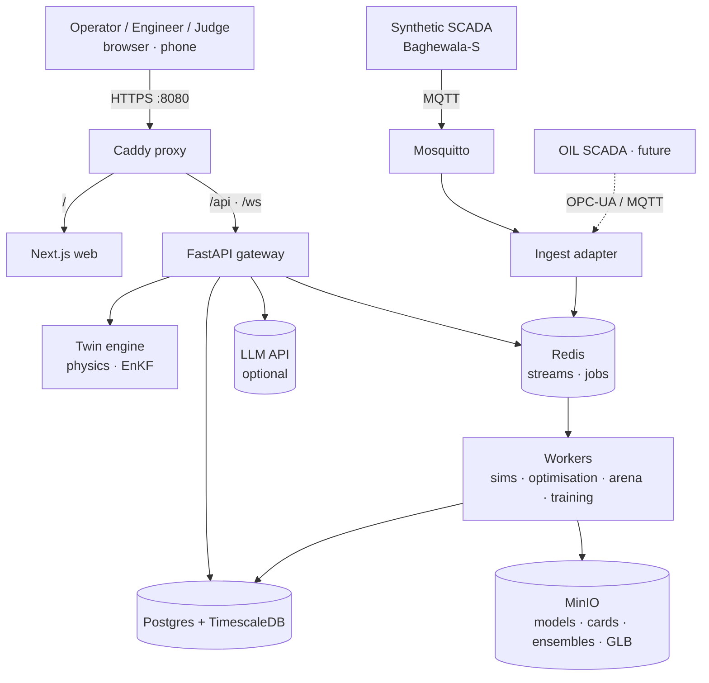
```mermaid
flowchart TB
  U[Operator / Engineer / Judge<br/>browser · phone] -->|HTTPS :8080| PX[Caddy proxy]
  PX -->|/ | WEB[Next.js web]
  PX -->|/api · /ws| GW[FastAPI gateway]
  GW --> ENG[Twin engine<br/>physics · EnKF]
  GW --> Q[(Redis<br/>streams · jobs)]
  Q --> WK[Workers<br/>sims · optimisation · arena · training]
  SC[Synthetic SCADA<br/>Baghewala-S] -->|MQTT| MQ[Mosquitto]
  MQ --> ING[Ingest adapter]
  ING --> Q
  GW --> DB[(Postgres + TimescaleDB)]
  WK --> DB
  WK --> OBJ[(MinIO<br/>models · cards · ensembles · GLB)]
  GW --> LLM[(LLM API<br/>optional)]
  OIL[OIL SCADA · future] -. OPC-UA / MQTT .-> ING
```

## 18.2 Containers and responsibilities

| Service | Tech | Responsibility | Scales by |
|---|---|---|---|
| `proxy` | Caddy 2 | Single entry (`:8080`), routes `/` → web, `/api` + `/ws` → gateway; gzip/zstd; local TLS optional | — |
| `web` | Next.js (App Router, standalone), React 19, R3F | All UI; server components for first paint; client components for 3D, charts and live data | replicas |
| `gateway` | FastAPI (uvicorn), Pydantic v2 | REST + WebSocket; auth (persona now, OIDC later); validation; orchestrates engine calls; enqueues jobs | replicas |
| `worker` | Python (Arq on Redis) | Long jobs: scenario sims, optimisation, Arena runs, training, exports | replicas / queues |
| `scada` | Python | Baghewala-S real-time publisher (MQTT), replay, fault injection | per field |
| `ingest` | Python | MQTT/OPC-UA/CSV adapters → canonical rows → Redis Streams + DB; data-quality auditor | per source |
| `estimator` | Python (inside worker or its own) | EnKF updates per well (hourly fast states, daily parameters) | per well shard |
| `mosquitto` | Eclipse Mosquitto | MQTT broker (Sparkplug B topics) | — |
| `db` | PostgreSQL 16 + TimescaleDB | Canonical data, ledger, scenarios, results | vertical |
| `redis` | Redis 7 | Streams (telemetry bus), pub/sub (WS fan-out), job queue, hot cache | — |
| `minio` | MinIO | Object store: models, ensembles, card archives, GLB, exports | — |
| `mlflow` (profile `ml`) | MLflow | Experiment tracking + model registry | — |
| `drafts` (profile `drafts`) | static server | HTML/CSS draft gallery | — |

## 18.3 Key runtime flows

**Telemetry → twin → screen**

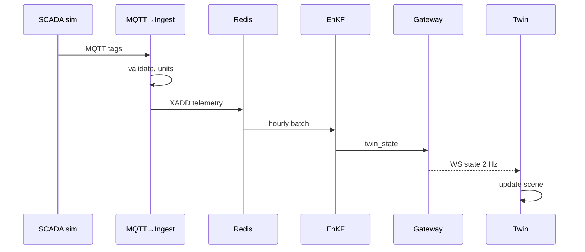
```mermaid
sequenceDiagram
  participant SC as SCADA sim
  participant IN as MQTT→Ingest
  participant RS as Redis
  participant ES as EnKF
  participant GW as Gateway
  participant UI as Twin
  SC->>IN: MQTT tags
  IN->>IN: validate, units
  IN->>RS: XADD telemetry
  RS->>ES: hourly batch
  ES->>GW: twin_state
  GW-->>UI: WS state 2 Hz
  UI->>UI: update scene
```

**Plan request (joint optimisation)**

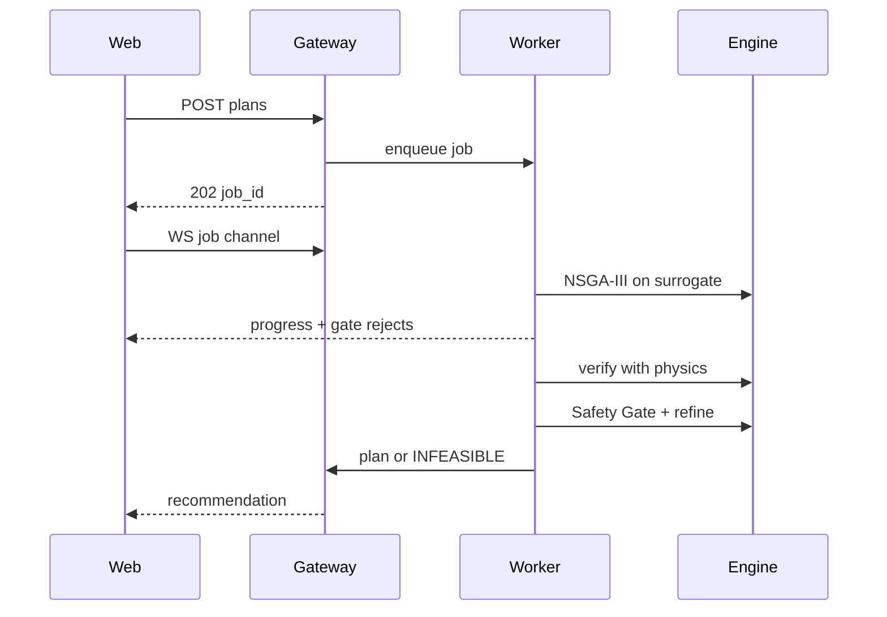
```mermaid
sequenceDiagram
  participant UI as Web
  participant GW as Gateway
  participant WK as Worker
  participant EN as Engine
  UI->>GW: POST plans
  GW->>WK: enqueue job
  GW-->>UI: 202 job_id
  UI->>GW: WS job channel
  WK->>EN: NSGA-III on surrogate
  WK-->>UI: progress + gate rejects
  WK->>EN: verify with physics
  WK->>EN: Safety Gate + refine
  WK->>GW: plan or INFEASIBLE
  GW-->>UI: recommendation
```

## 18.4 Frontend architecture (Next.js)

- **App Router layout tree.** One persistent 3D canvas lives in the root app layout, so moving between screens never tears down WebGL. The paper-wipe transition (§11.4) plays between routes.

```
app/
  layout.tsx                 ← fonts, tokens, providers (Query, stores), <SceneHost/> (client, persistent)
  (screens)/
    layout.tsx               ← shell: top bar, tabs, overlays, timeline
    well/[wellId]/page.tsx   ← Twin/Blueprint (mode via searchParams)
    field/page.tsx
    arena/page.tsx
    ledger/page.tsx
    impact/page.tsx
    proof/page.tsx
  m/[wellId]/page.tsx        ← mobile well card (PWA)
  present/page.tsx · play/page.tsx
  api/health/route.ts        ← web liveness only (backend is FastAPI)
```

- **Server vs client components.** Page shells and first-paint data (well list, summary) are server components that fetch from the gateway over the internal Docker network. The 3D scene, charts, timeline and anything live are client components (`"use client"`). The R3F canvas is loaded with `next/dynamic({ ssr: false })`.
- **State:** Zustand stores (`time`, `well`, `scenario`, `conditions`, `ui`, `camera`). TanStack Query for REST (cache keys include `t` buckets). A single WebSocket manager multiplexes channels.
- **API client:** TypeScript types generated from the gateway's OpenAPI (`openapi-typescript`) + a thin fetch wrapper. Zod validation at the boundary in development.
- **3D:** R3F + drei + postprocessing. Custom GLSL (thermal field, hatch dissolve, stress bands, meniscus, heat haze). Kinematics in a Web Worker. WebGL2 baseline with an optional WebGPU renderer.
- **Charts:** D3 + visx SVG (Paper), regl-scatterplot for dense clouds.
- **Styling:** CSS Modules + design tokens as CSS variables, generated from `packages/tokens/tokens.json` (the same file feeds the HTML drafts).
- **Choreography:** GSAP (+ Flip). Theatre.js is used only in development to author camera paths.
- **Maps:** MapLibre GL with the custom cream style; offline tiles bundled.
- **PWA:** the mobile Well Card is installable (service worker scoped to `/m`).

## 18.5 Backend architecture (Python, uv workspace)

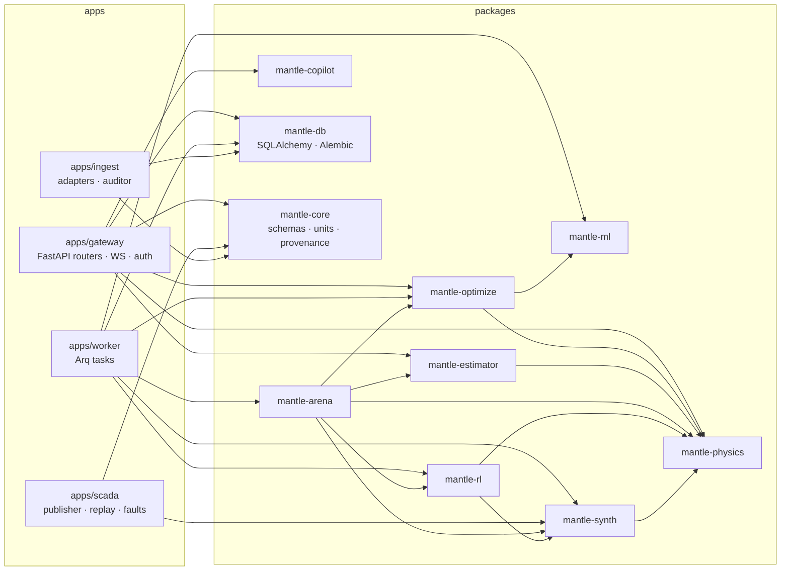
```mermaid
flowchart LR
  subgraph apps
    GWY[apps/gateway<br/>FastAPI routers · WS · auth]
    WRK[apps/worker<br/>Arq tasks]
    SCD[apps/scada<br/>publisher · replay · faults]
    ING[apps/ingest<br/>adapters · auditor]
  end
  subgraph packages
    PHY[mantle-physics]
    EST[mantle-estimator]
    OPT[mantle-optimize]
    ML[mantle-ml]
    RL[mantle-rl]
    SYN[mantle-synth]
    ARN[mantle-arena]
    COP[mantle-copilot]
    DBP[mantle-db<br/>SQLAlchemy · Alembic]
    CORE[mantle-core<br/>schemas · units · provenance]
  end
  GWY --> CORE & DBP & PHY & EST & OPT & COP
  WRK --> OPT & ARN & ML & RL & SYN & DBP
  SCD --> SYN & CORE
  ING --> CORE & DBP
  OPT --> PHY & ML
  EST --> PHY
  ARN --> PHY & EST & OPT & RL & SYN
  RL --> PHY & SYN
  SYN --> PHY
```

- **uv workspace:** a root `pyproject.toml` declares `[tool.uv.workspace] members = ["apps/*", "packages/*"]`. One `uv.lock`. Every package has its own `pyproject.toml` and tests. Commands: `uv sync`, `uv run pytest`, `uv run --package mantle-gateway uvicorn …`.
- **Python 3.12** (the widest wheel support across Numba, PyTorch, OR-Tools and pymoo at kickoff; revisit 3.13 in Phase 0).
- **Libraries:** FastAPI, Pydantic v2, SQLAlchemy 2 + Alembic, asyncpg, redis-py, arq, NumPy, SciPy, Numba, pint, iapws, pandas/polars, LightGBM, PyTorch, scikit-learn, MAPIE, SHAP, pymoo, OR-Tools, Stable-Baselines3 + Gymnasium, asyncua, paho-mqtt/aiomqtt, structlog, OpenTelemetry.
- **One calculation path:** only `mantle-physics` computes physics. The gateway, worker, Arena, RL environment and copilot all import it.

## 18.6 Cross-cutting concerns

| Concern | Approach |
|---|---|
| Config | 12-factor env vars (Appendix E), `pydantic-settings`; `.env.example` committed |
| Auth | Demo: persona header, no passwords. Deployment: OIDC (Keycloak/Entra) bearer tokens; RBAC per role. |
| Observability | structlog JSON logs; OpenTelemetry traces (gateway → worker → engine); Prometheus metrics; optional Grafana (profile `obs`) |
| Security | No secrets in repo; LLM key only server-side; dependency audits (pip-audit, pnpm audit); container scan (Trivy); CORS locked to proxy origin |
| Determinism | Seeds everywhere; `demo` profile pins the seed manifest; golden scenarios are regression-tested |
| Units | SI inside physics; `pint` at the API boundary; the API documents units per field |
| Time | Two clocks: wall time (UTC ISO 8601) and simulation time `t_sim` (seconds since field epoch). Every record carries both where relevant. |

## 18.7 Copilot architecture ("Ask Mantle")

```
user question → router (intent, well/time context)
             → LLM with tools (Anthropic Messages API, tool use; e.g. Claude Sonnet 5.5,
               with Haiku 4.5 for routing and short answers)
             → tools: get_state · get_forecast · explain_metric · get_card_diagnosis ·
                      run_scenario · optimize · compare_wells · get_decisions ·
                      get_assumptions · field_triage · steam_schedule
             → draft answer
             → NUMERIC VERIFIER: extract every number+unit; each must match a tool result
               (tolerance-aware) or a registered constant; otherwise regenerate once, then
               fall back to a templated answer
             → answer card with sources + "Show me" actions (highlight in Twin, open plate)
```

- The copilot **cannot** approve or apply anything. It can *propose* a scenario or open a recommendation.
- **Offline mode:** the same tools with templated natural language (no LLM), so the demo never depends on venue Wi-Fi. An optional local small model (via Ollama) is a P3 nice-to-have.

## 18.8 Synthetic SCADA engine (telemetry, honestly)

- Runs Baghewala-S forward in (accelerated) real time and **publishes telemetry through the same path real data would use**: MQTT topics (`mantle/BGW-17/srp/pprl`) into the ingest adapter, then Redis Streams, the EnKF and the WebSocket.
- **Replay mode:** plays historical synthetic records with transport controls (0.25×–500×).
- **Fault injection API** (the Anomaly Injector) perturbs the generator, never the twin, so detection is genuine.

---

# 19. API reference (v1)

The gateway's OpenAPI document (`/api/v1/openapi.json`) is the machine-readable source of truth. This section is the design contract it must satisfy. Contract tests enforce it (§23).

## 19.1 Conventions

| Topic | Rule |
|---|---|
| Base | `/api/v1` behind the proxy; WebSockets at `/ws` |
| Format | JSON, `snake_case` keys; UTF-8; gzip/zstd |
| Time | `t` = simulation seconds since the field epoch (integer). Wall times are ISO 8601 UTC (`*_at`). Query params accept `t` or `at`. |
| Units | Domain units, fixed per field and documented (°C, bar, cP, kN, m, BOPD, t, kWh, kg CO₂e, ₹). Every `Quantity` carries `unit`. |
| IDs | `well_id` like `BGW-17`; other resources use ULIDs (`dec_01J…`) |
| Pagination | Cursor: `?limit=50&cursor=…` → `{items, next_cursor}` |
| Async jobs | `202 Accepted` + `{job_id}`. Poll `GET /jobs/{id}` or stream `WS /ws/jobs/{id}`. `Idempotency-Key` header required on job-creating POSTs. |
| Errors | RFC 9457 `application/problem+json` (`type`, `title`, `status`, `detail`, `instance`, `errors[]`) |
| Auth | Demo: `X-Persona: operator\|engineer\|manager\|viewer`. Deployment: `Authorization: Bearer <OIDC JWT>`. |
| Versioning | URL major version. Additive changes only within v1. |
| Provenance | Any measured, estimated or simulated number is returned as a `Quantity` (below) unless it's inside a bulk series |
| Rate limits | Copilot 20/min/persona; jobs 10 concurrent per client |

## 19.2 Common types

```ts
type Source = "MEAS" | "EST" | "SIM" | "SIM-LLM" | "ASSUM" | "PUB";
interface Band { p10: number; p50: number; p90: number }
interface Quantity { value: number; unit: string; source: Source; band?: Band;
                     model_version?: string; stale?: boolean }
interface Series { t: number[]; values: Record<string, number[]>;           // columnar, compact
                   units: Record<string, string>; source: Source;
                   bands?: Record<string, { p10: number[]; p90: number[] }> }
interface Problem { type: string; title: string; status: number; detail?: string;
                    errors?: { loc: string[]; msg: string }[] }
interface Job { job_id: string; kind: string; status: "queued"|"running"|"done"|"failed"|"cancelled";
                progress: number; message?: string; result_url?: string; created_at: string }
type Phase = "INJECTION" | "SOAK" | "PRODUCTION" | "SHUT_IN";
```

## 19.3 Endpoint catalogue

**System**

| Method | Path | Purpose |
|---|---|---|
| GET | `/health` | Liveness + dependency status (db, redis, minio, mqtt) |
| GET | `/meta` | Versions (app, physics, models), mode (`SIMULATION`/`FIELD`), field epoch, units |
| GET | `/jobs/{job_id}` · DELETE | Job status · cancel |

**Field**

| Method | Path | Purpose / key params | Response |
|---|---|---|---|
| GET | `/field/summary?t=` | Field KPIs | `{bopd, sor, kwh_per_bbl, co2_per_bbl, counts:{ok,watch,high,critical}}` (Quantities) |
| GET | `/field/map` | Pads, wells, generators, header geometry (GeoJSON) | `FeatureCollection` |
| GET | `/field/triage?t=&limit=5` | Ranked worklist | `[{rank, well_id, severity, reason_code, reason, value_at_risk: Quantity, deep_link}]` |
| GET | `/field/brief?date=` | Morning brief | `{generated_at, sections[], pdf_url}` |
| GET | `/field/steam-schedule` | Current generator plan | `{generators[], slots[{well_id, generator_id, start_t, end_t, tonnes}], shadow_price}` |
| POST | `/field/steam-schedule/solve` | Re-solve (job). Body: `{horizon_days, overrides[], generator_outages[]}` | `202 Job` |

**Wells & live state**

| Method | Path | Purpose | Response (abridged) |
|---|---|---|---|
| GET | `/wells` | List | `[{well_id, pad_id, phase, severity, cycle_no}]` |
| GET | `/wells/{id}` | Static data: completion, rod string, pump, unit, PVT anchors | `WellDetail` |
| GET | `/wells/{id}/state?t=` | Posterior twin state at `t` | `WellState` (below) |
| GET | `/wells/{id}/timeseries?vars=&from=&to=&step=` | Columnar history (measured and estimated) | `Series` |
| GET | `/wells/{id}/profile?t=` | Depth tracks: T, P, μ, σ_max/σ_min, deposition band, fluid level | `{depth_m[], tracks:{…}, markers:{…}}` |
| GET | `/wells/{id}/thermal-field?t=` | r–z temperature grid for shaders | `application/octet-stream` float16 256×64 + `X-Grid-Meta` header |
| GET | `/wells/{id}/cards?t=&n=` | Last *n* surface/downhole cards + diagnosis | `[{t, surface:{x[],f[]}, downhole:{x[],f[]}, class, probs, fillage}]` |
| GET | `/wells/{id}/envelope?from=&to=` | Safe-SPM ceiling N_max(t) + actual + plan | `Series` |
| GET | `/wells/{id}/ipr?t=` | IPR curve(s) + pump line + operating point | `{ipr:[…], pump:[…], op_point, limit:"RESERVOIR"\|"PUMP"}` |
| GET | `/wells/{id}/heat-balance?cycle=` | Sankey nodes and links | `{nodes[], links[]}` |
| GET | `/wells/{id}/bom` | Parts list for the Blueprint | `[{balloon, part, spec, source}]` |
| GET | `/wells/{id}/cycles` | Cycle history | `[{cycle_no, steam_t, inj_days, soak_days, peak_bopd, oil_60d, sor, heat_util}]` |
| GET | `/wells/{id}/similar?k=3` | Nearest trajectories | `[{well_id, distance, aligned_series}]` |
| GET | `/wells/{id}/forecast?h=30d&plan=baseline\|{plan_id}` | Ensemble forecast | `Series` with bands |
| GET | `/wells/{id}/explain?metric=&t=` | Drivers: SHAP/physics sensitivities + causal path | `{metric, value, drivers[{name, contribution, direction}], path[], evidence[]}` |
| GET | `/wells/{id}/margins?t=` | Six risk margins | `[{kind, margin: Quantity, time_to_limit_d: Quantity, drivers[]}]` |
| GET | `/wells/{id}/maintenance` | Forecast + what-if | `{items[{kind, due_window, risk}], whatif_url}` |

```ts
interface WellState {
  well_id: string; t: number; phase: Phase; cycle_no: number; day_in_cycle: number;
  surface: { spm: Quantity; stroke_in: Quantity; kd: Quantity; vfd_hz: Quantity;
             motor_kw: Quantity; torque_pct: Quantity };
  rods:    { pprl_kn: Quantity; mprl_kn: Quantity; float_margin: Quantity; goodman_max: Quantity };
  pump:    { fillage: Quantity; vol_eff: Quantity; holddown_margin: Quantity };
  wellbore:{ fluid_level_m: Quantity; submergence_m: Quantity; pip_bar: Quantity; pwf_bar: Quantity;
             wellhead_t_c: Quantity; deposition_interval_m: [number, number] | null };
  reservoir:{ sandface_t_c: Quantity; mu_cp: Quantity; heated_radius_m: Quantity;
              thermal_battery_pct: Quantity; days_to_cutoff: Quantity };
  production:{ oil_bopd: Quantity; water_cut: Quantity; liquid_bpd: Quantity };
  economy: { net_inr_per_day: Quantity; sor: Quantity; kwh_per_bbl: Quantity;
             co2_kg_per_bbl: Quantity; water_m3_per_bbl: Quantity };
  coupling_dividend: { inr_per_cycle: Quantity; oil_pct: Quantity } | null;
  health: { score: number; flags: string[] }; conditions_id: string; scenario_id: string | null;
}
```

**Conditions & faults**

| Method | Path | Purpose |
|---|---|---|
| GET | `/conditions/catalog` | All cards and options with parameters and provenance |
| GET | `/conditions/presets` | The six presets |
| POST | `/wells/{id}/conditions` | Apply a bundle `{formation, crude, climate, completion, lift, steam_source}` → returns the new `conditions_id` and changed parameters |
| POST | `/faults/inject` | `{well_id, kind, start_t, duration_s, severity}` → perturbs the **generator**, not the twin |
| GET | `/faults/active` · DELETE `/faults/{id}` | List · clear |

**Plans, optimisation & recommendations**

| Method | Path | Purpose |
|---|---|---|
| POST | `/wells/{id}/plans` | Joint optimisation job. Body: `{horizon_days, objectives:{weights}, levers:{css:bool, srp:bool, stroke_shaper:bool, hardware:bool}, constraints_override?}` → `202 Job` |
| GET | `/plans/{plan_id}` | Plan: CSS design, SRP schedule, expected outcomes with bands, binding constraints, gate log summary |
| GET | `/plans/{plan_id}/candidates?status=rejected` | Rejected candidates with reasons (the Safety Gate log) |
| POST | `/optimize/pareto` | Pareto front job for a well or scenario |
| GET | `/wells/{id}/coupling-dividend?cycle=` | CD + Shapley decomposition |
| GET | `/recommendations?well_id=&status=` | Open or past recommendations |
| GET | `/recommendations/{id}` | Detail incl. explain payload |
| POST | `/recommendations/{id}/approve` | `{note?}` → Decision |
| POST | `/recommendations/{id}/modify` | `{changes:{…}, reason_code, note}` → re-simulation job, then Decision |
| POST | `/recommendations/{id}/reject` | `{reason_code, note}` → Decision (knowledge capture) |

**Ledger & analytics**

| Method | Path | Purpose |
|---|---|---|
| GET | `/decisions?well_id=&from=&to=` | Decision list (cursor) |
| GET | `/decisions/{id}` | ECN detail |
| GET | `/decisions/{id}/trace` | Provenance trace: plan → models (versions) → inputs → assumptions → sources |
| GET | `/decisions/{id}/outcome` | Predicted vs realised at +1/7/30 d + counterfactual band + score |
| GET | `/ledger/verify` | Recompute hash chain → `{ok, length, head_hash, first_bad?}` |
| GET | `/analytics/calibration?model=` | Reliability data, coverage |
| GET | `/analytics/overrides` | Override regimes |

**Scenarios & Arena**

| Method | Path | Purpose |
|---|---|---|
| POST | `/scenarios` | Create `{name, base:{well_id, t}, levers, conditions, horizon_days}` |
| GET | `/scenarios` · `/scenarios/{id}` | List · detail |
| POST | `/scenarios/{id}/run` | Simulate (job) |
| POST | `/scenarios/{id}/fork?t=` | Branch at `t` |
| POST | `/scenarios/{id}/clone` | Clone |
| GET | `/arena/strategies` | Contenders with definitions and parameters |
| POST | `/arena/runs` | `{strategies[], wells:"all"\|[…], seeds, horizon_days, conditions_preset, ablations[]}` → `202 Job` |
| GET | `/arena/runs` · `/arena/runs/{id}` | List (incl. `official` flag) · status and manifest |
| GET | `/arena/runs/{id}/series?metric=oil_rate&agg=mean` | Per-strategy series with seed bands |
| GET | `/arena/runs/{id}/scoreboard` | Deltas vs baseline with CIs, win rates, % oracle, violations |
| GET | `/arena/runs/{id}/ablation` · `/decomposition` | Ablation bars · CD decomposition |
| POST | `/challenge/sessions` · POST `/challenge/sessions/{id}/actions` · GET `/challenge/leaderboard` | Judge Challenge game |

**Impact**

| Method | Path | Purpose |
|---|---|---|
| GET | `/impact/summary?scope=field\|well\|illustrative&baseline=static\|pumpoff\|sequential&well_id=` | 12 hero numbers with bands and formulas |
| GET | `/impact/series?metric=&scope=&baseline=` | Cumulative series |
| GET | `/impact/receipt?well_id=&cycle=` | Cycle receipt (JSON + printable HTML/PDF URL) |

**Evidence, data & health**

| Method | Path | Purpose |
|---|---|---|
| GET | `/evidence/traceability` | PS line → features → deep links |
| GET | `/evidence/models` · `/evidence/models/{name}` | Model cards |
| GET | `/evidence/assumptions` | Assumption registry |
| GET | `/evidence/sources` | Source registry (PUB anchors with doc refs) |
| GET | `/evidence/provenance/summary` | Share by source |
| POST | `/data/imports` | Multipart upload (CSV/Parquet/ZIP) + mapping → job (auditor) |
| GET | `/data/imports/{id}/report` | Quality report: rows, missing, duplicates, outliers, unit issues, per-column scores |
| GET | `/data/mappings` · POST | Tag → canonical field mappings |
| GET | `/twin/health?well_id=` | Sensors, calibration, freshness, OOD, disagreement |

**Alerts, copilot, story, export**

| Method | Path | Purpose |
|---|---|---|
| GET | `/alerts?state=active` | ISA-18.2 alarms |
| POST | `/alerts/{id}/ack` · `/shelve` | Acknowledge · shelve `{minutes, reason}` |
| POST | `/copilot/query` | `{question, context:{well_id,t,screen}}` → `{answer, numbers[{text, value, unit, tool_ref, verified}], sources[], actions[]}` (SSE stream option) |
| GET | `/story/scripts` · `/story/scripts/{id}` | Demo beats (deep links + notes) |
| POST | `/snapshots` · GET `/snapshots/{id}` | Save / load a deep-link state |
| POST | `/exports/sheet` | Blueprint sheet → PDF/SVG job |
| POST | `/exports/timelapse` | Cycle time-lapse job (WebM) |
| GET | `/exports/{id}` | Download |

## 19.4 WebSocket protocol

One socket, multiplexed. Client sends `{"op":"sub","ch":"well:BGW-17"}` / `{"op":"unsub",…}`; server messages use the envelope `{ch, type, t, seq, data}`.

| Channel | Types | Rate |
|---|---|---|
| `well:{id}` | `state` (WellState delta), `card` (per stroke), `phase_change`, `margin_alarm` | 2 Hz / per stroke |
| `field` | `summary`, `triage_changed` | 0.2 Hz |
| `alerts` | `raised`, `cleared`, `acked` | event |
| `job:{id}` | `progress {pct, message, counters}`, `done {result_url}`, `failed {problem}` | event |
| `story` | `beat {index}` (presenter remote ↔ app) | event |
| `challenge:{id}` | `tick {day, oil, cum, failures}` | 10 Hz |

Back-pressure: the server drops intermediate `state` frames for slow clients (latest wins). `seq` gaps trigger a REST resync.

## 19.5 Status codes

`200` OK · `201` created · `202` job accepted · `400` validation (Problem with `errors[]`) · `404` unknown well or resource · `409` conflict (e.g. approving a closed recommendation; infeasible modify) · `422` physically invalid input (e.g. steam rate × duration ≠ volume) · `429` rate limit · `503` dependency down (the health payload names it).

---

# 20. Database schema

PostgreSQL 16 + TimescaleDB. Migrations use Alembic (`packages/db/migrations`). Naming: `snake_case`, singular type names, plural tables, `id` = ULID text unless natural keys exist (`well_id`). Every time-series table has `t` (sim seconds, `bigint`) and `ts` (`timestamptz`, derived from the epoch) and is a hypertable on `ts`. Every row that holds a number of uncertain origin carries `source source_kind`.

## 20.1 Entity relationships (core)

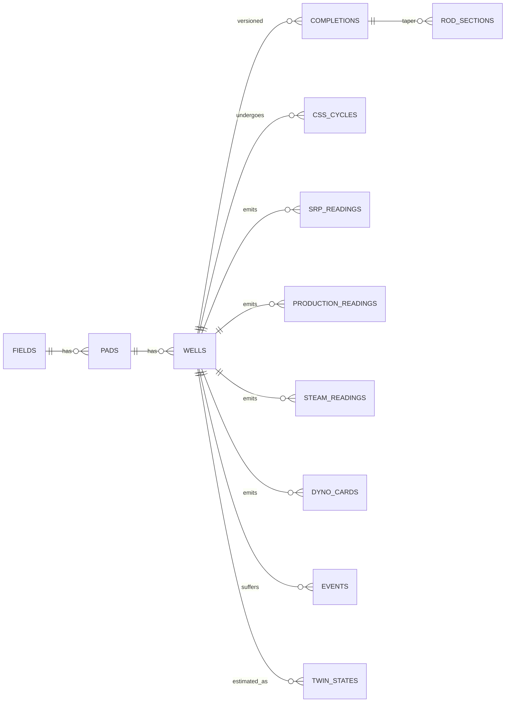
```mermaid
erDiagram
  direction LR
  FIELDS ||--o{ PADS : has
  PADS ||--o{ WELLS : has
  WELLS ||--o{ COMPLETIONS : versioned
  COMPLETIONS ||--o{ ROD_SECTIONS : taper
  WELLS ||--o{ CSS_CYCLES : undergoes
  WELLS ||--o{ SRP_READINGS : emits
  WELLS ||--o{ PRODUCTION_READINGS : emits
  WELLS ||--o{ STEAM_READINGS : emits
  WELLS ||--o{ DYNO_CARDS : emits
  WELLS ||--o{ EVENTS : suffers
  WELLS ||--o{ TWIN_STATES : estimated_as
```

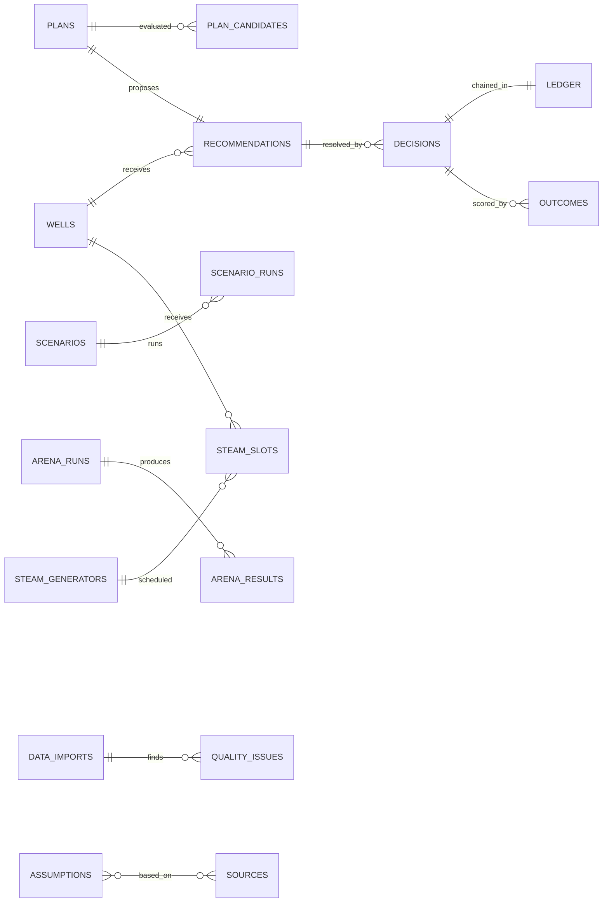
```mermaid
erDiagram
  direction LR
  WELLS ||--o{ RECOMMENDATIONS : receives
  PLANS ||--o{ PLAN_CANDIDATES : evaluated
  PLANS ||--|| RECOMMENDATIONS : proposes
  RECOMMENDATIONS ||--o{ DECISIONS : resolved_by
  DECISIONS ||--|| LEDGER : chained_in
  DECISIONS ||--o{ OUTCOMES : scored_by
  SCENARIOS ||--o{ SCENARIO_RUNS : runs
  ARENA_RUNS ||--o{ ARENA_RESULTS : produces
  STEAM_GENERATORS ||--o{ STEAM_SLOTS : scheduled
  WELLS ||--o{ STEAM_SLOTS : receives
  DATA_IMPORTS ||--o{ QUALITY_ISSUES : finds
  ASSUMPTIONS }o--o{ SOURCES : based_on
```

## 20.2 Types

```sql
CREATE TYPE source_kind  AS ENUM ('MEAS','EST','SIM','SIM_LLM','ASSUM','PUB');
CREATE TYPE phase_kind   AS ENUM ('INJECTION','SOAK','PRODUCTION','SHUT_IN');
CREATE TYPE severity     AS ENUM ('OK','WATCH','HIGH','CRITICAL');
CREATE TYPE rec_status   AS ENUM ('OPEN','APPROVED','MODIFIED','REJECTED','EXPIRED','SUPERSEDED');
CREATE TYPE card_class   AS ENUM ('NORMAL','FLUID_POUND','GAS_INTERFERENCE','ROD_FLOAT','PARTED_ROD',
                                  'TV_LEAK','SV_LEAK','TAGGING','UNSETTING','OVER_TRAVEL');
CREATE TYPE event_kind   AS ENUM ('ROD_FAILURE','PUMP_UNSETTING','ROD_FLOAT','FLUID_POUND','IMPACT',
                                  'WORKOVER','HOT_OIL','SENSOR_FAULT','GENERATOR_OUTAGE','OTHER');
CREATE TYPE alarm_prio   AS ENUM ('P1','P2','P3','P4');
```

## 20.3 Reference data

```sql
CREATE TABLE fields (id text PRIMARY KEY, name text NOT NULL, epoch timestamptz NOT NULL,
  description text, synthetic boolean NOT NULL DEFAULT true);
CREATE TABLE pads (id text PRIMARY KEY, field_id text REFERENCES fields, name text,
  geom geometry(Polygon,4326));                                    -- PostGIS optional; else jsonb
CREATE TABLE wells (well_id text PRIMARY KEY, pad_id text REFERENCES pads, spud_date date,
  td_m real, perf_top_m real, perf_bottom_m real, formation text, api_gravity real,
  lat real, lon real, illustrative_location boolean DEFAULT true, meta jsonb DEFAULT '{}');
CREATE TABLE completions (id text PRIMARY KEY, well_id text REFERENCES wells, valid_from bigint NOT NULL,
  tubing_type text CHECK (tubing_type IN ('VIT','BARE')), tubing_id_mm real, casing_id_mm real,
  casing_grade text, anchor_depth_m real, pump_depth_m real, pump_type text, plunger_in real,
  unit_type text CHECK (unit_type IN ('BEAM','HYDRAULIC')), unit_rating jsonb, source source_kind);
CREATE TABLE rod_sections (completion_id text REFERENCES completions, idx smallint, size_in real,
  grade text, length_m real, weight_kg_per_m real, tensile_mpa real, guides_per_rod smallint,
  PRIMARY KEY (completion_id, idx));
CREATE TABLE pvt_samples (id text PRIMARY KEY, well_id text REFERENCES wells, temp_c real, mu_cp real,
  density_kg_m3 real, water_cut real, asphaltene_onset_c real, source source_kind, source_ref text);
CREATE TABLE viscosity_fits (well_id text REFERENCES wells, valid_from bigint, walther_a double precision,
  walther_b double precision, emulsion_k real, source source_kind, PRIMARY KEY (well_id, valid_from));
CREATE TABLE steam_generators (id text PRIMARY KEY, field_id text REFERENCES fields, capacity_t_per_d real,
  efficiency real, fuel text, solar_capable boolean DEFAULT false);
```

## 20.4 Operational time series (hypertables)

```sql
CREATE TABLE telemetry_raw (ts timestamptz NOT NULL, t bigint NOT NULL, well_id text NOT NULL,
  tag text NOT NULL, value double precision, quality smallint DEFAULT 192, import_id text);
SELECT create_hypertable('telemetry_raw','ts');
CREATE INDEX ON telemetry_raw (well_id, tag, ts DESC);

CREATE TABLE srp_readings (ts timestamptz NOT NULL, t bigint NOT NULL, well_id text NOT NULL,
  spm real, stroke_in real, kd real, vfd_hz real, motor_kw real, motor_a real, torque_pct real,
  pprl_kn real, mprl_kn real, fillage real, runtime_frac real, source source_kind NOT NULL,
  PRIMARY KEY (well_id, ts));
CREATE TABLE production_readings (ts timestamptz NOT NULL, t bigint NOT NULL, well_id text NOT NULL,
  oil_bopd real, water_bwpd real, gas_mscfd real, wellhead_p_bar real, wellhead_t_c real,
  is_test boolean DEFAULT false, source source_kind NOT NULL, PRIMARY KEY (well_id, ts));
CREATE TABLE steam_readings (ts timestamptz NOT NULL, t bigint NOT NULL, well_id text NOT NULL,
  rate_t_per_h real, pressure_bar real, temp_c real, quality real, generator_id text,
  source source_kind NOT NULL, PRIMARY KEY (well_id, ts));
CREATE TABLE dyno_cards (ts timestamptz NOT NULL, t bigint NOT NULL, well_id text NOT NULL,
  surface_pos real[] NOT NULL, surface_load real[] NOT NULL, downhole_pos real[], downhole_load real[],
  class card_class, class_probs jsonb, fillage real, area_kj real, source source_kind NOT NULL,
  PRIMARY KEY (well_id, ts));
CREATE TABLE pressure_surveys (ts timestamptz NOT NULL, well_id text NOT NULL, kind text,
  fluid_level_m real, bhp_bar real, source source_kind, PRIMARY KEY (well_id, ts, kind));
-- all hypertables; compression after 7 days; continuous aggregates:
CREATE MATERIALIZED VIEW srp_1h WITH (timescaledb.continuous) AS
  SELECT well_id, time_bucket('1 hour', ts) AS bucket, avg(spm) spm, max(pprl_kn) pprl_max,
         min(mprl_kn) mprl_min, avg(fillage) fillage, avg(motor_kw) motor_kw
  FROM srp_readings GROUP BY 1,2;      -- likewise production_1h, production_1d
```

## 20.5 Cycles, events, maintenance

```sql
CREATE TABLE css_cycles (id text PRIMARY KEY, well_id text REFERENCES wells, cycle_no int NOT NULL,
  inj_start bigint, inj_end bigint, soak_end bigint, prod_end bigint, steam_t real, avg_inj_p_bar real,
  avg_quality real, cutoff_reason text, oil_bbl real, sor real, heat_util real, source source_kind,
  UNIQUE (well_id, cycle_no));
CREATE TABLE events (id text PRIMARY KEY, well_id text REFERENCES wells, t bigint NOT NULL,
  kind event_kind NOT NULL, downtime_h real, cost_inr real, depth_m real, notes text,
  source source_kind NOT NULL, meta jsonb);
CREATE TABLE maintenance_items (id text PRIMARY KEY, well_id text REFERENCES wells, kind text,
  due_from bigint, due_to bigint, risk real, status text, created_by text);
```

## 20.6 Twin, conditions, faults, forecasts

```sql
CREATE TABLE conditions (id text PRIMARY KEY, bundle jsonb NOT NULL, params jsonb NOT NULL,
  hash text UNIQUE NOT NULL);                                        -- content-addressed
CREATE TABLE well_conditions (well_id text REFERENCES wells, from_t bigint, conditions_id text
  REFERENCES conditions, PRIMARY KEY (well_id, from_t));
CREATE TABLE faults (id text PRIMARY KEY, well_id text, kind text, start_t bigint, duration_s bigint,
  severity real, active boolean DEFAULT true);
CREATE TABLE twin_states (ts timestamptz NOT NULL, t bigint NOT NULL, well_id text NOT NULL,
  summary jsonb NOT NULL,              -- WellState-shaped means + bands
  params jsonb NOT NULL,               -- posterior parameter means/sd
  ensemble_ref text,                   -- MinIO key for the full ensemble (npz)
  innovation jsonb, health real, model_versions jsonb, PRIMARY KEY (well_id, ts));
CREATE TABLE forecasts (id text PRIMARY KEY, well_id text, issued_t bigint, horizon_s bigint,
  plan_id text, series_ref text NOT NULL, headline jsonb, model_versions jsonb);
```

## 20.7 Plans, recommendations, decisions, ledger

```sql
CREATE TABLE plans (id text PRIMARY KEY, well_id text REFERENCES wells, created_t bigint,
  request jsonb NOT NULL, css jsonb, srp_schedule jsonb, expected jsonb, binding jsonb,
  feasible boolean NOT NULL, coupling_dividend jsonb, model_versions jsonb, job_id text);
CREATE TABLE plan_candidates (plan_id text REFERENCES plans, idx int, params jsonb, objectives jsonb,
  verified boolean, gate_pass boolean, reject_reasons text[], PRIMARY KEY (plan_id, idx));
CREATE TABLE recommendations (id text PRIMARY KEY, well_id text REFERENCES wells, plan_id text
  REFERENCES plans, created_t bigint, expires_t bigint, title text, action jsonb, deltas jsonb,
  confidence real, status rec_status NOT NULL DEFAULT 'OPEN', explain jsonb);
CREATE TABLE decisions (id text PRIMARY KEY, recommendation_id text REFERENCES recommendations,
  well_id text, t bigint, actor text NOT NULL, verdict rec_status NOT NULL, changes jsonb,
  reason_code text, note text, inputs_snapshot_ref text, model_versions jsonb);
CREATE TABLE ledger (seq bigserial PRIMARY KEY, decision_id text UNIQUE REFERENCES decisions,
  prev_hash char(64) NOT NULL, hash char(64) NOT NULL, created_at timestamptz DEFAULT now());
-- trigger: hash = sha256(prev_hash || canonical_json(decision row)); UPDATE/DELETE revoked on ledger
CREATE TABLE outcomes (decision_id text REFERENCES decisions, horizon text, predicted jsonb,
  realised jsonb, counterfactual jsonb, score text, PRIMARY KEY (decision_id, horizon));
CREATE TABLE knowledge_notes (id text PRIMARY KEY, well_id text, regime jsonb, text text,
  source_decision text REFERENCES decisions, tags text[]);
```

## 20.8 Scenarios, Arena, steam scheduling, alarms

```sql
CREATE TABLE scenarios (id text PRIMARY KEY, name text, parent_id text REFERENCES scenarios,
  base_well text, base_t bigint, levers jsonb, conditions_id text, horizon_s bigint, created_by text);
CREATE TABLE scenario_runs (id text PRIMARY KEY, scenario_id text REFERENCES scenarios, status text,
  series_ref text, summary jsonb, code_hash text, seed bigint);
CREATE TABLE arena_runs (id text PRIMARY KEY, official boolean DEFAULT false, manifest jsonb NOT NULL,
  code_hash text, status text, started_at timestamptz, finished_at timestamptz);
CREATE TABLE arena_results (run_id text REFERENCES arena_runs, strategy text, well_id text, seed int,
  metrics jsonb NOT NULL, violations int DEFAULT 0, series_ref text,
  PRIMARY KEY (run_id, strategy, well_id, seed));
CREATE TABLE steam_schedule_runs (id text PRIMARY KEY, created_t bigint, horizon_s bigint,
  objective real, shadow_price real, request jsonb);
CREATE TABLE steam_slots (run_id text REFERENCES steam_schedule_runs, well_id text, generator_id text
  REFERENCES steam_generators, start_t bigint, end_t bigint, tonnes real, locked boolean DEFAULT false);
CREATE TABLE alarms (id text PRIMARY KEY, well_id text, kind text, prio alarm_prio, raised_t bigint,
  cleared_t bigint, acked_by text, shelved_until bigint, group_id text, message text);
```

## 20.9 Evidence, data quality, copilot, misc

```sql
CREATE TABLE sources (id text PRIMARY KEY, title text, publisher text, year int, url text,
  file_ref text, pages text, verified boolean DEFAULT false);
CREATE TABLE assumptions (key text PRIMARY KEY, value jsonb, unit text, basis text,
  replace_with text, status text CHECK (status IN ('ASSUMED','CALIBRATED','MEASURED')),
  source_ids text[]);
CREATE TABLE model_registry (name text, version text, kind text, metrics jsonb, dataset_tag text,
  card_md text, artifact_ref text, PRIMARY KEY (name, version));
CREATE TABLE data_imports (id text PRIMARY KEY, filename text, uploaded_at timestamptz, mapping jsonb,
  rows int, valid_rows int, score real, status text);
CREATE TABLE quality_issues (import_id text REFERENCES data_imports, row_idx int, column_name text,
  kind text, detail text);
CREATE TABLE copilot_messages (id text PRIMARY KEY, session_id text, role text, content text,
  tool_calls jsonb, verified boolean, created_at timestamptz DEFAULT now());
CREATE TABLE snapshots (id text PRIMARY KEY, state jsonb NOT NULL, created_at timestamptz DEFAULT now());
CREATE TABLE challenge_sessions (id text PRIMARY KEY, player text, score real, result jsonb,
  created_at timestamptz DEFAULT now());
```

## 20.10 Data lifecycle

| Data | Retention (demo) | Notes |
|---|---|---|
| `telemetry_raw` | 30 d raw, then compressed | Canonical tables keep full resolution for the sim span |
| Canonical time series | Full span (3 y sim) | Compressed after 7 d; continuous aggregates for 1 h / 1 d |
| `twin_states` | Hourly for 90 d, daily after | Ensembles in MinIO, pruned to daily |
| Ledger | Forever, append-only | UPDATE/DELETE revoked at role level |
| Arena | Official runs forever; ad-hoc 30 d | Series in MinIO (Parquet) |

**Seeding:** `seed` (a one-shot container) loads the Baghewala-S snapshot (Parquet, ≈ 300 MB for 30 wells × 3 y at hourly resolution; cards subsampled), the official Arena run, sources, assumptions and model cards. The first run takes about 2 minutes; after that the stack starts in seconds.

---

# 21. Repository layout and development workflow

## 21.1 Monorepo layout

```
mantle/
├─ README.md                  plan.md · plan.pdf
├─ compose.yaml               the single-command stack (profiles: default, dev, test, drafts, ml, obs)
├─ .env.example               all configuration (Appendix E)
├─ Makefile                   thin aliases (make up / test / drafts / bench / pdf)
├─ pyproject.toml · uv.lock   uv workspace root (Python 3.12)
├─ package.json · pnpm-workspace.yaml · pnpm-lock.yaml
├─ apps/
│  ├─ web/                    Next.js app (App Router)
│  │  ├─ app/                 routes (§18.4)
│  │  ├─ components/          ui/ (design system) · twin/ · blueprint/ · charts/ · overlays/
│  │  ├─ three/               scene graph, materials, shaders (glsl), kinematics worker
│  │  ├─ lib/                 api client (generated), ws, stores, deep links, units
│  │  └─ tests/               vitest units · playwright e2e & visual
│  ├─ gateway/                FastAPI app (routers/, ws/, deps/, tests/)
│  ├─ worker/                 Arq tasks
│  ├─ scada/                  synthetic SCADA publisher, replay, faults
│  └─ ingest/                 MQTT/OPC-UA/CSV adapters, auditor
├─ packages/
│  ├─ tokens/                 tokens.json → tokens.css (drafts + web) · tokens.ts
│  ├─ core/                   (py) schemas, units, provenance, ids
│  ├─ physics/ estimator/ optimize/ ml/ rl/ synth/ arena/ copilot/ db/   (py packages)
│  └─ api-types/              (ts) generated OpenAPI types
├─ drafts/                    HTML/CSS drafts (§21.3)
│  ├─ index.html              gallery: variants side by side
│  ├─ screens/<screen>/v1.html v2.html v3.html …
│  ├─ components/<component>/v1.html …
│  ├─ fixtures/               JSON mirrors of API responses
│  └─ DECISIONS.md            which variant won and why
├─ assets/3d/                 mantle_well.glb, variants, depth_map.json, kinematics.json, anchors.json
├─ data/                      schema/ (JSON Schema, dictionary) · seeds/ (manifests; data via DVC or releases)
├─ bench/                     arena configs, official results, RESULTS.md (generated)
├─ evidence/                  sources/ · assumptions.yaml · model_cards/
├─ docs/                      adr/ · diagrams/ (wireframes, rendered) · demo/ (scripts) · api/ (generated)
├─ infra/                     docker/ (Dockerfiles) · caddy/ · mosquitto/ · grafana/
└─ .github/workflows/         ci.yml · nightly.yml · release.yml
```

## 21.2 Toolchain

| Area | Tool |
|---|---|
| Python env & deps | **uv** (workspace, `uv.lock`, `uv run`, `uv sync --frozen` in Docker/CI) |
| Python quality | ruff (lint + format), pyright (strict on packages), pytest, hypothesis |
| JS/TS | pnpm workspaces; Next.js; TypeScript strict; Biome (lint + format); Vitest; Playwright |
| Git hooks | lefthook: ruff, biome, typecheck on staged files; conventional-commit message check |
| Docs | Markdown + Mermaid; `make pdf` renders plan.pdf (Mermaid → SVG → Chrome headless) |
| Large data | Git LFS for GLB; seed snapshots as release artefacts (or DVC) |

## 21.3 Draft-first UI workflow (HTML/CSS → Next.js)

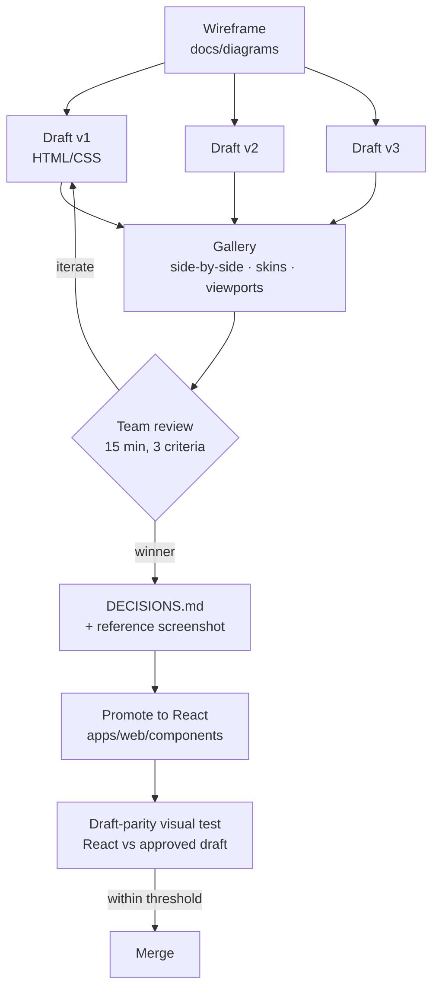
```mermaid
flowchart TB
  W[Wireframe<br/>docs/diagrams] --> D1[Draft v1<br/>HTML/CSS]
  W --> D2[Draft v2]
  W --> D3[Draft v3]
  D1 & D2 & D3 --> G[Gallery<br/>side-by-side · skins · viewports]
  G --> R{Team review<br/>15 min, 3 criteria}
  R -->|winner| DEC[DECISIONS.md<br/>+ reference screenshot]
  R -->|iterate| D1
  DEC --> P[Promote to React<br/>apps/web/components]
  P --> T[Draft-parity visual test<br/>React vs approved draft]
  T -->|within threshold| M[Merge]
```

- **Rules for drafts:** plain HTML + CSS, no framework, no build step. They import `packages/tokens/tokens.css` (the same tokens the app uses) and read `drafts/fixtures/*.json` via a tiny inline `fetch` for realistic numbers. 3D is represented by a still render (or a minimal three.js CDN embed when evaluating glass-over-scene).
- **Variants:** at least 2 for every screen and every non-trivial component (callout, recommendation card, plate, peek card, timeline, condition card). Each variant targets a clear hypothesis ("denser right stack", "callouts as dots until hover").
- **Gallery:** `drafts/index.html` shows variants side by side in iframes at 1440×900 and 1920×1080, with a Glass/Paper toggle, an overlay "onion-skin" comparer and a grayscale check (colour carries meaning only).
- **Review criteria:** (1) does the screen answer its one question in 3 seconds, (2) ≤ 7 visible numbers per region and no paragraphs, (3) legible on a projector (tested at 50% brightness).
- **Promotion checklist:** tokens only (no raw colours) · semantic HTML preserved · keyboard path defined · states covered (loading/empty/error/stale) · Storybook-free: the draft *is* the reference, and the **draft-parity test** (Playwright screenshot of the React component with fixture data vs the approved draft screenshot, perceptual diff ≤ 2%) guards drift.

## 21.4 Engineering conventions

- **Trunk-based development**, short-lived branches `feat/…`, `fix/…`; PRs need green CI + 1 review; squash merge.
- **Conventional Commits.** The changelog is generated.
- **ADRs** in `docs/adr/NNNN-title.md` for every non-obvious decision (Appendix F).
- **Definition of Done:** code + tests (§23) + docs updated + provenance tags on new numbers + demo deep link where visible.

---

# 22. Docker: one command to run everything

## 22.1 The command

```bash
docker compose up
```

That's it. On first run it builds images, starts infrastructure, runs migrations, seeds Baghewala-S and the official Arena run, then serves the app at **http://localhost:8080**. Subsequent runs start in seconds. `make up` is an alias.

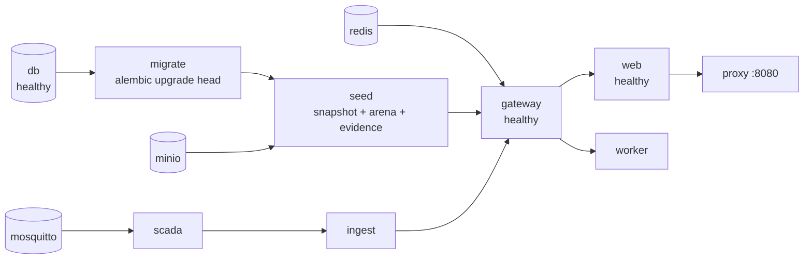
```mermaid
flowchart LR
  DB[(db<br/>healthy)] --> MIG[migrate<br/>alembic upgrade head] --> SEED[seed<br/>snapshot + arena + evidence]
  RD[(redis)] --> GW
  MN[(minio)] --> SEED
  MQ[(mosquitto)] --> SC[scada]
  SEED --> GW[gateway<br/>healthy] --> WEB[web<br/>healthy] --> PX[proxy :8080]
  GW --> WK[worker]
  SC --> ING[ingest] --> GW
```

## 22.2 Services

| Service | Build / image | Port (host) | Depends on | Healthcheck |
|---|---|---|---|---|
| `proxy` | `caddy:2` | **8080** | web, gateway healthy | `GET /healthz` |
| `web` | `infra/docker/web.Dockerfile` (Next standalone) | — | gateway | `GET /api/health` |
| `gateway` | `infra/docker/python.Dockerfile` target `gateway` | — (8000 internal) | db, redis, minio, seed done | `GET /api/v1/health` |
| `worker` | same image, target `worker` | — | db, redis, minio | arq health key |
| `scada` | same image, target `scada` | — | mosquitto, seed | heartbeat topic |
| `ingest` | same image, target `ingest` | — | mosquitto, redis, db | heartbeat |
| `migrate` | same image, one-shot | — | db healthy | exit 0 |
| `seed` | same image, one-shot, idempotent | — | migrate, minio | exit 0 |
| `db` | `timescale/timescaledb:latest-pg16` | 5432 (dev profile only) | — | `pg_isready` |
| `redis` | `redis:7` | — | — | `redis-cli ping` |
| `minio` | `minio/minio` | 9001 console (dev) | — | `/minio/health/live` |
| `mosquitto` | `eclipse-mosquitto:2` | 1883 (dev) | — | `$SYS` topic |

## 22.3 Profiles

| Command | What you get |
|---|---|
| `docker compose up` | Full demo stack (production builds, seeded, offline-capable) |
| `docker compose --profile dev watch` | Hot reload: Next.js dev server + `uvicorn --reload`, source synced via Compose Watch; DB/MinIO ports exposed |
| `docker compose --profile test run --rm tests` | Entire test suite in containers (§23), exits non-zero on failure |
| `docker compose --profile drafts up drafts` | Draft gallery at http://localhost:8090 |
| `docker compose --profile ml up mlflow` | MLflow UI + training jobs (`make train`) |
| `docker compose --profile obs up` | Prometheus + Grafana dashboards |
| `docker compose --profile bench run --rm bench` | Official Arena run → `bench/` |

## 22.4 Image design

- **Python image** (multi-stage, one Dockerfile, multiple targets): `FROM python:3.12-slim`, copy `uv` from `ghcr.io/astral-sh/uv`, `uv sync --frozen --no-dev --package <app>` with cache mounts, `UV_COMPILE_BYTECODE=1`, non-root user. Numba cache is warmed at build time for the physics kernels.
- **Web image:** `node:24-slim` build stage with pnpm, then `next build` with `output: "standalone"`; the runtime stage copies `.next/standalone` + `static` + `public`; non-root.
- **Sizes (targets):** python ≤ 1.2 GB (PyTorch CPU wheels), web ≤ 250 MB.
- **Offline demo bundle:** `make bundle` runs `docker save` on all images plus the seed snapshot into a single tarball for the demo laptop; `make load` restores it with no network needed.

## 22.5 Resource needs

Demo laptop: 4+ cores, **16 GB RAM** recommended (8 GB minimum with `MANTLE_WORKERS=1`), ~10 GB disk. GPU not required (RL training and big Arena runs are done ahead of time; the official results ship in the seed).

---

# 23. Testing strategy: tests for everything

**Principle:** every claim Mantle makes on screen is backed by a test that would fail if the claim became false. The physics is tested against textbooks, the numbers against the physics, the screens against the drafts, and the demo against a script.

## 23.1 Test pyramid

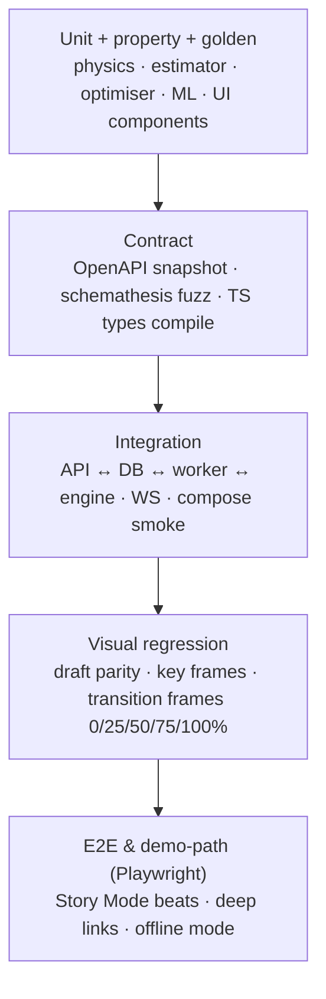
```mermaid
flowchart TB
  E2E["E2E & demo-path (Playwright)<br/>Story Mode beats · deep links · offline mode"]
  VIS["Visual regression<br/>draft parity · key frames · transition frames 0/25/50/75/100%"]
  INT["Integration<br/>API ↔ DB ↔ worker ↔ engine · WS · compose smoke"]
  CON["Contract<br/>OpenAPI snapshot · schemathesis fuzz · TS types compile"]
  UNIT["Unit + property + golden<br/>physics · estimator · optimiser · ML · UI components"]
  UNIT --> CON --> INT --> VIS --> E2E
```

## 23.2 What is tested, how, and the gate

| Layer | Tool | What | Gate |
|---|---|---|---|
| **Physics golden** | pytest | API RP 11L worked examples (PPRL/MPRL/PD within 2%); Marx–Langenheim G(t_D) table values; IAPWS-IF97 check values; Walther fit round-trip; Boberg–Lantz ratio limits; Ramey vs published example; Goodman allowable; four-bar kinematics vs API 11E geometry | 100% pass |
| **Physics invariants** | hypothesis | μ strictly decreasing in T; PD ≥ 0; energy balance closes ≤ 1%; soak never heats without a source; fluid-level mass balance; float margin decreases with SPM at fixed μ | 100% pass |
| **Numerics** | pytest | Wave-equation CFL stability; grid-refinement convergence (order ≈ 2); thermal-grid conservation; deterministic outputs for fixed seeds | pass |
| **Estimator** | pytest | Twin experiments: truth run + noisy obs → EnKF recovers parameters inside P10–P90 in ≥ 75% of trials; coverage ≈ nominal; innovation test flags injected stuck sensors within N hours | thresholds |
| **Optimiser** | pytest | Safety Gate rejects each seeded bad plan (one per constraint); INFEASIBLE returned (never a fallback) on impossible requests; Pareto set non-dominated; surrogate top-k re-verified with physics | 100% pass |
| **ML** | pytest + pandera | Data contracts on training frames; metric floors (card classifier macro-F1 ≥ 0.9 on synthetic hold-out; ECE ≤ 0.05); determinism with seeds; slice metrics per class and condition; model cards generated | thresholds |
| **RL** | pytest | Env API compliance (Gymnasium checker); reward sanity; shielded policy has 0 unsafe executed actions on the eval set | pass |
| **Arena** | pytest (small) | CRN reproducibility (same seed → identical metrics); stats code vs known distributions; CI mini-arena: Mantle − Static > tolerance band | band |
| **Synthetic data** | pytest | Generator outputs match schema; distributions within calibration anchors; faults appear where injected | pass |
| **API** | pytest + httpx | Every endpoint: happy path, validation errors (Problem shape), 404/409/422; auth persona handling | 100% endpoints |
| **API contract** | schemathesis | Property-based fuzzing from OpenAPI (no 5xx on valid input); OpenAPI snapshot diff reviewed in PRs | no 5xx |
| **DB** | pytest + testcontainers | Alembic up/down round-trip; constraints; **ledger hash-chain trigger** + tamper detection; hypertable/aggregate refresh | pass |
| **WebSocket** | pytest | Subscribe/unsubscribe, seq ordering, back-pressure drop, resync | pass |
| **Ingest** | pytest | MQTT/CSV adapters; unit conversions; auditor catches seeded issues (gaps, duplicates, impossible values, unit mismatch) | 100% of seeded issues |
| **Copilot** | pytest (LLM mocked + recorded) | Tool routing; **numeric verifier** blocks invented numbers (adversarial set); offline template fallback | 100% on adversarial set |
| **Web units** | Vitest + Testing Library | Stores, deep-link encode/decode, unit conversion, formatters, WS manager, callout layout solver (no overlaps) | ≥ 85% lines in `lib/` |
| **Components** | Vitest + Playwright CT | Each component in all states (loading/empty/error/stale/alarm) with fixtures | all states |
| **Draft parity** | Playwright screenshots | React component vs approved draft screenshot (perceptual diff ≤ 2%) | threshold |
| **Visual regression** | Playwright | 30 key frames incl. transition at 0/25/50/75/100% (time-seeked GSAP timeline, fixed seed, fixed camera) | diff ≤ 0.5% |
| **3D asset** | glTF-Validator + custom script | GLB validates; all required nodes, anchors and pivots present by name; triangle and draw-call budgets; line-art registration ≤ 1 px vs ortho render | pass |
| **Shaders** | Playwright (headless GPU) | Compile all materials at load; no WebGL errors in console | 0 errors |
| **Performance** | Playwright trace + Lighthouse CI | Twin ≥ 55 fps median on a CI GPU runner (nightly; demo-laptop check manual); transition 0 dropped frames; LCP < 2.5 s | budgets §24 |
| **Accessibility** | axe-core | Paper screens: 0 serious violations; keyboard path through every interaction | 0 serious |
| **E2E demo path** | Playwright | Story Mode script start to finish; every Proof "demo" link resolves; offline mode (network disabled) passes | pass |
| **Compose smoke** | CI job | `docker compose up` → health green in < 5 min → e2e smoke | pass |
| **Security** | pip-audit, pnpm audit, Trivy, gitleaks | No high CVEs; no secrets | 0 high |

## 23.3 Golden scenarios

Six seeded scenarios (the Condition Deck presets) run end-to-end on every CI build. Their headline numbers (oil, SOR, float hours, the recommendation) and screenshots are snapshot-tested. Any change must be deliberate, reviewed and re-baselined with a reason in the PR.

## 23.4 CI pipeline

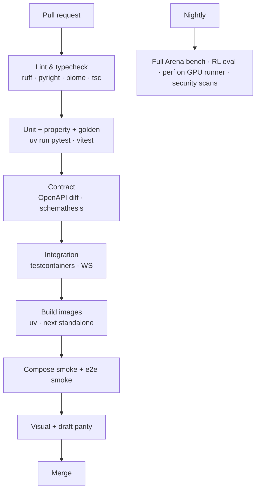
```mermaid
flowchart TB
  PR[Pull request] --> L[Lint & typecheck<br/>ruff · pyright · biome · tsc]
  L --> U[Unit + property + golden<br/>uv run pytest · vitest]
  U --> C[Contract<br/>OpenAPI diff · schemathesis]
  C --> I[Integration<br/>testcontainers · WS]
  I --> B[Build images<br/>uv · next standalone]
  B --> S[Compose smoke + e2e smoke]
  S --> V[Visual + draft parity]
  V --> OK[Merge]
  N[Nightly] --> A[Full Arena bench · RL eval · perf on GPU runner · security scans]
```

**Coverage targets:** physics/estimator/optimise ≥ 90% lines + branches on the Safety Gate = 100%; gateway ≥ 85%; web `lib/` ≥ 85%. Mutation testing (mutmut) runs weekly on `mantle-physics` and the Safety Gate; surviving mutants are triaged.

## 23.5 Demo-day tests (manual checklist, automated where possible)

Projector at 1080p and 4K · offline (Wi-Fi off) full run · battery-saver mode fps · second-screen presenter notes · phone remote pairing · Judge Challenge kiosk loop for 2 hours without leaks (memory profile) · recovery from browser refresh mid-transition.

---

# 24. Performance and accessibility budgets

## 24.1 Performance budgets (demo laptop class: Apple M1/M2 or RTX laptop)

| Item | Budget |
|---|---|
| Twin frame time | ≤ 16.6 ms (60 fps) at 1440p; floor 30 fps on integrated Intel Iris Xe at 1080p (auto-quality) |
| Transition | 0 dropped frames over 2.2 s (pre-warm shaders; compile all materials at load) |
| First meaningful paint | < 2.5 s (Twin shell); GLB streamed with a progressive placeholder silhouette |
| GLB | ≤ 25 MB meshopt; KTX2 textures |
| Blurred glass area | ≤ 30% of viewport, ≤ 5 surfaces |
| WS state update | 2 Hz state, per-stroke cards; < 50 ms end-to-end locally |
| Optimization (per well, joint) | < 8 s to the first Pareto front, < 30 s to the verified plan |
| Scrub latency | < 50 ms per frame (precomputed dense trajectories and client-side interpolation of the returned arrays, not physics) |

**Auto-quality ladder:** particles → SSAO → shadows → post-FX → DPR, stepped down by measured frame time.

## 24.2 Testing

See §23.

## 24.3 Accessibility

Keyboard navigation for everything, including 3D part selection (Tab cycles through anchors). Colour-blind-safe thermal ramp. Text contrast AA on both skins. `prefers-reduced-motion` honoured. Every chart has a data-table fallback.

---

# Part V: Winning

---

# 25. The three impacts: economic, environmental, social

**Method rule:** the numbers come from the Strategy Arena (§16). every impact number is **Mantle policy vs baseline policies on identical simulated wells** (Baghewala-S, N seeds, mean ± sd), labelled SIM. Where we extrapolate to the field ("if applied to 33 wells…"), we label it **ILLUSTRATIVE** and show the arithmetic.

## 25.1 Economic

| Metric | Definition | Where |
|---|---|---|
| Incremental oil | Δ cumulative oil vs baseline, per cycle and per 180 d | Impact, Battle |
| **Coupling Dividend** | §15.6 | Twin, Impact |
| Lifting cost per bbl | (steam + power + water + maintenance + chemicals) / oil | Impact |
| Steam cost per bbl, marginal steam ROI | §13.3 | Cycle |
| Avoided failure cost | Δ expected failures × (workover + deferred oil) | Impact, Lift |
| Deferred-production avoided | Δ downtime × rate | Impact |
| Equipment life | Δ Goodman-loading cycles consumed per bbl | Lift |
| Energy security (national frame) | Barrels of domestic heavy oil recovered more efficiently. India imports most of its crude (cite the latest PPAC figure). | Impact narrative |

## 25.2 Environmental

| Metric | Definition |
|---|---|
| **SOR** (CWE) | Steam per barrel. Lower means less fuel and water per barrel. |
| Steam avoided (t) | Δ steam vs baseline for equal or greater oil |
| **CO₂e per bbl** | Steam-generator fuel × emission factor + grid power × grid factor (CEA baseline database; verify the current value) |
| **Solar-steam share** | Fraction of heat from solar thermal (hybrid condition) |
| **Water intensity** | m³ fresh water per bbl (steam feed − recycled produced water). **Framed around the Thar desert: water is the scarcest resource there.** |
| Heat utilization | Useful reservoir heat / fuel energy (from the heat balance) |
| Wasted thermal energy | Surface + wellbore + caprock losses avoided (VIT, timing) |
| Workover footprint | Δ interventions (each is rig mobilization, diesel and waste) |

## 25.3 Social (grounded, not decorative)

| Metric | Definition / rationale |
|---|---|
| **Worker safety: high-risk states avoided** | Δ hours in float/impact/overload states (these precede failures and emergency interventions) |
| **Heat-stress exposure avoided** | Δ unplanned site visits × heat index for the date (Thar summers exceed 45 °C). Remote diagnosis means fewer people on hot pads. |
| Emergency interventions avoided | Δ unplanned workovers |
| **Knowledge retention** | Captured override reasons and "known well behaviours". Senior operators' judgement becomes institutional memory. |
| **Skilling** | Challenge mode as a training simulator for young engineers; hours trained, score improvement |
| Decision transparency | % of actions with a full provenance trail |
| Regional economy (narrative) | Sustained production in Rajasthan supports local employment and state revenue. Qualitative only; don't quantify without sources. |

## 25.4 Impact screen layout (see also §6.8)

Three paper columns (Economic · Environmental · Social), each with 4 hero numbers (± band, SIM tag), a cumulative chart vs both baselines (historical practice, pump-off controller) and a "how we computed this" fold-out showing the formula and data. A top toggle switches between **per well**, **field (simulated 30 wells)** and **illustrative extrapolation**.

---

# 26. Hackathon plan

> **Dates below are indicative.** Replace them with the official SIH 2026 calendar from the portal and the institute SPOC. The *sequence* and *durations* are what matter.

## 26.1 SIH stages and what we deliver at each

| Stage | What judges or evaluators see | Our deliverable | Owner |
|---|---|---|---|
| **Internal hackathon** (institute) | Idea pitch + early prototype | 5-min pitch, the vertical slice (Phase 2), a 60-s video | Product lead |
| **Idea submission** (SIH portal, via SPOC) | The SIH idea PPT template + optional video | Deck per §29.2; 2-min demo video recorded from Story Mode | Product lead + 3D lead |
| **Shortlisting** | The deck | — (keep building) | — |
| **Grand Finale** (multi-round evaluation, typically ~36 h, on site) | Live product, progress between rounds, Q&A | Frozen demo build + planned on-site increments (§26.4) | Whole team |

## 26.2 Timeline

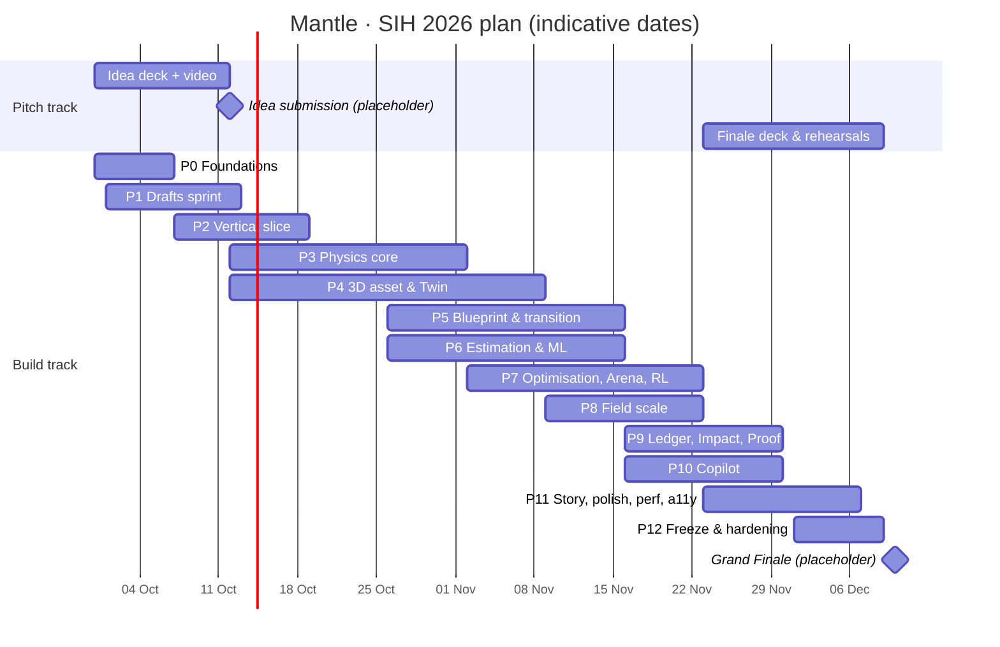
```mermaid
gantt
  title Mantle · SIH 2026 plan (indicative dates)
  dateFormat YYYY-MM-DD
  axisFormat %d %b
  section Pitch track
  Idea deck + video               :p1, 2026-09-30, 12d
  Idea submission (placeholder)   :milestone, m1, 2026-10-12, 0d
  Finale deck & rehearsals        :p2, 2026-11-23, 16d
  section Build track
  P0 Foundations                  :b0, 2026-09-30, 7d
  P1 Drafts sprint                :b1, 2026-10-01, 12d
  P2 Vertical slice               :b2, 2026-10-07, 12d
  P3 Physics core                 :b3, 2026-10-12, 21d
  P4 3D asset & Twin              :b4, 2026-10-12, 28d
  P5 Blueprint & transition       :b5, 2026-10-26, 21d
  P6 Estimation & ML              :b6, 2026-10-26, 21d
  P7 Optimisation, Arena, RL      :b7, 2026-11-02, 21d
  P8 Field scale                  :b8, 2026-11-09, 14d
  P9 Ledger, Impact, Proof        :b9, 2026-11-16, 14d
  P10 Copilot                     :b10, 2026-11-16, 14d
  P11 Story, polish, perf, a11y   :b11, 2026-11-23, 14d
  P12 Freeze & hardening          :b12, 2026-12-01, 8d
  Grand Finale (placeholder)      :milestone, m2, 2026-12-10, 0d
```

## 26.3 Weekly rhythm

- **Monday:** plan (30 min), pick the week's golden-scenario targets.
- **Daily:** 10-min stand-up; the demo build must stay green (`main` always demoable).
- **Wednesday:** draft review (15 min per screen, three criteria).
- **Friday:** full Story Mode run-through, recorded. One "judge" teammate asks 5 hostile questions and we log the answers (feeds §30).
- **Every 2 weeks:** mentor/faculty review with the Proof screen.

## 26.4 Grand Finale playbook (≈ 36 h, adapt to the official format)

**Tactic:** arrive with a finished, frozen product. Reserve **3 small, pre-scoped, visible increments** to build on site, so each evaluation round sees real progress. Also keep a slot for mentor-requested changes.

| Pre-scoped on-site increments (each ≤ 4 h, pre-researched) |
|---|
| 1. A new Condition Deck preset from mentor input (e.g. a specific well pattern or climate) plus an Arena re-run |
| 2. An OIL-requested metric or unit added to the Blueprint and Impact |
| 3. A new card-class or fault type, with the injector and detection shown live |

| Hours | Activity |
|---|---|
| 0–2 | Set up the booth: demo laptop + external display + phone remote; offline check; Judge Challenge kiosk on a second laptop |
| 2–6 | Mentor round: listen, log requests, triage to increments |
| 6–12 | Build increment 1; rehearse the 7-min script twice |
| **Round 1** | Full demo (§29.3) + Q&A (§30) |
| 12–20 | Increment 2; sleep rota (two people always awake; the physics owner sleeps before Round 2) |
| **Round 2** | Demo with "what changed since Round 1" opener (show increment 1 and 2) |
| 20–30 | Increment 3; final Arena run with any new preset; freeze by hour 30 |
| **Final round** | 7-min pitch, clean, rehearsed; Q&A; leave a printed Blueprint well card with judges |
| Always | One person owns the demo laptop; nobody pulls or updates it after the freeze |

## 26.5 Booth and kit checklist

Demo laptop (charged, performance mode, notifications off, `make load` bundle already restored) · spare laptop with the same bundle · HDMI/USB-C adapters · clicker + phone remote · printed A3 Blueprint well cards (×20) · printed cycle receipts · QR standee to `/m/BGW-17` and `/play` · backup video of the full demo on a USB drive and on both laptops · extension board.

## 26.6 Team roles during the event

| Role | During demo | During Q&A |
|---|---|---|
| Product/domain lead | Narrator | Impact, PS mapping, OIL deployment |
| 3D lead | Drives the laptop | Visuals, performance |
| Physics lead | On call | Physics, rod float, CSS |
| ML/estimation lead | On call | EnKF, models, RL, uncertainty |
| Backend/optimisation lead | Arena run | Architecture, Arena, safety |
| Frontend lead | Kiosk + phone remote | UX, accessibility, drafts |

---

# 27. Technical implementation plan

Each phase has a **goal**, **tasks by role**, **deliverables**, **tests** and **exit criteria**. Phases overlap (see the Gantt). `main` must always be demoable.

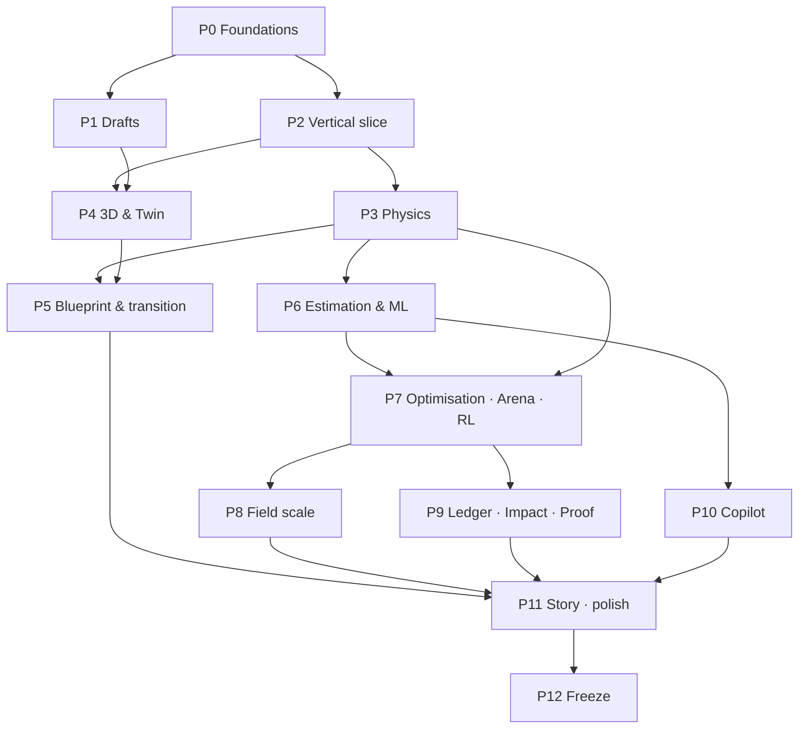
```mermaid
flowchart TB
  P0[P0 Foundations] --> P1[P1 Drafts] & P2[P2 Vertical slice]
  P2 --> P3[P3 Physics] & P4[P4 3D & Twin]
  P1 --> P4
  P3 --> P5[P5 Blueprint & transition]
  P4 --> P5
  P3 --> P6[P6 Estimation & ML]
  P6 --> P7[P7 Optimisation · Arena · RL]
  P3 --> P7
  P7 --> P8[P8 Field scale]
  P7 --> P9[P9 Ledger · Impact · Proof]
  P6 --> P10[P10 Copilot]
  P5 & P8 & P9 & P10 --> P11[P11 Story · polish]
  P11 --> P12[P12 Freeze]
```

### P0: Foundations (week 1)

- **Goal:** the empty shell runs with one command, and CI is green.
- **Tasks:**
  - *Backend:* uv workspace skeleton (`packages/*`, `apps/*`); FastAPI `/health`, `/meta`; Alembic baseline; Compose with db, redis, minio, mosquitto, migrate, seed (no-op); Caddy.
  - *Frontend:* Next.js app with App Router shell, tokens pipeline (`tokens.json` → CSS), persistent `SceneHost` placeholder, routes for the 6 screens.
  - *Physics:* package skeleton + first golden test (API RP 11L example).
  - *Product:* source-truth folder; SIH traceability table; ADR-0001…0005.
  - *All:* lefthook, CI (lint, typecheck, unit, compose smoke).
- **Deliverables:** `docker compose up` shows 6 empty screens behind Caddy; CI green; README accurate.
- **Exit:** a fresh clone runs in ≤ 10 min on a teammate's machine.

### P1: Drafts sprint (weeks 1–2, parallel)

- **Goal:** approved HTML/CSS drafts for every screen and core component.
- **Tasks:** fixtures from the §19 schemas; ≥ 2 variants for 6 screens × 2 skins + 12 components (callout, peek, sheet, dialog, rec card, risk bars, timeline, plate, title block, condition card, scoreboard, receipt); gallery; reviews; DECISIONS.md.
- **Exit:** every screen has a winning draft with a reference screenshot; tokens frozen v1.

### P2: Vertical slice (weeks 2–3)

- **Goal:** one well end-to-end: lumped physics → state → Twin (placeholder GLB) → Blueprint Plate 3 → Timeline.
- **Tasks:** lumped thermal + Walther + RP 11L + float margin; `/wells/{id}/state`, `/envelope`, `/timeseries`; WS state; placeholder 3D well (primitives) with 3 callouts; Plate 3 SVG; timeline scrub.
- **Exit:** scrub 60 days and watch the SPM envelope cross actual SPM in both views; demo-able to mentors.

### P3: Physics core (weeks 3–5)

- **Goal:** the full `mantle-physics` of §14, tested.
- **Tasks:** IAPWS steam + surface loss; Ramey/VIT wellbore; Marx–Langenheim + r–z thermal grid; Boberg–Lantz inflow; annulus material balance; Gibbs wave equation (Numba) + card generation; four-bar kinematics; Goodman, torque, hold-down, casing stress, deposition; economics, CO₂, water; cut-off rule.
- **Tests:** all golden + property + convergence tests (§23.2).
- **Exit:** physics coverage ≥ 90%; cards look right to a domain review; ≤ 50 ms per sim-day per well.

### P4: 3D asset & Twin (weeks 3–6)

- **Goal:** the final GLB integrated; the Twin looks finished.
- **Tasks:**
  - *3D agent:* the §8 brief.
  - *3D lead:* asset validation script; materials; thermal-field shader from `/thermal-field`; lenses; particles (flow); rod segments driven by u(z,t); callout layout solver; phase behaviours; Condition Deck visual responses; performance ladder.
- **Exit:** 60 fps on the demo laptop; all six lenses; all special states (§8.10) triggerable.

### P5: Blueprint & transition (weeks 5–7)

- **Goal:** the living drawing and the signature transition.
- **Tasks:** Plates 1–6 + tracks from the API; SVG line-art projection from `LINE_*`; hatch dissolve shader; paper wipe; the GSAP master timeline authored in Theatre; FLIP of numbers into the BOM; reverse; reduced motion; export sheet.
- **Exit:** transition visual tests at 0/25/50/75/100%; 0 dropped frames; the Twin and Blueprint numbers are identical at the same `t`.

### P6: Estimation & ML (weeks 5–7)

- **Goal:** the twin tracks truth with honest uncertainty; perception models work.
- **Tasks:** Baghewala-S generator v1 (30 wells × 3 y, faults, noise); EnKF (M1); card classifier (M4); hazard (M5); anomaly (M6) + Petrobras 3W validation; residual learner (M3); conformal wrappers; SHAP; model cards; the data decision ADR (§17.7).
- **Exit:** EnKF twin-experiment tests pass; classifier and hazard metrics meet floors; Proof shows model cards.

### P7: Optimisation, Arena, RL (weeks 6–8)

- **Goal:** the evidence engine.
- **Tasks:** cycle surrogate (M2); NSGA-III + physics verification + Safety Gate + refinement; receding horizon; Stroke Shaper; Coupling Dividend + Shapley; strategies S0–S8; the Gymnasium env + shielded PPO training (M8); Arena runner with CRN + stats; the official run; the Arena screen.
- **Exit:** §16.5 criteria evaluated on the official run; the Arena screen loads it in < 1 s; the live mini-run finishes in < 30 s.

### P8: Field scale (weeks 7–8)

- **Tasks:** field map (MapLibre cream style, offline tiles); triage ranking; CP-SAT steam scheduler + dialog; similarity search; morning brief; fleet table; field time-lapse.
- **Exit:** the Field screen matches its draft; the scheduler re-solves in < 5 s for 30 wells × 180 d.

### P9: Ledger, Impact, Proof (weeks 8–9)

- **Tasks:** recommendations → decisions → hash-chained ledger (trigger + verify); outcomes and counterfactual scoring; calibration + override analytics; Impact summary/series/receipt; Proof cards, CSV import + auditor, assumption and source registries, twin health.
- **Exit:** all Proof buttons work live; ledger tamper test passes.

### P10: Copilot (weeks 8–9)

- **Tasks:** tool layer over the engine; LLM integration; numeric verifier + adversarial test set; offline templates; answer cards with "Show me"; command palette actions.
- **Exit:** 100% of the adversarial set is blocked or corrected; offline mode works.

### P11: Story, polish, performance, accessibility (weeks 9–10)

- **Tasks:** Story Mode script + presenter remote; intro sequence; Judge Challenge kiosk; sound (optional); units toggle; performance pass; axe fixes; the pitch video from the time-lapse export; printed well cards.
- **Exit:** three clean end-to-end rehearsals; e2e demo-path test green.

### P12: Freeze & hardening (week 10)

- **Tasks:** bug bash; offline bundle; demo-laptop checklist (§23.5); final Arena run; plan.pdf Rev C; the backup video.
- **Exit:** tagged release `v1.0-finale`; bundle verified on both laptops.

---

# 28. Visual evidence map: what judges don't see doesn't exist

Every claim needs a **visual**, a **place** (deep link), **data** behind it and a **test** that keeps it true.

| # | Claim | The visual that proves it | Where | Backed by | Test |
|---|---|---|---|---|---|
| 1 | We model the whole well-to-surface chain | Lens switching on one 3D model; the Blueprint depth tracks aligned on one depth axis | Well · Twin/Blueprint | §14 physics | golden + parity tests |
| 2 | Heat decays and viscosity rises | Thermal lens fading over a timeline scrub; the Walther chart marker moving | Well | thermal grid, Walther | visual frames |
| 3 | That makes rods float | Bridle slack + impact flash in 3D; float margin bar crossing zero; Plate 3 envelope crossing | Well | wave eq., margin | special-state tests |
| 4 | We detect it | Card shape changes; the classifier label on Plate 2; P2 alarm | Well, Alerts | M4 | classifier floors |
| 5 | We optimise CSS + SRP jointly | Optimiser progress stream; the recommendation's binding constraint | Well | §15.4 | optimiser tests |
| 6 | Joint beats separate | **Coupling Dividend** decomposition bars | Arena, Twin chip | S7 − S5 | Arena CI band |
| 7 | Mantle beats every alternative | **Production-output race**, scoreboard with CIs, % of oracle | Arena | official run | §16.5 criteria |
| 8 | Not just tuning, not just RL | Tuned-static and RL lines on the same chart | Arena | S1, S6 | Arena |
| 9 | Safe by construction | "1,120 rejected by Safety Gate" counter; the ablation "no Safety Gate" disqualified | Well, Arena | Safety Gate log | 100% gate tests |
| 10 | It knows when it's unsure | P10–P90 fans; OOD and disagreement badges; the sensor-fault pause | Well, Proof | EnKF, M6 | twin experiments |
| 11 | It learns from outcomes | Predicted-vs-realised chart; calibration scatter improving by cycle | Ledger | outcomes | ledger tests |
| 12 | Humans stay in charge | Approve / Modify / Reject dialog; override analytics | Well, Ledger | decisions | e2e |
| 13 | Tamper-evident audit | "CHAIN VERIFIED" seal; live verify | Ledger, Proof | hash chain | tamper test |
| 14 | Field-scale value | Steam scheduler Gantt; shadow price of a generator-day | Field | CP-SAT | solver tests |
| 15 | Environmental benefit | Impact column; **cycle receipt**; solar-steam preset flipping CO₂/bbl | Impact | economics | golden scenarios |
| 16 | Social benefit | High-risk hours avoided; heat-stress-weighted visits avoided; knowledge notes count | Impact | §25.3 | golden scenarios |
| 17 | Real-data ready | **Live CSV import** with the auditor report; SCADA readiness diagram; Petrobras 3W result | Proof | ingest | auditor tests |
| 18 | Honest | Provenance mode tinting every number; assumption registry | any, Proof | provenance | contract tests |
| 19 | Runs anywhere | `docker compose up` on the judge's request (if asked) | — | Compose | smoke test |
| 20 | Answers the PS line by line | Traceability card with `↗ demo` links | Proof | Appendix A | e2e link test |

---

# 29. Scripts: how we talk about Mantle

## 29.1 The 30-second pitch

> "Baghewala's oil is as thick as honey. Oil India heats it with steam and lifts it with a 1.1-kilometre steel rod pump. But as the heat fades, the oil thickens, and the pump speed that was safe last week starts breaking rods. Today steam and pump are tuned separately, by experience. **Mantle** is a digital twin that sees the whole chain, from steam to rock to rod to rupees. It plans steam and pump as one decision, and it proves it: on identical simulated wells, it beats every alternative we could build, from today's practice to a reinforcement-learning agent. And it tells you when not to trust it."

## 29.2 Idea-submission deck (SIH template)

| Slide | Title | Content | Visual |
|---|---|---|---|
| 1 | Title | Mantle · SIH26120 · team, institute | Cover drawing (plan.pdf page 1 style) |
| 2 | Problem & idea | The thermal-battery-on-a-steel-spring metaphor; "optimised separately" is the problem | Causal chain diagram (§1) |
| 3 | Proposed solution | Twin ⇄ Blueprint; the 6 screens; Coupling Dividend | Twin and Blueprint wireframes |
| 4 | Technical approach | Physics + EnKF + ML + joint MPC + Safety Gate; Next.js/R3F, FastAPI/uv, Docker | Architecture diagram (§18.1) |
| 5 | Feasibility & viability | Synthetic-first but real-data-ready; risks and mitigations; the prototype already running (screenshots) | Readiness diagram; Arena chart |
| 6 | Impact & benefits | Economic · environmental · social with the method | Impact wireframe |
| 7 | Research & references | Physics standards, public sources, competitor review | Reference list |

**Video (2 min):** Story Mode auto-play with voice-over of §29.3 beats 1–6.

## 29.3 The 7-minute finale demo

| Time | Beat | Screen & action | Spoken line (verbatim guide) |
|---|---|---|---|
| 0:00 | **Hook** | Intro sequence: the drawing comes alive into the 3D Twin at dusk | "This is a heavy-oil well in the Thar. Twelve hundred metres down, oil as thick as honey." |
| 0:25 | The machine | Slow orbit; callouts breathe; hover the polished rod | "We keep it moving with steam, and with a steel rod over a kilometre long that we push up and down five times a minute." |
| 0:50 | **The coupling** | Thermal lens; scrub the timeline +30 days; the heated zone fades; the viscosity callout climbs; the Mechanical lens turns the rods red | "As the heat fades, the oil thickens. The same pump speed that was safe last week now makes the rods float, and floating rods break." |
| 1:40 | The failure, visible | The float margin hits amber; bridle slack + impact flash | "That flash is impact loading. Oil India lists it in the problem statement. It's how rods fail." |
| 2:00 | **Engineering view** | Press `B`: the transition; Plate 3 | "Here's the engineering. The red hatch is where rods float. The safe speed shrinks as the well cools, and today's fixed setting walks straight into it." |
| 2:40 | Why | Click *Why?* → waterfall → causal trace | "Sixty-two percent of this risk is viscosity, and the viscosity was decided forty days ago by the steam plan. That's why steam and pump have to be one decision." |
| 3:10 | **Decide** | Back to Twin → Plan; the progress stream; the recommendation | "Mantle searched about five thousand joint plans, threw out eleven hundred unsafe ones, and recommends this: slow the downstroke, keep the upstroke fast, and advance the next steam cycle four days." |
| 3:50 | **Prove** (`3`) | Arena: the production race plays | "Is it actually better? Same thirty wells, twenty random seeds, three years. Grey is today's practice, orange the industry pump-off controller, red the greedy strategy that burns out its rods, purple a reinforcement-learning agent. Blue is Mantle, at about ninety-four percent of the theoretical best." |
| 4:40 | The number | Coupling Dividend decomposition | "This bar is the value of optimising together instead of separately. It's the problem statement, as a number." |
| 5:10 | **Trust** | Inject "stuck sensor in a sandstorm"; the pause; ⌘K "why did you stop?" | "It also knows when not to trust itself. A sensor froze in a sandstorm, so Mantle paused and told us why. It won't optimise on bad data." |
| 5:45 | Human in charge (`4`) | Modify → approve → Ledger seal; outcome chart | "The engineer stays in charge. Every decision is recorded, tamper-evident, and scored later against what really happened." |
| 6:15 | **Impact** (`5`) | Three columns; the solar preset; the cycle receipt | "More oil from less steam, less water in a desert, and fewer people on hot pads at forty-eight degrees." |
| 6:40 | **Close** (`6`) | Proof → live CSV import; back to the Twin | "Every number here is labelled simulated or measured, and it plugs into Oil India's SCADA. A flight simulator and autopilot for heavy oil." |

**Fallbacks:** if the 3D stutters, press `Q` (quality low) and continue. If the live Arena run is slow, show the official run ("this is the pre-computed official run; the live one is still going in the corner"). If the network is down, nothing changes, since everything is local. If the laptop fails, the spare laptop has the same bundle, and the backup video is on USB.

## 29.4 Architecture walkthrough (90 seconds, with §18.1 on screen)

> "Three layers. **At the edge**, a synthetic SCADA publishes real protocols: MQTT today, OPC-UA ready. It's the same path Oil India's data would take. **In the middle**, a Python engine managed with uv. One physics library, `mantle-physics`, is the only place any physics is computed. An Ensemble Kalman Filter keeps the twin synchronised with the well and quantifies uncertainty. The optimiser screens thousands of joint plans with a learned surrogate, verifies the best with full physics, and a deterministic Safety Gate has the final say. **At the top**, a Next.js app with a persistent 3D scene and a living SVG blueprint. It's all in Docker: one command, fully offline. And all of it is tested, from textbook physics to the pixels of the transition."

## 29.5 One-liners per screen (for the booth)

| Screen | One-liner |
|---|---|
| Well · Twin | "The well, live. Every colour is a calculation." |
| Well · Blueprint | "The same well, as an engineer draws it, and it's still moving." |
| Field | "Thirty wells, ranked by value at risk, and a steam schedule for the whole field." |
| Arena | "Nine strategies, the same wells, one winner, with confidence intervals." |
| Ledger | "Every decision, who made it, why, and whether it worked." |
| Impact | "What it means for money, the environment and people, and how we computed it." |
| Proof | "Press any button: the evidence runs live." |

## 29.6 Stage roles and hand-offs

Narrator (product lead) speaks. The 3D lead drives. For questions, the narrator routes by topic (§26.6) with "*X built that. X?*". **Never** say a simulated number is a field result. Say "in our simulated field…".

---

# 30. Judges' Q&A

## 30.1 Impacts and benefits: our arguments

### Economic

| | |
|---|---|
| **Claim** | Mantle raises oil recovered per cycle and lowers lifting cost per barrel, mainly by avoiding rod failures and by timing steam better. |
| **Mechanism** | (1) The safe-SPM envelope stops over-speed, so fewer float and impact events, fewer rod failures and workovers, less deferred production. (2) Marginal-value cut-off and a joint steam design mean steam is spent where it returns the most oil. (3) The Stroke Shaper recovers production without extra steam. (4) The field steam scheduler allocates a scarce generator to the highest-value wells. |
| **Evidence shown** | Arena scoreboard (net value Δ with CI, failures Δ); Coupling Dividend; steam scheduler shadow price; Impact economic column. |
| **Method** | Policy vs policy on identical simulated wells; costs from the assumption registry (steam ₹/t, power ₹/kWh, workover ₹); Monte-Carlo over seeds. |
| **Caveat, said proactively** | "Absolute rupees depend on Oil India's cost data, which we don't have. The *relative* ranking and the mechanisms are what we show. The EnKF is how we'd calibrate to their numbers." |
| **Why OIL cares** | OIL's Rajasthan strategy emphasises production optimisation and competitive lifting cost. |

### Environmental

| | |
|---|---|
| **Claim** | Fewer tonnes of steam, less fuel gas, less water and lower CO₂e per barrel. |
| **Mechanism** | Lower SOR (less steam per barrel) → less fuel burned → less CO₂. Less steam also means less boiler feed water, which matters in the Thar desert. VIT and timing reduce wasted heat. The solar-thermal hybrid option shifts steam to daytime solar. Fewer workovers mean fewer rig moves and less diesel and waste. |
| **Evidence shown** | Impact environmental column; cycle receipt; the "Sun-powered steam" preset; the heat-balance Sankey (where the heat goes). |
| **Method** | Fuel = steam heat / generator efficiency × emission factor (IPCC default for natural gas, flagged ASSUM); grid power × CEA emission factor; water = steam feed − recycled produced water. |
| **Caveat** | "We don't claim oil production is green. We make an existing thermal process less wasteful per barrel, and we show how solar steam could change the picture." |

### Social

| | |
|---|---|
| **Claim** | Safer operations, less heat-stress exposure, retained know-how, faster skilling. |
| **Mechanism** | (1) Fewer high-risk mechanical states means fewer emergency interventions, and rod failures and workovers are hazardous work. (2) Remote diagnosis means fewer unplanned site visits in 45–48 °C summers. (3) Knowledge capture on every override keeps senior operators' judgement as institutional memory. (4) The Challenge/Sandbox mode trains young engineers on a safe simulator. (5) Transparent decisions (ledger) build trust between field and office. |
| **Evidence shown** | Impact social column (high-risk hours, heat-stress-weighted visits avoided, knowledge notes, decisions with a full trail); the Judge Challenge itself. |
| **Method** | Counts from the simulator's event logs (policy vs policy); heat index by date from the climate condition. |
| **Caveat** | "We don't invent social metrics. Everything here is safety, exposure or knowledge, measured in the simulation." |

**Also relevant nationally (narrative, sourced):** India imports most of its crude (cite the latest PPAC figure). Making domestic heavy-oil production more efficient supports energy security.

## 30.2 The PS's expected benefits → our proof

| Expected benefit (PS) | Proof shown | Metric |
|---|---|---|
| Increased oil production and recovery | Arena race; Impact | Δ cumulative oil, % of oracle |
| Reduced SOR | Arena scoreboard; receipt | Δ SOR (CWE) |
| Lower energy per barrel | Arena; economy strip | Δ kWh/bbl |
| Reduced rod failures and pump unsetting | Arena failures; Risk margins | Δ failure counts, float hours |
| Improved equipment life and reliability | Goodman damage; maintenance forecast | Δ fatigue consumed per bbl |
| Data-driven, predictive decisions | Ledger calibration; forecasts with bands | coverage, outcome scores |

## 30.3 Hard questions

| Question | Answer (short) | Show |
|---|---|---|
| Is this real data? | No. It's physics-based synthetic data calibrated to public figures, labelled on every screen. The anomaly pipeline was also validated on Petrobras 3W real well data. | Provenance mode; Proof |
| How accurate is it? | Against the simulator: model cards with held-out wells and time splits, and interval coverage. Against the field: unknown until calibrated. That's the EnKF's job, and we built the ingestion for it. | Proof → Model cards |
| Why not just machine learning? | Physics extrapolates to states you haven't seen; ML doesn't. We use ML where it helps (speed, residuals, perception) and alarm when the two disagree. | Twin health "physics≈ML" |
| Do you use reinforcement learning? | Yes, as a shielded contender in the Arena. MPC wins on safety, explainability and data efficiency, and the Arena shows the numbers. If RL ever wins, it becomes a proposal generator behind the same Safety Gate. | Arena purple line |
| What's new compared with other teams? | The coupled physics-driven 3D/2D twin, the Coupling Dividend, the Stroke Shaper, the Arena with an oracle bound, and the honest learning loop. | §31 |
| How would Oil India deploy it? | Read-only first: SCADA → MQTT/OPC-UA adapter → Advise mode. Their control system executes. On-prem Docker. Calibrate per well via EnKF. | Proof → Readiness |
| What if the optimiser is wrong? | A deterministic Safety Gate, INFEASIBLE instead of a guess, human approval, outcome scoring and override analytics. | Ledger |
| Does it work in real time? | Twin state at 2 Hz and a card per stroke. The EnKF updates hourly and daily, which matches CSS time scales. Plans take seconds to minutes. | Well live |
| Scalability? | Stateless gateway, sharded estimators, a job queue; 30 wells on a laptop, so a field's ~50 wells on a small server. | Architecture |
| Cyber-security? | Read-only integration, no write-back to PLCs, on-prem, OIDC/RBAC, audited dependencies, tamper-evident ledger. | §18.6 |
| Cost to run? | Open-source stack on one server; LLM optional (templated offline mode). | — |
| Isn't the 3D just decoration? | Every visual is computed: thermal colour = T(r,z), particle speed = Darcy velocity, rod colour = wave-equation stress. The Blueprint shows the same numbers as an engineer's drawing. | Lens toggle |
| What's done versus planned? | Answer honestly by feature tier (§13). The Proof page lists model status. | Proof |
| What's the business case? | "In our simulated field, X% more oil and Y% fewer failures." Scale the arithmetic in the *Illustrative ×33* view, labelled as illustrative. | Impact |

---

# 31. Competitive analysis: 25 public repos

GitHub search on 29 Sep 2026 for `SIH26120`, `SIH 26120` and `baghewala` found **25 repositories**. 21 have substantive content. Private repos and teams without public code are invisible to us, so treat this as a floor, not a census.

## 31.1 Who has what

| Repo | Stack | Stand-out features | Weak spots we exploit |
|---|---|---|---|
| **XploY04/Aavartan** | Next.js + Three.js, FastAPI, SQLite | **3D twin**, IAPWS-IF97, Marx–Langenheim, Walther, Boberg–Lantz, API RP 11L, Couette drag, Goodman; equipment-limit gate; field schedule calendar; best-documented formulas; conformal and LightGBM *designed* | Minimal light UI; 3D is basic; ML layer not built; 4-well demo |
| **Sharon-codes/SIH-120 (Urja Twin)** | React + FastAPI, Vercel | SVG animated cutaway; 730-plan search with infeasibility; assistant with **numeric verification** (Nemotron); 43 tests + CI; decision export; research docs | 2D SVG only; screening proxies; illustrative dynocard |
| **Rohit-girish-Belagali (Inferno)** | Vanilla JS + stdlib server | **EnKF** P10–P90; **Gibbs wave-equation cards**; Ramey; **marginal-value cut-off**; **rod-float envelope with downstroke share**; 3 policies incl. pump-off baseline; ISA-style HMI; Day/Night | Plain UI; steam MILP and multi-taper **not built** |
| **Dhayananth1511/Polaris** (MIT) | React + FastAPI + Postgres | 7-table dataset incl. 38,400 card points; SPM_crit; telemetry replay 1–50×; Isolation Forest; 12 pages; approve/reject | Page sprawl; lumped physics |
| **maddy-bit/PetroTwin-AI** | React + FastAPI + Spring Boot | 180-day time machine; conformal 95% CI; SHAP waterfall; **agentic copilot endpoint**; WebSocket; parted-rod classifier; tiered data honesty | Three backends; results table looks optimistic (e.g. "0.0% unsafe") |
| **nishanth24vv** | React + FastAPI + SQLite | Wellbore hydraulics (Pwf, PIP, fluid level); **anomaly injector**; 11-step judging demo; 15 wells | A competitor review found fallback results substituted when infeasible |
| **sandhya-parekar/WellTwin-AI** | React + FastAPI | **30 modules**: RUL, health gauge, root cause, dossier generator, **SIH requirement mapping**, **judge presentation mode**, RBAC | Breadth over depth; "R² 0.9997"-style claims |
| **Devansh-567** | Web | **Calibration table with sources**; OSM map with real pads; sensor-integrity page; Everitt–Jennings; Arps | Small |
| **bharatmalik-cs** | React + FastAPI | Gibbs inversion; card fault classes; Beggs & Brill; canvas pseudo-3D pump; GIS map; WS telemetry | Rule-based assistant |
| **Apaar-Gupta/SIH-2026** | FastAPI + static HTML | Steam-driven **hourly 720-h forecast**; steam quality; casing risk; cut-off hour; SPM schedule; honest assumptions | Single-page UI; ML regresses grid-search labels |
| **dasher06** (MIT) | Python | SRP physics + GBM surrogate; **trained on real "NK" SCADA** (7 wells) | Component only |
| **naveed1756** | Python + web | **9-class dynocard library**; figures for the PPT | PoC only |
| **varshini2419** | React + FastAPI | **RAG over OIL public documents** with a source index; soft-sensor nowcast; 7-day alarm classifier; constraints registry | Unstructured repo |
| **Bhuvanesh0097/WellWise** | React + FastAPI | Approve / Modify / Reject; 24 h prediction | Narrow |
| **DevanshS1ngh/WELL-NEX** | React + FastAPI | **Cream / desert palette**, Leaflet map, CSS/SRP simulate/apply | Similar palette to ours, so our differentiation must be the *living blueprint* concept, not the colour |
| **ZotacMaster** | React + FastAPI + TimescaleDB + Redis | Validation benchmark; in-memory fallback | 5 pages |
| **Bis28** | Streamlit + PyCaret + **Ollama Llama 3.2** | Offline local copilot with deterministic safety overrides | Streamlit look |
| **xarjunpatil** | Static HTML + FastAPI | **Glassmorphic dark dashboard**, cryptographic audit logs, PostGIS | Mostly a whitepaper |
| Others (Rajatgupta2760, viveky1621, n230837, SRILEKHA-910, kr7561846, aniketcoder15, Vvl1232) | various | Concept READMEs, ML vs physics comparison (viveky), large synthetic SRP set (n230837) | Early-stage |

## 31.2 What we adopt (and credit as prior art in our research doc)

Wellbore hydraulics · fluid level · PPRL/MPRL · card metrics · fluid pound as a separate mode · casing thermal risk · steam quality · heat-delivery efficiency · SPM_crit / float envelope with downstroke share · dynamic SPM schedule · cut-off and re-steam timing (marginal value) · 180-d horizon · conformal intervals · anomaly injection · telemetry replay · multi-well fleet · SHAP · safety gate · approve/modify/reject · audit trail · data-quality auditor · physics-vs-ML · OOD · tool-using copilot with numeric verification · knowledge capture · scenario library · requirement mapping page · judge presentation mode · pump-off baseline · calibration-with-sources table · RAG-style source index (as provenance, not chat) · offline copilot fallback.

All are **re-implemented by us** from the published physics and standards. We copy no code from unlicensed repos.

## 31.3 What nobody has (our moat, as of the review date)

1. **The living Blueprint** and the **in-place 3D → 2D transition** with continued animation in line art.
2. **Physics-driven visuals:** rendering the actual T(r,z) field, Darcy-speed particles and wave-equation stress bands in 3D.
3. **Coupling Dividend** with a Shapley decomposition. It quantifies the PS thesis.
4. **Stroke Shaper as an optimizer lever**, visualized.
5. **Condition Deck** covering formation, crude, climate, completion, **solar-thermal steam** and faults, changing physics and scene together.
6. **Field Steam Scheduler** (CP-SAT) *built* (one competitor planned it).
7. **Asphaltene/wax deposition band** from the wellbore temperature profile (the PS mentions asphaltenes and no repo models it).
8. **Hash-chained ledger** + **counterfactual scoring** + **override analytics** as one learning loop.
9. **Provenance mode** on every number.
10. **Safe Calibration Probe** (active learning with a safety constraint).
11. **Strategy Arena with an oracle bound and an RL contender**, all on common random numbers.
12. **Real-data method validation** on Petrobras 3W for the anomaly pipeline.

---

# 32. Honesty rules and risks

## 32.1 Honesty rules (non-negotiable)

1. Never present synthetic results as Baghewala field results. Every impact number is tagged SIM.
2. Never report a metric without its dataset and split.
3. Every constant not from a source lives in the Assumption Registry, tagged ASSUM, with "replace with…".
4. The optimizer returns INFEASIBLE when it is infeasible.
5. The copilot's numbers must pass the verifier.
6. No real company branding or logos in the 3D scene or the UI. Mantle is an independent prototype for the PS, not an Oil India product.
7. Credit competitors' ideas as prior art in our research document; copy no unlicensed code or data.

## 32.2 Risks

| Risk | Likelihood | Mitigation |
|---|---|---|
| 3D performance on the venue machine | Med | Own laptop; auto-quality ladder; pre-rendered video fallback of the transition |
| Venue network down | High | Fully offline demo; copilot offline mode |
| Physics too slow for interactive scrubbing | Med | Precompute dense trajectories per scenario; surrogates in the optimizer inner loop |
| Judges challenge synthetic data | High | Provenance mode, source table, Petrobras 3W real-data validation, readiness story |
| Scope sprawl, nothing polished | High | Phases with demoable exits; P0 first; golden scenarios |
| Transition looks "cheap" if mistimed | Med | Author in Theatre.js, review frame by frame, visual regression on transition frames |
| Domain errors (wrong petroleum terms) | Med | Domain lead review; ask the OIL mentor; the source truth folder |
| RL training time or instability | Med | Train offline on nightly runs; the Arena reports RL honestly even if it's weak; MPC doesn't depend on it |
| Next.js + WebGL hydration and route pitfalls | Med | Persistent client-only canvas in the root layout; e2e tests on route changes |
| Data decision drags on | Med | Adapters make sources swappable; deadline end of P2 (ADR-0007) |
| Drafts multiply and never converge | Med | Time-box: 2 variants, 15-minute review, decision logged |
| Competitor convergence (others add 3D) | Med | Our moat is the *coupled physics-driven visuals* and the Coupling Dividend, not 3D alone |

---

# Appendices

## Appendix A: SIH26120 traceability matrix

| PS item | Mantle feature(s) | Evidence in app |
|---|---|---|
| Integrated reservoir + wellbore + surface twin | Twin, physics chain §14, EnKF | Twin, Blueprint depth tracks |
| Real-time monitoring | Synthetic SCADA → WS → Twin; Alerts (ISA-18.2) | Live badge, Alerts drawer |
| Prediction | 30/90/180-d forecasts with P10–P90 | Timeline fan, Reservoir sheet |
| Optimize CSS (steam volume, injection pressure, soak time, production cut-off) | Joint optimizer, cut-off rule, marginal steam, Scheduler | Well → Reservoir sheet, Recommendation card |
| Predict heating, cooling, production | Thermal grid + EnKF | Thermal lens, Plate isotherms |
| Continuously optimize SRP (stroke speed, SPM) | Receding-horizon schedule, Stroke Shaper | Well → Lift sheet, Plate 3 |
| Detect rod floating, minimize impact loading | Float margin, wave-equation impact, card classifier | Risk Stack, Plate 2 |
| Pump efficiency, equipment reliability | Fillage, Goodman, hazard models, maintenance forecast | Well → Lift sheet |
| Optimize steam and energy, reduce cost | Economics, SOR, kWh/bbl, steam ROI | Impact, Battle |
| Rod failures, pump unsetting ↓ | Hazard + margins + Safety Gate | Risk Stack, Impact |
| Data-driven, predictive decisions | Decision Ledger, outcome scoring | Ledger |
| Uses the listed data categories | Canonical schema §17.3 | Proof → Real-data readiness |

## Appendix B: Metric dictionary (core)

| Metric | Unit | Formula / source | Shown in |
|---|---|---|---|
| SPM | 1/min | measured / plan | Twin callout 2, Lift |
| Downstroke share k_d | – | VFD profile | Twin callout 2, Plate (Stroke Shaper) |
| PPRL / MPRL | kN | wave eq.; RP 11L fast form | Twin callout 1, Plate 2 |
| Rod-float margin | % | 1 − (F_drag + F_fric)/W_b | Risk Stack, callout 1 |
| N_max (safe SPM) | 1/min | 120·k_d·v_max/(π·S), corrected | Plate 3 |
| Pump fillage | % | pump model / card | Callout 6 |
| Volumetric efficiency | % | q_liquid / PD | Callout 6 |
| Hold-down margin | × | rating / (friction + transient) | Risk Stack |
| Goodman loading | – | S_range / S_a,allow | Plate 6, Risk Stack |
| Gearbox torque | % rating | torque factor × net load | Callout 2 |
| Fluid level / submergence | m | annulus balance | Callout 5 |
| Pwf, PIP | bar | hydraulics | Pressure track |
| Sandface temperature | °C | thermal grid / EnKF | Callout 7 |
| Viscosity | cP | Walther + emulsion | Callout 7, μ track |
| Heated radius | m | Marx–Langenheim / grid | Callout 7 |
| J_hot/J_cold | – | Boberg–Lantz | Plate 4 |
| Oil rate | BOPD | min(inflow, pump) | Callout 4 |
| SOR (CWE) | bbl/bbl | steam t × 6.2898 / oil bbl | Economy strip |
| Energy / bbl | kWh/bbl | (motor + steam-gen fuel)/oil | Economy strip |
| CO₂e / bbl | kg/bbl | fuel EF + grid EF | Economy strip, Impact |
| Water / bbl | m³/bbl | (feed − recycle)/oil | Economy strip, Impact |
| Casing thermal stress | % yield | E·α·ΔT / yield | Callout (injection), Risk |
| Deposition interval | m | T(z) < T_onset | Temperature track |
| Coupling Dividend | ₹/cycle, bbl, ΔSOR | §15.6 | Twin chip, Impact |
| Twin health | % | weighted sensor integrity, calibration, freshness, OOD | Twin ring, Proof |

## Appendix C: Glossary

**API gravity:** density scale for crude; lower means heavier. **BOPD:** barrels of oil per day. **CSS:** cyclic steam stimulation (inject → soak → produce). **CWE:** cold-water-equivalent steam volume. **Dynamometer card:** load vs position loop of one pump stroke. **EnKF:** Ensemble Kalman Filter. **Fillage:** fraction of the pump barrel filled with liquid per stroke. **Fluid pound:** the plunger striking the liquid in a partially filled barrel. **Goodman diagram:** fatigue allowable-stress chart for rods. **IPR:** inflow performance relationship. **MPRL / PPRL:** minimum / peak polished-rod load. **Pump unsetting:** the insert pump pulled off its seating nipple. **Rod float:** the rod string failing to follow the surface unit on the downstroke because of viscous drag. **SOR:** steam-oil ratio. **SPM:** strokes per minute. **VFD:** variable-frequency drive. **VIT:** vacuum-insulated tubing.

## Appendix D: References (primary; obtain and verify)

- Oil India Limited, *Rajasthan Fields* (field description, CSS/SRP, VIT, viscosity).
- SIH 2026 Problem Statement **SIH26120** (Oil India Limited).
- Marx, J.W. & Langenheim, R.H. (1959). Reservoir heating by hot fluid injection. *Trans. AIME* 216.
- Boberg, T.C. & Lantz, R.B. (1966). Calculation of the production rate of a thermally stimulated well. *JPT* 18(12).
- Ramey, H.J. (1962). Wellbore heat transmission. *JPT* 14(4). · Willhite, G.P. (1967). Over-all heat transfer coefficients in steam and hot water injection wells. *JPT* 19(5).
- Gibbs, S.G. (1963). Predicting the behavior of sucker-rod pumping systems. *JPT*. · Everitt, T.A. & Jennings, J.W. (1992). An improved finite-difference calculation of downhole dynamometer cards. *SPE PE*.
- API RP 11L (design calculations for sucker rod pumping systems) · API Spec 11E (pumping units) · API RP 11BR (sucker rod care, Goodman).
- ASTM D341 (viscosity–temperature charts) · IAPWS-IF97.
- Vogel, J.V. (1968). Inflow performance relationships for solution-gas drive wells. *JPT*.
- Evensen, G. (2009). *Data Assimilation: The Ensemble Kalman Filter*. Springer.
- Deb, K. et al. (2002). NSGA-II. *IEEE TEC*. · Angelopoulos & Bates (2021). Conformal prediction (arXiv:2107.07511). · Lundberg & Lee (2017). SHAP.
- Hansen, B. et al. (2018). Model predictive automatic control of sucker rod pump system (BYU-PRISM USTAR-Artificial-Lift).
- Vargas, R.E.V. et al. (2019). A realistic and public dataset with rare undesirable real events in oil wells (**Petrobras 3W**). *J. Petrol. Sci. Eng.*
- ISA-101 (HMI design) · ISA-18.2 (alarm management) · ISO 128 (technical drawing lines) · ISO/PAS 12835 (thermal well casing connections).
- ACT SHARP consortium, D4.1 (2022). Geological characterization including Baghewala (as indexed by a competitor; obtain the original).
- Competitor repositories listed in §31 (accessed 29 Sep 2026).

---

*End of plan. Revision A. The next revision should add: confirmed source numbers, the final asset review, benchmark results, and the rehearsed demo timings.*

## Appendix E: Configuration (environment variables)

| Variable | Default | Used by | Meaning |
|---|---|---|---|
| `MANTLE_MODE` | `SIMULATION` | all | `SIMULATION` or `FIELD` (locked in the demo) |
| `MANTLE_PROFILE` | `demo` | all | `demo` (seeded, deterministic) · `dev` · `bench` |
| `MANTLE_SEED` | `2026` | synth, arena | Global seed for the demo field |
| `MANTLE_WELLS` | `30` | synth | Wells in Baghewala-S |
| `MANTLE_WORKERS` | `2` | worker | Concurrent job workers |
| `DATABASE_URL` | `postgresql+asyncpg://mantle:mantle@db:5432/mantle` | py | DB |
| `REDIS_URL` | `redis://redis:6379/0` | py | Streams, queue |
| `S3_ENDPOINT` / `S3_BUCKET` / `S3_ACCESS_KEY` / `S3_SECRET_KEY` | `http://minio:9000` / `mantle` / – / – | py | Object store |
| `MQTT_URL` | `mqtt://mosquitto:1883` | scada, ingest | Broker |
| `OPCUA_ENDPOINT` | empty | ingest | Optional OPC-UA source |
| `LLM_PROVIDER` / `LLM_API_KEY` / `LLM_MODEL` | `anthropic` / empty / e.g. `claude-sonnet-5-5` | copilot | Empty key means offline templated mode |
| `NEXT_PUBLIC_WS_PATH` | `/ws` | web | WebSocket path behind the proxy |
| `GATEWAY_INTERNAL_URL` | `http://gateway:8000` | web (server components) | Internal API base |
| `WEB_QUALITY` | `auto` | web | `auto` · `high` · `low` |
| `TZ` | `Asia/Kolkata` | all | Display time zone |

## Appendix F: Decision records to write (ADRs)

| ADR | Title | Status |
|---|---|---|
| 0001 | Monorepo with pnpm + uv workspaces | Accepted (Rev B) |
| 0002 | Next.js App Router with a persistent R3F canvas | Accepted |
| 0003 | FastAPI gateway; one physics library as the only calculation path | Accepted |
| 0004 | Docker Compose single command; Caddy as the single entry point | Accepted |
| 0005 | HTML/CSS draft-first UI with draft-parity tests | Accepted |
| 0006 | EnKF for state estimation (vs particle filter / UKF) | Proposed |
| 0007 | Data sources: synthetic / competitor / LLM mix | Open (decide end of P2) |
| 0008 | MPC primary, shielded RL as contender | Accepted |
| 0009 | Ledger hash chain in Postgres (vs external) | Proposed |
| 0010 | LLM provider and offline fallback | Proposed |
| 0011 | Map stack (MapLibre + offline tiles) | Proposed |

---

*End of plan, Revision B. Rev C should add: confirmed source numbers, the approved drafts, the final asset review, official Arena results and rehearsed demo timings.*
